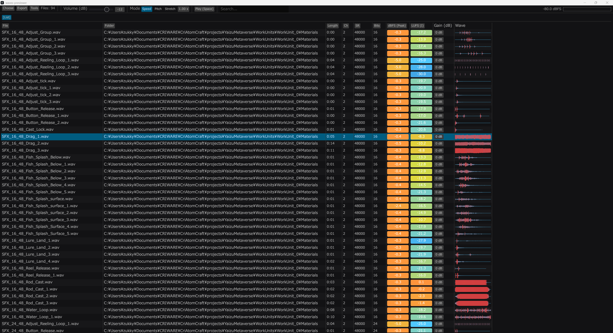
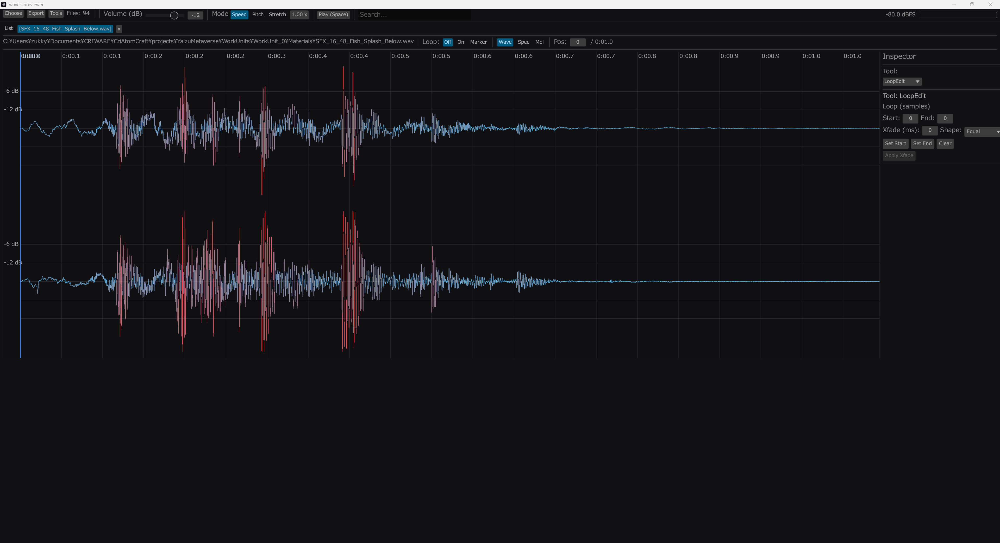

# NeoWaves Audio List Editor (NeoWaves)

NeoWaves は大量の音声ファイルを素早く一覧表示し、即試聴・編集できる軽量オーディオリストエディタです。UI は `eframe/egui`、オーディオ出力は `cpal` を使用しています。

対応フォーマット（デコード）:
- WAV / MP3 / M4A (isomp4) / AAC / ALAC

---

## 主な機能

### リストビュー（高速）
- フォルダ/ファイルの読み込み（ドラッグ&ドロップ対応）
- 検索（Regex対応）、ソート、列の表示/非表示
- メタ情報の列表示: 長さ / チャンネル / SR / Bits / Bitrate / dBFS / LUFS / Gain / 波形
- Auto Play やキーボード操作で高速試聴

### エディタ（非破壊）
- Speed / PitchShift / TimeStretch
- Fade / Trim / Normalize / LoudNorm
- Sample Rate 変換（Apply まではメモリ上のみ）
- マーカー / ループ編集 / ループ解除（Unwrap）
- スペクトログラム / メルスペクトログラム表示

### 外部データ連携（CSV / Excel）
- CSV/Excel を読み込み、列をリストにマッピング
- シート選択、ヘッダ行/データ開始行の指定
- 正規表現キー + スコープで高速マッピング
- 未参照行の表示切り替え

### セッション保存（.nwsess）
- 作業状態（開いていたファイル、選択、編集状態など）を復元
- Ctrl+S: セッション保存
- Ctrl+Shift+S: セッション Save As
- Ctrl+E: 音声の Export
- `.nwsess` はダブルクリック/ドラッグ&ドロップ対応

---

## 画面イメージ



---

## 使い方（基本）

- **Folder... / Files...** から読み込み
- **ドラッグ&ドロップ** で追加読み込み
- **Space** で再生/停止
- **Enter** でエディタを開く

> 詳細な操作は `docs/CONTROLS.md` を参照してください。

---

## ビルド

```bash
cargo build
cargo run
```

### Installer (Windows)
```powershell
cargo build --release
"C:\\Program Files (x86)\\Inno Setup 6\\ISCC.exe" installer\\NeoWaves.iss
```

出力:
- `dist\\NeoWaves-Setup-<version>.exe`

---

## CLI / 自動化

CLI 引数は `AGENTS.md` に最新一覧があります。
例:
```bash
cargo run -- --open-folder "C:\\path\\to\\wav" --open-first --screenshot screenshots\\shot.png --exit-after-screenshot
```

---

## MCP (stdio/http)

MCP サーバ機能を内蔵しています。起動方法・許可パスなどは README 内の MCP セクションまたは `AGENTS.md` を参照してください。

---

## Docs

全ドキュメント一覧:
- `docs/INDEX.md`

