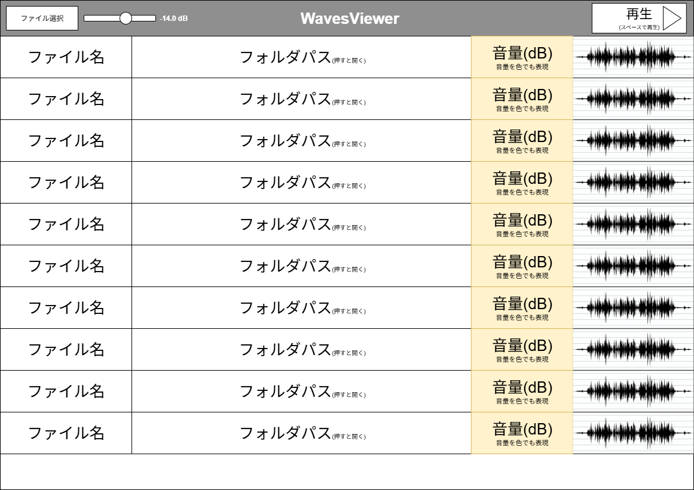
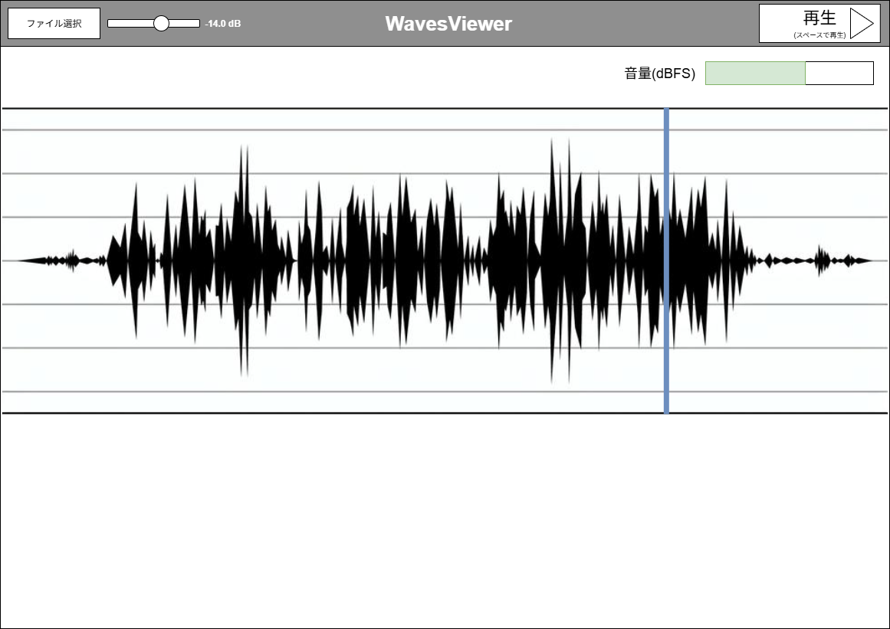

# waves-previewer (WavesViewer)

外部フォルダを再帰的に走査して `.wav` を一覧表示し、Space で即試聴、波形(min/max)と dBFS メータを表示する Rust 製の軽量プレビュワーです。GUI は `eframe/egui`、オーディオ出力は `cpal` を使用しています。リストは大規模でも軽快に動作し、検索・ソート・即時プレビューに最適化しています。

現状は WAV のみ対応（`hound`）。今後 `symphonia` による mp3/ogg/flac/aac 対応を予定しています。

## Recent Updates
- Added Settings > Appearance (Dark/Light). Default is Dark and it persists across restarts.
- Theme preference is stored in `%APPDATA%\\waves-previewer\\prefs.txt`.
- Undo/Redo in the editor (Ctrl+Z / Ctrl+Shift+Z) with toolbar buttons.
- List UX: click selection no longer auto-centers; keyboard selection still auto-centers.
- Metadata loading prioritizes visible rows when you jump-scroll.

## 現状の画面イメージ


---

## Documentation

See docs index for full guides and references:

- docs/INDEX.md

---

## デザイン方針（ご提案）

基本画面は「リスト表示」。ファイル名をダブルクリックすると「波形エディタ」を開きます。

どちらの表示方法がよいか検討中ですが、初期実装は「同一ウィンドウ内タブ」を採用します（実装容易・一体感・ショートカットが素直）。将来的にポップアウト（別ウィンドウ）も選べる設計にします。

- タブ方式（既定）: 1 ウィンドウ内で複数エディタをタブ切替。複数ファイル比較が楽。マルチモニタ利用時は後述のポップアウトで補完。
- 別ウィンドウ方式（将来オプション）: エディタを新規ウィンドウへ分離。マルチモニタで並べられる一方、ウィンドウ管理の複雑さが増します。

### モック（参考）

リスト画面（一覧）



波形エディタ（詳細）



---

## 機能

- フォルダ選択（再帰走査）で `.wav` を一覧表示（上部バーに総数を表示、読み込み中は ⏳ 表示）
- 検索バーでファイル名/フォルダを部分一致フィルタ（表示数/総数を表示）
- ファイル名のダブルクリックでエディタタブを開く（同一ウィンドウ内）
- Space/ボタンで再生・停止、音量スライダ、dBFS メータ表示
- エディタの Undo/Redo（Ctrl+Z / Ctrl+Shift+Z）。Inspector にボタンも表示
- モード選択（Mode: Speed / PitchShift / TimeStretch）
  - Speed: 再生速度（Speed x [0.25〜4.0]）。ピッチは変化（非保持）。リアルタイム再生で低遅延。
  - PitchShift: セミトーン（-12〜+12）でピッチのみ変更。長さは保持。signalsmith-stretch によるオフライン処理。
  - TimeStretch: 伸縮倍率（0.25〜4.0）で長さを変更。ピッチは保持。signalsmith-stretch によるオフライン処理。
  - Pitch/Stretch は処理が重い場合があるため、実行中は画面全体にローディングカバーを表示して完了後に自動反映（他の重い処理にも使い回し可能な共通オーバーレイ）。
  - UI は「セグメント化された Mode 切替 + 小型の数値ステッパ（DragValue）」で統一。文字高さを揃え、横幅占有を最小化。
- リスト列: File | Folder | Length | Ch | SR | Bits | dBFS (Peak) | LUFS (I) | Gain(dB) | Wave
  - 各列はリサイズ可能で、初期幅は最適化済み
  - 長いテキスト（ファイル名・フォルダパス）は自動切り詰め（...）表示、ホバーで全文表示
  - Ch/SR/Bits/Length は可視行表示時に即ヘッダ情報を読んで反映（高速）
  - dBFS(Peak)/LUFS(I)/Wave はバックグラウンドで逐次計算して上書き（非同期）
  - dBFS(Peak) と LUFS(I) は値に応じて背景色を着色（低:寒色→高:暖色）
- Gain 列は dB で編集可能（-24..+24）。複数選択中に対象行で調整すると、変更量が選択全体に一括適用。未保存の行はファイル名末尾に " •" を表示
- ソート: ヘッダクリックで「昇順→降順→元の順」をトグル（文字列はUTF順、数値は大小順、Length列は秒数順）
- 行のどこでもクリックで選択＋音声ロード、ファイル名ダブルクリックでタブを開く、フォルダ名ダブルクリックでOSのファイルブラウザを開く（該当WAVを選択状態）
- キーボード操作で選択した行は自動で見える位置へスクロール（クリック選択では位置を維持）
- リストの Wave 列は min/max の簡易描画。エディタではズーム/パン/シークに対応。
- 波形表示は Volume には影響されません（常に 0 dB と見なす）。Gain(dB) のみ反映されます。
- エディタのループは上部バーで Off/On/Marker を切替、ループ範囲編集は Inspector > LoopEdit に集約。
- 上部バーに未保存ゲイン件数（"Unsaved Gains: N"）を表示
- Export メニュー:
  - Save Selected (Ctrl+S): 選択中のファイルへゲインを適用して保存（Overwrite／New File は Settings で指定）
  - Apply Gains (new files): すべての保留中ゲインを同一フォルダに新規 WAV として一括出力
  - Clear All Gains: すべての保留中ゲインを破棄
  - Settings: 保存先フォルダ／ファイル名テンプレート（{name}, {gain:+0.0} など）／衝突時の挙動（Rename/Overwrite/Skip）／Overwrite 時の .bak 作成／Appearance（Dark/Light）
- **再生方式**:
  - **リスト表示時**: 常にループ無効（一度再生で停止、試聴に最適）
  - **エディタ表示時**: ループ再生のオン/オフ切替可能（無音ギャップなしのシームレスループ）
  - Pitch/Stretch のときはアルゴリズムの出力レイテンシと残り出力（flush）を考慮して末尾が切れないよう調整。ループ継ぎ目の引っかかりを低減。

将来（ロードマップ）

- タブの「ポップアウト」＝別ウィンドウ化（マルチウィンドウ）
- ズーム/パン、シークバー、A–B ループ、波形サムネイル列、色による大まかな音量表現
- 多形式（mp3/ogg/flac/aac）と高品質リサンプル
- 出力デバイス選択、タグ/メタ表示、スペクトル表示

---

## 画面構成

- 上部バー: フォルダ/ファイル選択（メニュー「Choose」: Folder... / Files...）、総数表示、音量、モード選択（Speed/Pitch/Stretch）、検索バー、dBFS メータ、再生ボタン（Space）
- リスト画面: File | Folder | Length | Ch | SR | Bits | Level(dBFS) | Wave
  - 列リサイズ可能、長いテキストは自動切り詰め＋ホバー表示、仮想化スクロール対応
- 波形エディタ（タブ）: フル波形、垂直プレイヘッド、グリッド線、ループトグル（全域）
  - クリックでシーク、クリック&ドラッグでスクラブ
  - Ctrl+ホイールで時間ズーム、Shift+ホイール（または横ホイール）で左右パン

動作イメージ

1) 起動するとリスト画面。メニュー「Choose」から Folder... または Files... を選択、もしくはウィンドウへドラッグ&ドロップ。
2) 行クリック→選択＋音声ロード。ファイル名ダブルクリック→エディタタブを開く（既存タブがあれば右側に追加）。
3) フォルダ名ダブルクリック→OS のファイルブラウザでフォルダを開き、WAV を選択状態で表示。
3) Space で再生/停止。再生中はプレイヘッドが移動。上部の dBFS メータが反映される。

---

## 使い方 / ビルド

要件: Rust stable、オーディオ出力が有効な Windows/macOS/Linux。
PitchShift/TimeStretch（signalsmith-stretch）を使うには C/C++ ツールチェーンと libclang が必要です。

```bash
cargo run
```

### Automation (CLI)

```bash
cargo run -- --open-folder "C:\\path\\to\\wav" --open-first --screenshot screenshots\\shot.png --exit-after-screenshot
```

Options:
- --open-folder <dir>
- --open-file <wav> (repeatable)
- --open-first
- --screenshot <path.png>
- --screenshot-delay <frames>
- --exit-after-screenshot
- --dummy-list <count>
- --debug
- --debug-log <path>
- --auto-run
- --auto-run-time-stretch <rate>
- --auto-run-delay <frames>
- --auto-run-no-exit
- --debug-check-interval <frames>
- F9 saves a screenshot into ./screenshots
- F12 toggles the debug window

Example:
```bash
cargo run -- --open-folder "C:\path\to\wav" --auto-run --debug-log debug\log.txt
```

起動後、左上のメニュー「Choose」から Folder... / Files... を選択して一覧を置き換えます。ウィンドウへのドラッグ&ドロップでも追加可能です。ファイル名をダブルクリックしてタブで開き、Space で再生/停止、音量スライダと Mode の数値（Speed/Pitch/Stretch）で調整、検索バーで絞り込み。

`wgpu` で動作しない環境では、`eframe` の feature を `glow` に変更してビルドしてください。

### Windows（signalsmith-stretch を使う場合）
- LLVM をインストール（libclang を含む）
  - winget: `winget install -e --id LLVM.LLVM`
- 環境変数を設定（PowerShell）
  - 一時: `$Env:LIBCLANG_PATH = 'C:\\Program Files\\LLVM\\bin\\libclang.dll'`
  - 併せて: `$Env:CLANG_PATH = 'C:\\Program Files\\LLVM\\bin\\clang.exe'`
- 必要に応じて MSVC C++ Build Tools（Windows SDK 含む）を導入
  - `winget install -e --id Microsoft.VisualStudio.2022.BuildTools`

macOS/Linux の例:
- macOS: `brew install llvm` → `export LIBCLANG_PATH="$(brew --prefix)/opt/llvm/lib"`
- Ubuntu: `sudo apt-get install llvm-dev libclang-dev clang` → `export LIBCLANG_PATH=/usr/lib/llvm-XX/lib`

---

## 実装メモ（要点）

- 出力ストリームは CPAL で常時起動。ロックフリー共有状態（`ArcSwapOption<Vec<f32>>` と `Atomic*`）にバッファ/再生位置/音量/RMS/ループ領域を保持。
- WAV は `hound` で読み込み、モノラル化して簡易リサンプル（線形）。
- 波形表示は固定ビンの min/max を事前計算して描画。
- タブ UI は `egui` のタブ/コンテナで実装。将来 `egui` のマルチビューポートでポップアウト対応予定。
- 視覚: ダーク/ライト切替（Settings > Appearance）。デフォルトはダーク。日本語フォント（Meiryo/Yu Gothic/MSGothic 等）を OS から動的読み込み（Windows）。
- スムーズな再描画: 60fps 目安で `request_repaint_after(16ms)` を使用。

### モジュール構成

- `src/audio.rs`: 再生エンジン（CPAL）と共有状態。シームレスループ/音量/メータ/再生速度（線形補間）。
- `src/wave.rs`: デコード・リサンプル・波形(min/max)作成と準備ヘルパ。Pitch/Stretch 用に `signalsmith-stretch` を使用したオフライン処理（出力レイテンシ/flush を考慮）。
- `src/app/`（GUI）
  - `app.rs`: egui アプリ本体（update ループ、ビュー構築）。
  - `types.rs`: App 内部の型（`EditorTab`/`FileMeta`/`RateMode`/`SortKey` など）。
  - `helpers.rs`: UI ヘルパ（dB↔振幅/色、ヘッダソート、フォーマット、OS 連携）。
  - `meta.rs`: メタのバックグラウンド生成ワーカー（RMS/サムネ）。
  - `logic.rs`: 非 UI ロジック（走査/検索/ソート/D&D マージ/重処理起動）。
- 重い処理（Pitch/Stretch 等）は別スレッドで実行し、UI は全画面ローディングオーバーレイで入力をブロック。完了時に結果（波形/バッファ）を適用。

編集機能の仕様は `docs/EDITOR_SPEC.md` を参照してください。
- `src/main.rs`: エントリポイント。

---

## トラブルシューティング

- No default output device: OS 側で有効な出力デバイスを設定
- Unsupported sample format: 現在は `f32` 出力前提。必要に応じて変換を挟む
- GUI が起動しない: `wgpu` → `glow` へ切替を検討
- エディタの時間ズーム/パンが不安定な場合があります。既知の回避策は `docs/KNOWN_ISSUES.md` を参照してください。

---

## ロードマップ / Next

- Speed ラベルのプルダウン化（Speed / PitchShift / TimeStretch のモード選択）
- （実装済）リストの dBFS（Gain）編集と保存。今後は Normalize/LUFS 対応を検討
- エディタ機能の拡充（計画中：非破壊編集）
  - 波形: トリミング、前後フェード、前後クロスフェード、ループマーカー＋ループ境界クロスフェード
  - スペクトログラム: 選択ノイズ除去、周波数方向の画像的ワープ
  - メルスペクトログラム: 閲覧のみ（初期段階）
  - WORLD 特徴量: F0 サンプルレベル編集、スペクトル包絡の周波数方向ワープ
  - UI 概要: トップバー下に編集タブ、その下に編集コントロール、さらに下に波形/スペクトログラム等を縦積み（時間軸共有）
- エディタの波形をチャンネルごとに分割表示
- 多形式（mp3/ogg/flac/aac）と高品質リサンプル（`symphonia` 予定）
- 出力デバイス選択、タグ/メタ表示

詳細は `docs/EDITOR_SPEC.md` の「Editing Roadmap (Planned)」を参照。

---

## 貢献

- `rustfmt` / `clippy`（`cargo clippy -- -D warnings`）
- 小さな PR 歓迎。再現手順と動作確認を明記してください

---

## ライセンス / クレジット

TBD（MIT / Apache-2.0 を想定）。各ライブラリの著作権はそれぞれのプロジェクトに帰属します。

---

## FAQ

- ショートカット: Space（再生/停止）、K/P（ループ開始/終了をプレイヘッドから設定）、L（ループ On/Off）、S（ゼロクロススナップ切替）、Ctrl+S（選択保存）、Ctrl+W（タブを閉じる）、Ctrl+A（全選択）、↑/↓（選択移動）、Shift+↑/↓（範囲選択）、←/→（Gain 調整: 既定 ±0.1dB / Shift ±1.0 / Ctrl ±3.0）、Enter（エディタを開く）
- WAV 以外: 今は非対応。`symphonia` 組み込み後に拡張

---

Maintainers: 初期設計 @you（ハンドオフ済）。引き継ぎメンバーは追記してください。
