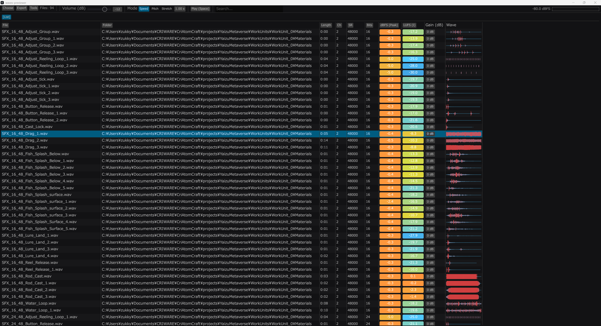
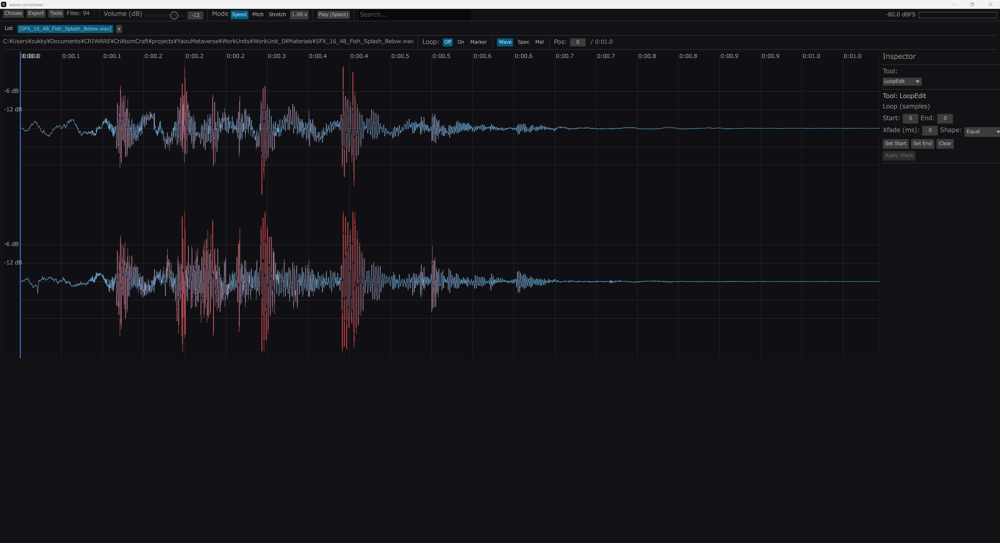

# NeoWaves Audio List Editor (NeoWaves)

NeoWaves は大量の音声ファイルを素早く一覧表示し、即試聴・編集できる軽量オーディオリストエディタです。UI は `eframe/egui`、オーディオ出力は `cpal` を使用しています。

対応フォーマット（デコード）:
- WAV / MP3 / M4A (isomp4) / AAC / ALAC

---

## Playback Principle

NeoWaves は「加工済み音は offline render、未加工の pristine WAV は即再生を優先」という hybrid 方針です。

- dry な physical WAV で、`Speed` モードかつ dirty state / preview overlay / SR override / bit-depth override / per-file gain が無い場合だけ、exact-stream transport を許可します。
- 上記 exact-stream では callback 側で許可する可聴処理は `source_sr / out_sr` に基づく rate 補正と master output volume のみです。
- Sample Rate 変換、PitchShift、TimeStretch、VST/CLAP preview/apply、per-file gain 反映、preview overlay、編集結果の再生はすべて full offline render 後の buffer だけを再生します。
- passive な list selection や loading UI は progressive でも構いませんが、sample が変わる経路では未完成波形をそのまま再生しません。
- callback 内 plugin / callback 内 pitch-time 処理 / callback 内 per-file gain / callback 内 sample-changing DSP は設計上禁止です。

---

## 主な機能

### リストビュー（高速）
- フォルダ/ファイルの読み込み（ドラッグ&ドロップ対応）
- 検索（Regex対応）、ソート、列の表示/非表示
- メタ情報の列表示: 長さ / チャンネル / SR / Bits / Bitrate / dBFS / LUFS / Gain / 波形
- Auto Play やキーボード操作で高速試聴

### エディタ（非破壊）
- Speed / PitchShift / TimeStretch
- Fade / Trim / Normalize / LoudNorm
- Sample Rate 変換（Apply まではメモリ上のみ）
- マーカー / ループ編集 / ループ解除（Unwrap）
- スペクトログラム / メルスペクトログラム表示

### 外部データ連携（CSV / Excel）
- CSV/Excel を読み込み、列をリストにマッピング
- シート選択、ヘッダ行/データ開始行の指定
- 正規表現キー + スコープで高速マッピング
- 未参照行の表示切り替え

### セッション保存（.nwsess）
- 作業状態（開いていたファイル、選択、編集状態など）を復元
- Ctrl+S: セッション保存
- Ctrl+Shift+S: セッション Save As
- Ctrl+E: 音声の Export
- `.nwsess` はダブルクリック/ドラッグ&ドロップ対応

---

## 画面イメージ



---

## 使い方（基本）

- **Folder... / Files...** から読み込み
- **ドラッグ&ドロップ** で追加読み込み
- **Space** で再生/停止
- **Enter** でエディタを開く

> 詳細な操作は `docs/CONTROLS.md` を参照してください。

---

## ビルド

```bash
git submodule update --init --recursive
cargo build
cargo run
```

### Windows ビルド前提
- Rust toolchain (`stable-x86_64-pc-windows-msvc`)
- Visual Studio 2022 Build Tools（MSVC C++ / Windows SDK）
- このプロジェクトは **MSVC 動的ランタイム (/MD)** 前提です（ONNX Runtime と整合させるため）

このリポジトリには `.cargo/config.toml` で `-Ctarget-feature=-crt-static` を固定しています。  
環境変数 `RUSTFLAGS` で `+crt-static` を上書きするとリンクエラーになります。

### Windows での典型エラー（LNK2038 RuntimeLibrary mismatch）
`MD_DynamicRelease` と `MT_StaticRelease` の不一致が出る場合は以下を確認してください。
1. `echo %RUSTFLAGS%`（PowerShell は `$env:RUSTFLAGS`）で `+crt-static` が入っていないこと
2. `cargo clean`
3. 再度 `cargo build --release`

`signalsmith-stretch` は git submodule として管理しています。  
初回 clone 後は `git submodule update --init --recursive` を実行してください。

### Installer (Windows)
```powershell
.\commands\build_installer.ps1
```

出力:
- `installer\\out\\installer_<buildid>\\NeoWaves-Setup-<version>-<buildid>.exe`

補足:
- `build_installer.ps1` は `ISCC` の `Resource update error ... EndUpdateResource failed (110)` を検知した場合、再試行します。
- 再試行中に失敗が続く場合は出力先を `%TEMP%` 配下へ切り替えて継続します（最終 `OutputDir` はログに表示）。

---

## CLI / 自動化

CLI 引数は `AGENTS.md` に最新一覧があります。
例:
```bash
cargo run -- --open-folder "C:\\path\\to\\wav" --open-first --screenshot screenshots\\shot.png --exit-after-screenshot
```

---

## MCP (stdio/http)

MCP サーバ機能を内蔵しています。起動方法・許可パスなどは README 内の MCP セクションまたは `AGENTS.md` を参照してください。

---

## Docs

全ドキュメント一覧:
- `docs/INDEX.md`

## Code Layout

- `src/main.rs` はネイティブ起動の入口だけを持ち、CLI 引数解析は `src/cli.rs` に分離しています。
- `src/app.rs` は app state / trait shell を持ち、起動時構築は `src/app/app_init.rs`、フレーム進行は `src/app/frame_ops.rs`、タブ起動は `src/app/tab_ops.rs`、editor decode orchestration は `src/app/editor_decode_ops.rs` に委譲しています。
- top bar UI は `src/app/ui/topbar/` 配下の `menus.rs` / `transport.rs` / `status.rs` に分割されています。
- list UI は `src/app/ui/list.rs` を orchestration に寄せ、フォーカス/キーボード制御とテーブル定義を `src/app/ui/list/navigation.rs` / `src/app/ui/list/table.rs` へ切り出しています。
- staged split を継続中の大物ファイルは `src/app/ui/editor.rs`、`src/app/ui/effect_graph.rs`、`src/app/effect_graph_ops.rs` です。局所性の高い backend 系は巨大関数を先に削りつつ段階分割します。

---

## ライセンス補足（Third-party）
- `signalsmith-stretch` は submodule で取り込み、上流ライセンスをそのまま保持しています。
- 参照先:
  - `vendor/signalsmith-stretch/LICENSE.md`
  - `vendor/signalsmith-stretch/signalsmith-stretch/LICENSE.txt`
