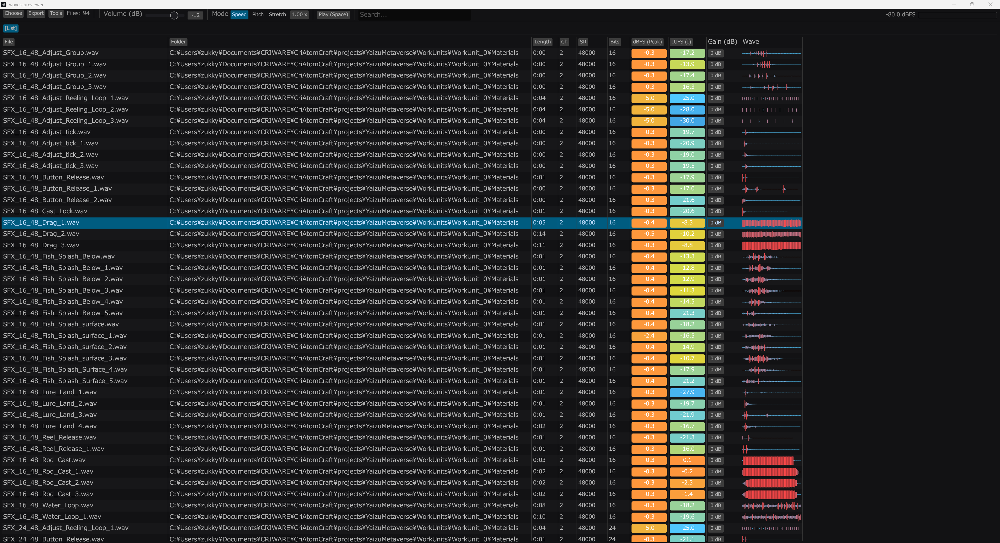
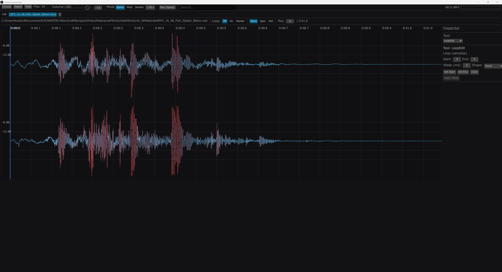

# NeoWaves Audio List Editor (NeoWaves)

NeoWaves は大量の音声ファイルを素早く一覧表示し、即試聴・編集できる軽量オーディオリストエディタです。UI は `eframe/egui`、オーディオ出力は `cpal` を使用しています。

対応フォーマット（デコード）:
- WAV / AIFF / FLAC / MP3 / M4A (ALAC / AAC) / OGG (Vorbis)
- 動画コンテナ MP4 / MOV / M4V / 3GP / 3G2 — **音声トラックを再生**。
  エディタでは Mini Meter に再生位置の映像フレームを表示する（読み込み専用）
- AAC は**自前のコーデックを同梱せず、OS のデコーダーを借りて**再生する。
  Windows では Media Foundation が担当し、mp4 / m4a の AAC 音声がそのまま鳴る。
  OS デコーダーが無い環境では従来どおり `AAC UNSUPPORTED` と表示し、
  映像は無音タイムラインで再生・シークできる。AAC の書き出しは全環境で非対応

対応フォーマット（エンコード / 書き出し）:
- WAV / AIFF / FLAC / MP3 / OGG (Vorbis)

フォーマットごとのメタ情報（loop marker / marker / BPM / artwork など）の対応状況は `docs/FORMAT_SUPPORT.md` を参照してください。

---

## Playback Principle

NeoWaves は「加工済み音は offline render、未加工の pristine WAV は即再生を優先」という hybrid 方針です。

- dry な physical WAV で、`Speed` モードかつ dirty state / preview overlay / SR override / bit-depth override / per-file gain が無い場合だけ、exact-stream transport を許可します。
- 上記 exact-stream では callback 側で許可する可聴処理は `source_sr / out_sr` に基づく rate 補正と master output volume のみです。ソース ch 数が出力 ch 数を超える場合のチャンネル折り畳み（余剰 ch の平均）と、エディタのチャンネル mute/solo（寄与 ch の選択。フォールドダウンは可聴 ch のみを平均）はマッピングであり DSP には含めません。
- Sample Rate 変換、PitchShift、TimeStretch、VST/CLAP preview/apply、per-file gain 反映、preview overlay、編集結果の再生はすべて full offline render 後の buffer だけを再生します。
- passive な list selection や loading UI は progressive でも構いませんが、sample が変わる経路では未完成波形をそのまま再生しません。
- callback 内 plugin / callback 内 pitch-time 処理 / callback 内 per-file gain / callback 内 sample-changing DSP は設計上禁止です。

---

## 主な機能

### リストビュー（高速）
- フォルダ/ファイルの読み込み（ドラッグ&ドロップ対応）
- 検索（Regex対応）、ソート、列の表示/非表示
- メタ情報の列表示: 長さ / チャンネル / SR / Bits / Bitrate / dBFS / LUFS / Gain / 波形
- Auto Play やキーボード操作で高速試聴

### 動画ファイル（読み込み専用）
- mp4 / mov などをリストに読み込み、音声トラックだけを再生
- エディタの Mini Meter に再生位置のフレームを表示（音と同期）
- サムネイルは埋め込みアートワーク優先、無ければ 1 フレーム目
- 映像エンコーダを持たないため、編集・書き出しは不可

### エディタ（非破壊）
- Speed / PitchShift / TimeStretch
- Fade / Trim / Normalize / LoudNorm
- Sample Rate 変換（Apply まではメモリ上のみ）
- マーカー / ループ編集 / ループ解除（Unwrap）
- スペクトログラム / メルスペクトログラム表示

### 外部データ連携（CSV / Excel）
- CSV/Excel を読み込み、列をリストにマッピング
- シート選択、ヘッダ行/データ開始行の指定
- 正規表現キー + スコープで高速マッピング
- 未参照行の表示切り替え

### セッション保存（.nwsess）
- 作業状態（開いていたファイル、選択、編集状態など）を復元
- Ctrl+S: セッション保存
- Ctrl+Shift+S: セッション Save As
- Ctrl+E: 音声の Export
- `.nwsess` はダブルクリック/ドラッグ&ドロップ対応

### ファイルサーバー上のセッションを複数人で使う
`.nwsess` を共有フォルダに置き、複数人・複数プロセス（GUI 2 台、GUI と `--cli`
バッチ）で扱えます。ロックは取りません。代わりに**保存時に競合を検知**します。

- **他人の保存を黙って上書きしません。** 読み込んだ時点と中身が変わっていたら
  保存を中止し、`Save As... / Overwrite / Reload / Cancel` を選べます。
  中止した時点では**何も書かれておらず**、手元の編集も失われません。
- **Overwrite を選んだ場合**、置き換える前の内容を `<name>.nwsess.bak` に残します。
- **他の人が保存したら気付けます。** トップバーに `⟳ changed on disk` を出し、
  誰がいつ保存したかを表示します。再読込は手動です（自動再読込は未保存の編集を
  捨ててしまうため行いません）。`File > Reload Session from Disk...`。
- **開くだけなら 1 バイトも書きません。** パス修復もメモリ上で行い、次の保存で
  反映します。
- **CLI も同じ保護を受けます。** 競合した場合は非ゼロ終了して中止します。
  意図的に上書きするときは `--force`（この場合も `.bak` を残します）。
- **共有に新規保存したセッションは相対パス**が既定です。`Z:\Proj` と
  `\\server\share\Proj` のようにマウントの仕方が人によって違っても解決できます。
- 保存者名は prefs.txt の `display_name=` で設定できます（未設定なら OS のユーザー名）。

詳細は `docs/NWPROJ_PLAN.md` の「Shared sessions」を参照してください。

### 前回開いてから参照ファイルが変わったかを知る
他人が wav を差し替えても `.nwsess` は 1 バイトも変わらないので、上の競合検知では
気付けません。**自分が前回このセッションを開いた時点**の状態を覚えておき、次に
開いたときに差分を知らせます。

- **2 段構えで見ます。** まず全件を `stat` して `(サイズ, 更新時刻)` を比べ、
  **食い違ったファイルだけ**内容ハッシュを取ります。10 万ファイルのリストでも
  コストは実際に変わった件数に比例します。
- **コピーし直しただけ（中身は同じ）は報告しません。** 更新時刻だけが動いた
  ファイルはハッシュが弾きます。これが 2 段目を置いている理由です。
- **削除・新規も報告します。** 音声ファイルに加えて、リストに結合している
  CSV/Excel も対象です。
- **初回は何も出ません。** 比較対象が無いセッションはベースラインを黙って作ります。
- **開いている間に起きた変更は再通知しません。** その場で記録し直すので、
  自分が見ていた変更を次回また知らされることはありません。
- 通知はトーストに加えて、トップバーに `⚠ N source files changed` を**行動するまで
  残します**。クリックで一覧（ファイル / 種別 / サイズ / 検知時刻）。
  `File > Changed Since Last Open...` からも開けます。**再読込は手動です。**

記録は**共有ファイルではなく個人のローカル**（`%LOCALAPPDATA%\NeoWaves\cache\`）に
置きます。セッション内に持たせると開くたびに全員が書き手になってしまうためです。

### セッションファイルの履歴
保存が既存のドキュメントを置き換えるたび、置き換えられた版を**個人ローカルに**
残します（1 セッションあたり 20 世代）。`File > Session History...` で revision /
保存者 / 保存時刻 / サイズが並びます。

- **Restore**: その版をセッションに書き戻します。**戻す直前の版も履歴に入る**ので、
  戻す操作自体をやり直せます。
- **Save As...**: その版を別ファイルに書き出します（今のセッションは触りません）。

個人ローカルなので他人の保存は自分の履歴には入りません。共有側の保険は従来どおり
`<name>.nwsess.bak` の 1 世代です。

---

## 画面イメージ



---

## 使い方（基本）

- **Folder... / Files...** から読み込み
- **ドラッグ&ドロップ** で追加読み込み
- **Space** で再生/停止
- **Enter** でエディタを開く

> 詳細な操作は `docs/CONTROLS.md` を参照してください。

---

## ビルド

```bash
git submodule update --init --recursive
cargo build
```

ビルド後の実行ファイル:

- `.\target\debug\neowaves.exe`
- `.\target\release\neowaves.exe`

### Windows ビルド前提
- Rust toolchain (`stable-x86_64-pc-windows-msvc`)
- Visual Studio 2022 Build Tools（MSVC C++ / Windows SDK）
- このプロジェクトは **MSVC 動的ランタイム (/MD)** 前提です（ONNX Runtime と整合させるため）

このリポジトリには `.cargo/config.toml` で `-Ctarget-feature=-crt-static` を固定しています。  
環境変数 `RUSTFLAGS` で `+crt-static` を上書きするとリンクエラーになります。

### Windows での典型エラー（LNK2038 RuntimeLibrary mismatch）
`MD_DynamicRelease` と `MT_StaticRelease` の不一致が出る場合は以下を確認してください。
1. `echo %RUSTFLAGS%`（PowerShell は `$env:RUSTFLAGS`）で `+crt-static` が入っていないこと
2. `cargo clean`
3. 再度 `cargo build --release`

`signalsmith-stretch` は git submodule として管理しています。  
初回 clone 後は `git submodule update --init --recursive` を実行してください。

### Installer (Windows)
```powershell
.\commands\build_installer.ps1
```

出力:
- `installer\\out\\installer_<buildid>\\NeoWaves-Setup-<version>-<buildid>.exe`

補足:
- インストーラー生成には NSIS を使います。事前に `choco install nsis`（または公式インストーラー）で `makensis.exe` を入れてください。見つからない場合は `-MakensisPath` で明示できます。
- スクリプト本体は `installer\\NeoWaves.nsi` です。Windows版`makensis.exe`で検証してください。
- スクリプトの最後に更新 smoke checklist を出します。既存版の上書きインストール、設定保持、関連付け、shell-open の確認に使ってください。

---

## CLI / 自動化

通常起動は GUI です。

```bash
neowaves.exe
neowaves.exe --open-folder "C:\\path\\to\\wav" --open-first
```

headless CLI は `--cli` で入ります。`stdout` は JSON、画像系は PNG を保存して絶対パスを返します。

```bash
neowaves.exe --cli --help
neowaves.exe --cli list query --folder "C:\\path\\to\\wav"
neowaves.exe --cli batch loudness plan --session ".\\work.nwsess" --query "_BGM" --target-lufs -24
neowaves.exe --cli item inspect --input ".\\debug\\gui_test_440.wav"
neowaves.exe --cli render waveform --input ".\\debug\\gui_test_440.wav" --output ".\\debug\\cli-renders\\wave.png"
neowaves.exe --cli effect-graph list
```

repo 内から直接使う場合:

```powershell
.\target\release\neowaves.exe --cli --help
```

CLI の仕様書:
- `docs/CLI_MASTER_PLAN.md`
- `docs/CLI_COMMAND_REFERENCE.md`
- `docs/CLI_MIGRATION_MATRIX.md`
- `docs/CLI_HELP_SPEC.md`

## Repo-Local Skills

repo には NeoWaves CLI を LLM と人間の両方で扱いやすくする repo-local skill を `.agents/skills/` 配下に同梱しています。

- `cli-session-workflow`
- `batch-loudness`
- `effect-graph-authoring`
- `loop-authoring`
- `list-query-review`
- `external-merge-review`
- `transcript-batch-generate`
- `music-analysis-markers`
- `plugin-draft-preview`
- `render-editor-review`
- `verify-loop-tags`
- `effect-graph-test`
- `plugin-search-paths`

これらの skill も `neowaves.exe` 前提で書かれており、詳細な command surface は `docs/CLI_COMMAND_REFERENCE.md` と `docs/CLI_AGENT_WORKFLOWS.md` を参照します。

---

## Docs

全ドキュメント一覧:
- `docs/INDEX.md`

## ライセンス

NeoWaves is released under the MIT License. See `LICENSE` for details.
If this software was useful to you, you have the right to buy the author a drink.

## Code Layout

- `src/main.rs` はネイティブ起動の入口だけを持ち、CLI 引数解析は `src/cli.rs` に分離しています。
- `src/app.rs` は app state / trait shell を持ち、起動時構築は `src/app/app_init.rs`、フレーム進行は `src/app/frame_ops.rs`、タブ起動は `src/app/tab_ops.rs`、editor decode orchestration は `src/app/editor_decode_ops.rs` に委譲しています。
- top bar UI は `src/app/ui/topbar/` 配下の `menus.rs` / `transport.rs` / `status.rs` に分割されています。
- list UI は `src/app/ui/list.rs` を orchestration に寄せ、フォーカス/キーボード制御とテーブル定義を `src/app/ui/list/navigation.rs` / `src/app/ui/list/table.rs` へ切り出しています。
- staged split を継続中の大物ファイルは `src/app/ui/editor.rs`、`src/app/ui/effect_graph.rs`、`src/app/effect_graph_ops.rs` です。局所性の高い backend 系は巨大関数を先に削りつつ段階分割します。

---

## ライセンス補足（Third-party）

アプリ内の **Help → Licenses...** に、依存している全 657 コンポーネントのライセンス全文と、
商用配布時に別途対応が要る項目の一覧を表示します。表示データは
`assets/licenses/third_party.json` にコミット済みのスナップショットで、ビルド時に
`include_str!` で埋め込まれます（ビルド時・実行時ともネットワーク不要）。

依存を追加・更新したら再生成してコミットしてください:

```powershell
git submodule update --init --recursive   # 初回のみ
cargo install cargo-about --locked --features cli
pwsh ./commands/generate_licenses.ps1
```

`cargo-about` は `about.toml` の `accepted` に無いライセンスを見つけると失敗します。
GPL 依存が紛れ込んだらリリースではなくここで止まる、という設計です。

- 生成対象外（crate ではないもの）は `assets/licenses/extra.json` に手書きで管理します。
  `-sys` crate が同梱ビルドする C/C++ ソース、インストーラが配る DLL、フォント、
  埋め込みデータ、実行時ダウンロードするモデル、Steinberg VST 3 の扱いなど。
- `signalsmith-stretch` は submodule で取り込み、上流ライセンスをそのまま保持しています。
  - `vendor/signalsmith-stretch/LICENSE.md`
  - `vendor/signalsmith-stretch/signalsmith-stretch/LICENSE.txt`

### 配布物のライセンス構成

NeoWaves 本体のソースは MIT です。MP3 書き出しに使う LAME 3.100 は
`libmp3lame.dll` として分離し、利用者が ABI 互換版へ差し替えられる動的リンク構成です。
最新の構成と全文ライセンスは Help → Licenses と、インストール先の
`THIRD_PARTY_NOTICES.txt` に表示されます。

| ビルド | 構成 | ライセンス上の位置づけ |
| --- | --- | --- |
| 既定 (`cargo build --release`) | MP3 書き出し・VST3・CLAP あり、AAC コーデック/OpenH264 の同梱なし | MIT アプリ＋動的 LGPL LAME。MPL-2.0 依存あり |
| LAME なし | `--no-default-features --features glow,plugin_native_vst3,plugin_native_clap` | MP3 書き出しなし。MPL-2.0 依存は残る |
| 映像プレビュー込み | `--features video` | 上記＋自前ビルド OpenH264（下記注意） |

**強い copyleft の GPL/AGPL アプリ依存は採用していません。** LGPL と MPL は
商用利用できますが、通知・差し替え・変更ファイル公開など、それぞれの条件は残ります。

### 過去の懸念と、その解消

| 対象 | 解消方法 |
| --- | --- |
| **Steinberg VST 3** | VST 3.8 (2025-10-29) で SDK が MIT に再ライセンスされ、旧来の GPLv3/proprietary 二択が消滅。`vst3` crate も Steinberg のソースを同梱していない。残るのは商標表記のみ（VST is a registered trademark of Steinberg Media Technologies GmbH） |
| **Cisco OpenH264** | `video` を既定 feature から除外。Cisco の特許料肩代わりは Cisco 配布バイナリ限定で、ソースからビルドすると義務が配布者に移るため。リリースする Windows インストーラでは Media Foundation が映像を担うので機能的損失はない。`--features video` でビルドしたバイナリを再配布する場合は AVC の義務が自分に来る点に注意 |
| **AAC** | FDK AAC 依存と Symphonia AAC decoder は依存グラフに入れない（feature でも入らない）。デコードは**同梱せず OS のデコーダーを借りる**方式にした。Windows では Media Foundation が AAC 音声を再生し、コーデックは OS の一部なので再配布物には含まれない（映像の H.264 / HEVC と同じ扱い）。OS デコーダーが無い環境では `AAC UNSUPPORTED` と表示し、映像は無音タイムラインで再生・シーク可能。AAC の書き出しは借りられるエンコーダーが無いため引き続き非対応 |
| **LAME (MP3 書き出し)** | `mp3_lame` feature は既定 ON。LAME を `libmp3lame.dll` として同梱し、EXE は import table 経由で動的リンク。LAME 3.100 同梱原文の LGPL-2.0 §6(b) に沿う共有ライブラリ構成。正確な 3.100 ソースは `vendor/lame-3.100` に固定 |
| **インストーラー生成ツール** | Inno Setup は配布物に同梱されないビルド専用ツールだが、公式が全商用ユーザーに商用ライセンス購入を要請しており、未購入のビルドは「非商用/テスト専用」扱いだった。zlib/libpng ライセンスで商用利用を無償許諾する **NSIS** へ置き換え、購入要請そのものを解消。LZMA モジュールの CPL-1.0 には作者によるリンク例外があるため生成物に義務は及ばない |

#### LGPL と商用販売について

よくある誤解ですが、**LGPL は商用販売時にも自分のソース公開を要求しません**。
そこが GPL との決定的な差で、LGPL はアプリ本体に感染しません。義務の対象は
「ライブラリ」と「利用者がそれを差し替えられること」だけです。

現在の構成でクローズドソース製品として販売する場合も、アプリ本体のソース公開は不要です。
ただし配布者は次を維持する必要があります:

1. `libmp3lame.dll` を EXE に取り込まず、差し替え可能な別ファイルで配る
2. LAME の利用告知・著作権表示・LGPL-2.0 全文と LAME 公式サイトへの案内を残す
3. 配布した DLL と一致する LAME ソース（変更分を含む）を必要期間提供する
4. LAME の差し替えをデバッグするための reverse engineering を禁止しない

NeoWaves の MIT 条項は 4 を妨げません。なお、ソフトウェアライセンスの遵守だけで
各国の特許その他の権利まで自動的に許諾されるわけではありません。これは技術的な
配布チェックであり、法的助言ではありません。

#### 同梱バイナリについて

Windows インストーラーが配るコーデック DLL は `libmp3lame.dll` です。ONNX Runtime、
Oniguruma、SQLite は従来どおり EXE 側にリンクされ、DirectML は Windows の
OS コンポーネントを呼ぶだけで再頒布しません。`LICENSE` と
`THIRD_PARTY_NOTICES.txt` もインストール先へコピーします。

インストーラー生成には [NSIS](https://nsis.sourceforge.io/License) を使用します。NSIS 本体は
配布物へ同梱されず、ビルド時にしか登場しません。NSIS は zlib/libpng ライセンスで、
**商用利用を含むあらゆる用途を無償で許諾**しています。購入要請はなく、謝辞も任意です。
LZMA 圧縮モジュールだけは CPL-1.0 ですが、作者による明示的なリンク例外があるため、
モジュール自体を改変しない限り生成物に義務は及びません。

つまり**インストーラー生成ツールに起因する商用リリースの前提条件はありません**。
鍵の購入も secret の登録も不要で、CI が出力するインストーラーはそのまま商用
production 成果物として扱えます。
