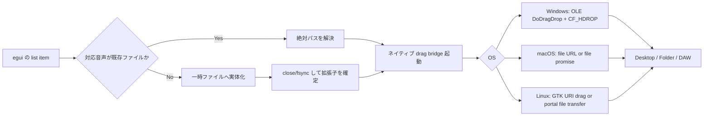

# Rust と egui で音声ファイルをデスクトップや DAW へドラッグ配置する実装調査レポート

## エグゼクティブサマリ

結論から言うと、**egui 単体では「アプリ外へファイルをドラッグして渡す」ための OS ネイティブなドラッグ開始 API は足りず、実装にはネイティブブリッジが必要**です。egui 自体は内部ドラッグ用の `DragAndDrop` ペイロード機構を持ち、さらに外部からアプリへ落とされたファイルを `DroppedFile` や `hovered_files` / `dropped_files` で受け取れますが、**外向きのファイルドラッグは winit/tao/OS API 側の責務**です。しかも `winit` では外向き drag-out が長年 open issue のままで、公式に「受け取り」はあっても「出す」は未整備です。したがって、実務では **egui を UI 層に保ちつつ、Windows は OLE/COM + `IDataObject`、macOS は AppKit の `NSDraggingItem` / `NSPasteboard` / `NSFilePromiseProvider`、Linux は GTK の drag source か portal を使う**構成が最も現実的です。citeturn38search19turn37search14turn30view0turn43view0turn42search0turn15search3turn26view0

要件に対して最も成功率が高い設計は、**「List item = 実在ファイル」なら絶対パスをそのままドラッグする**、**「List item = メモリ上の音声や遅延生成データ」ならドラッグ開始直前に一時ファイルへ実体化してからドラッグする**、という二段構えです。Windows の公式 Shell データ転送ガイドも、**既存ファイルは `CF_HDROP`、ファイル風の仮想データは `CFSTR_FILECONTENTS` / `CFSTR_FILEDESCRIPTOR`** を勧めていますが、DAW 互換性を最優先するなら **仮想ファイルより既存ファイルパスの提示が安全**です。macOS でも既存ファイルなら file URL が最も単純で、遅延生成が必要なときだけ file promise を使うのが筋です。Linux でも実務上は `text/uri-list` / GTK URI targets か、Flatpak 環境では portal 経由の file transfer が基本になります。citeturn15search4turn15search2turn23search10turn42search0turn42search4turn29search7turn26view0

DAW 側については、**公開されている主要 DAW の利用者向けドキュメントは、専用の DAW 間プロトコルではなく、Finder / Explorer / 外部ファイルブラウザから音声ファイルをドラッグして配置するワークフローを説明している**ケースが大半です。Logic Pro は Finder から Tracks area に音声ファイルをドラッグするとトラックを作成でき、Pro Tools は Edit Window の空き領域へドラッグすると新しい Audio Track が作成されます。Ableton Live、FL Studio、Cubase、REAPER も同様に外部ファイルブラウザ由来のファイルドラッグをサポートしています。**少なくとも公開資料上、AAF や Core Audio オブジェクトを live drag payload として扱う記述は見つからず、相互運用の中心は「OS 標準のファイルドラッグ」**とみなすのが妥当です。citeturn14search0turn14search5turn11search1turn13search0turn13search2turn11search4turn41view0

実装優先度としては、**最短の PoC は `egui` + ネイティブ drag bridge** です。そのうち **Windows / macOS は `drag` クレートの採用でかなり短く実装できる**一方、**Linux は `drag` クレートが GTK ベースで、純粋な `winit` 直結では使いにくい**ため、GTK ブリッジを追加するか、アプリ基盤を `tao/wry` 寄りに寄せる設計変更を検討した方が早いです。もし対象市場に Linux が含まれ、しかも Wayland や Flatpak を強く意識するなら、**Linux だけは GTK で drag source を持つ専用ブリッジ層を切る**のが実務的な落としどころです。citeturn32view0turn34view0turn30view1turn26view0turn26view1

## 技術的背景と設計上の結論

egui のドラッグ&ドロップは、まず **アプリ内でペイロードを持ち回る内部 DnD** と、**外部から落とされたファイルを受け取る受動的な DnD** に分けて考える必要があります。`egui::DragAndDrop` は内部ペイロードの保持・自動クリーンアップのための低レベル API であり、`egui_dnd` はこれを使ってリスト並べ替えを簡単にする補助クレートです。一方で、外部ファイル受け取りには `DroppedFile` や `hovered_files` / `dropped_files` が使えます。つまり egui は **「内部ドラッグ」や「外部からのドロップ受信」には強い**ものの、**Explorer/Finder/DAW へファイルを drag-out する送信元 API を完結には提供していません**。citeturn38search19turn38search4turn38search6turn37search14turn30view1

その下のウィンドウ層である `winit` / `tao` も、現状の重点は **ウィンドウ生成・イベントループ・受信イベント** にあります。`winit` と `tao` には `DroppedFile`、`HoveredFile`、`HoveredFileCancelled` があり、**アプリが drop target になる機能**はあります。しかし `winit` の issue では、**「dropping はあるが dragging out of a window はない」**ことが明言されており、外向き DnD は公式に埋まっていない穴だと分かります。したがって、egui 上の行を外へドラッグしたい場合、**OS API を直接たたくか、その橋渡しクレートを使う**しかありません。citeturn37search1turn37search0turn30view0turn45view2

この穴を埋める現実的な候補が `drag` クレートです。現行ドキュメントでは、`drag` は **macOS / Windows / Linux(GTK 経由)** で「window の外へ drag operation を開始」でき、`tao` / `winit` / `wry` / `tauri` のウィンドウでテスト済みとされています。ただし Linux では **GTK ベース実装のため、純粋な `winit` 単独では現状うまく活用できない**ことが明記されています。この一点が、`egui + eframe/winit` で全部を通そうとしたときの最大の実務障壁です。citeturn32view0turn34view0

設計上の最重要ポイントは、**DAW 互換の良い drag payload は「その場で読み出せる音声ファイル」**だということです。Windows の Shell Data Transfer ドキュメントは既存ファイルなら `CF_HDROP` を、仮想的なファイル風データなら `CFSTR_FILECONTENTS` / `CFSTR_FILEDESCRIPTOR` を使うよう整理しています。major DAW の公開マニュアルも、Finder / Explorer / 外部ファイルブラウザから「音声ファイル」をドラッグする操作を記述しています。したがって、**wav / mp3 / m4a 等をメモリだけで渡そうとするより、まず実ファイルに落とす方が DAW 互換性は高い**、というのがこの調査の中核結論です。これは OS ネイティブ API と DAW 利用者向け公式マニュアルの両方から裏づけられます。citeturn15search4turn15search2turn14search0turn11search1turn13search0turn13search2turn41view0



このフローは、Windows の `DoDragDrop` / `IDataObject`、macOS の `NSDraggingItem` / `NSPasteboard` / `NSFilePromiseProvider`、Linux の GTK drag API / XDG portal の役割分担を整理したものです。特に Linux sandbox 環境では portal が「drag-and-drop or copy-paste のファイル転送の仲介」を担います。citeturn43view0turn42search6turn42search0turn26view0turn29search4

## 実装候補の比較

まず、今回の要件に対する実装候補を実務目線で比較すると、以下のようになります。表中の「DAW 互換性」は、**Desktop / Folder / Finder / Explorer / DAW から見て、普通のファイルドラッグとして解釈されやすいか**を基準にしています。citeturn15search4turn14search0turn11search1turn13search0turn13search2turn41view0

| 実装候補 | 概要 | OS 対応 | 利点 | 欠点 | 推奨度 |
|---|---|---|---|---|---|
| **egui 内部 DnD のみ** | `egui::DragAndDrop` / `egui_dnd` で内部ペイロードや並べ替えだけ実装。citeturn38search19turn38search4 | Win / macOS / Linux のアプリ内操作 | 実装が最短。List 並べ替えには最適。 | Desktop / Folder / DAW へは出せない。 | **低** |
| **egui + `drag` クレート** | `drag::start_drag` で外向きファイルドラッグ。`DragItem::Files` を使う。citeturn32view0turn34view0 | Win / macOS / Linux(GTK)。ただし Linux 純 `winit` は難あり。citeturn32view0 | Windows/macOS の PoC が非常に速い。Rust から扱いやすい。 | Linux/Wayland/Flatpak を詰めると結局 GTK/portal を理解する必要がある。 | **高** |
| **egui + 自前ネイティブブリッジ** | Windows OLE、macOS AppKit、Linux GTK/portal をそれぞれ実装。citeturn43view0turn42search6turn26view0 | 3 OS で最も柔軟 | DAW 互換性を最大化できる。ファイル promises / virtual files も制御しやすい。 | 工数最大。FFI・イベント統合・保守コストが高い。 | **高** |
| **`tao/wry/tauri` へ基盤を寄せる** | drag-rs / plugin を使いやすい土台に寄せる。citeturn34view0turn19search2turn45view2 | Win / macOS / Linux | drag 実装の定石が増える。WebView 混在アプリには相性が良い。 | 既存 eframe/eframe-glow/wgpu 構成からの移行コスト。 | **中** |
| **Linux だけ GTK 補助プロセス or ブリッジ** | egui 本体は維持し、Linux だけ GTK drag source を持つ補助層を追加。citeturn29search7turn26view0 | 主に Linux | 既存 egui 資産を残しつつ Linux を救える。 | アーキテクチャが二重化しやすい。 | **中〜高** |

Rust 周辺クレートの比較は次の通りです。ライセンス欄は、**今回の調査で公開ページから明示確認できたもののみ記載**し、確認できなかったものは「要確認」としています。citeturn32view0turn45view3turn19search16

| クレート / 層 | 主用途 | 外向きファイル DnD | OS 対応 | 実装難易度 | ライセンス | コメント |
|---|---|---|---|---|---|---|
| `egui` | 内部 DnD、外部 drop 受信、即時 GUI。citeturn38search19turn37search14 | **なし** | Cross-platform | 低 | 要確認 | UI 層としては最適だが drag-out は別層が必要。 |
| `egui_extras` | `TableBuilder` など一覧・表 UI。citeturn38search3turn38search1 | **なし** | Cross-platform | 低 | 要確認 | List item/row の見た目には便利。 |
| `egui_dnd` | 内部並べ替えヘルパ。citeturn38search4turn38search6 | **なし** | Cross-platform | 低 | 要確認 | 外部 drag ではなく内部 reorder 用。 |
| `winit` | ウィンドウ・イベントループ。`DroppedFile` 等あり。citeturn37search1turn30view0 | **未整備** | Cross-platform | 中 | 要確認 | 受信はあるが送信は open issue。 |
| `tao` / `wry` | ウィンドウ / WebView 基盤。citeturn45view2turn19search2 | 単独では限定的。`drag` と組み合わせやすい。citeturn34view0 | Cross-platform | 中 | `wry`: Apache-2.0 OR MIT。`tao`: 要確認。citeturn19search16 | drag-rs との相性が良い。 |
| `drag` | 外向き drag source 実装。`DragItem::Files` 対応。citeturn32view0turn34view0 | **あり** | Win / macOS / Linux(GTK) | 低〜中 | Apache-2.0 OR MIT。citeturn32view0turn31search3 | 今回の最短 PoC 候補。 |
| `gtk-rs` | Linux のネイティブ DnD / portal 追従。citeturn45view1turn29search4turn29search7 | **あり** | Linux 中心 | 中〜高 | 要確認 | Linux を確実にやるなら最重要。 |
| `arboard` | クリップボード API。citeturn45view4turn18view1 | **なし** | Win / macOS / Linux | 低 | 要確認 | drag-out ではなく clipboard 用。 |
| `copypasta` | クリップボード API。Wayland clipboard 追加。citeturn45view3 | **なし** | Cross-platform | 低 | MIT + Apache2。citeturn45view3 | drag 代替にはならない。 |
| `rfd` | ネイティブ file dialog。citeturn45view0 | **なし** | Win / macOS / Linux / BSD / wasm | 低 | 要確認 | drag 不可環境のフォールバックには有用。 |
| `druid` | Rust GUI toolkit。 | drag/drop は未成熟。citeturn36view0 | Cross-platform | 中 | 要確認 | 今回の用途で積極採用する理由は薄い。 |

実務判断としては、**“既存ファイルをそのままドラッグできる” なら `drag` + 最小ネイティブ補強**、**“生成ファイル・仮想ファイル・Linux/Flatpak/Waylandまで本気で詰める” なら自前ネイティブブリッジ**が妥当です。`arboard` / `copypasta` / `rfd` は補助にはなりますが、本件の本丸ではありません。citeturn32view0turn26view0turn45view0turn45view3turn45view4

## OSごとの実装手順

共通の実装手順は、**egui 側でドラッグ開始ジェスチャを検出し、対象 item から「実際に渡すファイルパス」を確定し、それを OS drag source に渡す**という流れです。List item が既存ファイルなら `canonicalize` 済みの絶対パスを使い、生成音声なら安全な一時ディレクトリ配下へ書き出してから渡します。`std::env::temp_dir` は共有・予測可能な名前の危険性があるため、**固定名ではなく `tempfile` や一意名ディレクトリを使う**べきです。citeturn32view0turn39search0turn39search1turn39search7

**Windows**  
Windows では、標準的な drag-out は **`OleInitialize` → `DoDragDrop` → `IDataObject` / `IDropSource`** です。`DoDragDrop` は `IDataObject` を受け取り、`IDropTarget` と対話しながらドラッグを進めます。既存ファイルを渡す最も互換性の高い形式は **`CF_HDROP`** で、データ本体は `DROPFILES` 構造体 + ダブル NUL 終端のファイル名列です。Shell の公式ガイドも、既存ファイルには `CF_HDROP` を使うべきだと整理しています。メモリ上の仮想ファイルを遅延提供したいなら `CFSTR_FILEDESCRIPTOR` / `CFSTR_FILECONTENTS` もありますが、DAW 互換性優先ならまず避けるべきです。さらに `winit` の Windows drag-and-drop は COM apartment の相性問題を持つため、**UI スレッドの COM 初期化方針を最初に決めておく**必要があります。citeturn43view0turn15search2turn23search10turn15search4turn18view4

以下は、`CF_HDROP` 用の `HGLOBAL` を組み立てる最小スケルトンです。この戻り値を `IDataObject::GetData` で `STGMEDIUM.hGlobal` として返す形にします。`fWide = TRUE` により UTF-16 を明示するので、**非 ASCII ファイル名**の最低限の互換性を確保できます。`DoDragDrop` 自体の完全実装は長いためここでは省略しますが、**一番面倒なパートは `IDataObject` 実装よりも、正しい `CF_HDROP` バッファ生成**です。citeturn23search10turn43view0

```rust
#[cfg(target_os = "windows")]
use std::{mem::size_of, os::windows::ffi::OsStrExt, path::PathBuf, ptr::copy_nonoverlapping};

#[cfg(target_os = "windows")]
use windows::core::Result;

#[cfg(target_os = "windows")]
use windows::Win32::{
    Foundation::{BOOL, HGLOBAL},
    System::Memory::{GlobalAlloc, GlobalLock, GlobalUnlock, GMEM_MOVEABLE, GMEM_ZEROINIT},
    UI::Shell::DROPFILES,
};

#[cfg(target_os = "windows")]
fn build_cf_hdrop(paths: &[PathBuf]) -> Result<HGLOBAL> {
    let mut utf16: Vec<u16> = Vec::new();

    for path in paths {
        utf16.extend(path.as_os_str().encode_wide());
        utf16.push(0); // path terminator
    }
    utf16.push(0); // double-NUL terminator for CF_HDROP list

    let bytes_len = utf16.len() * std::mem::size_of::<u16>();
    let total_len = size_of::<DROPFILES>() + bytes_len;

    unsafe {
        let hglobal = GlobalAlloc(GMEM_MOVEABLE | GMEM_ZEROINIT, total_len);
        let base = GlobalLock(hglobal) as *mut u8;

        let dropfiles = base as *mut DROPFILES;
        (*dropfiles).pFiles = size_of::<DROPFILES>() as u32;
        (*dropfiles).fWide = BOOL(1);

        let dst = base.add(size_of::<DROPFILES>()) as *mut u16;
        copy_nonoverlapping(utf16.as_ptr(), dst, utf16.len());

        GlobalUnlock(hglobal);
        Ok(hglobal)
    }
}
```

Windows での実務上の推奨は明快です。**Desktop / Explorer / DAW 向けは `CF_HDROP`、動的生成やクラウド裏側のデータは必要になって初めて virtual files**に進む、という順序が安全です。音声プレビュー画像やカーソル表示より、**「Drop 時点でファイルが閉じられていて、対象アプリが再オープンできること」**の方がはるかに重要です。citeturn15search4turn43view0turn39search4

**macOS**  
macOS では AppKit の drag-and-drop を使います。基本線は **`NSDraggingItem` + `NSPasteboardWriting`** で、既存ファイルを渡すなら **file URL (`NSURL`) を pasteboard writer として使う**のがもっとも単純です。遅延生成が必要な場合は **`NSFilePromiseProvider`** を使い、destination が promise を fulfill するタイミングでファイルを書き出します。Apple のドキュメントでも、`NSFilePromiseProvider` は drag-and-drop で file promises を作るためのクラスで、1 promised file ごとに 1 インスタンスを作るよう説明されています。さらに `fileType` は UTI 文字列で、delegate の `fileNameForType` は最終ファイル名を返すために呼ばれます。citeturn16search1turn16search3turn42search0turn42search2turn42search4turn42search13turn42search16

実務的には、**Finder や DAW 互換を重視するなら macOS でもまずは「実在 file URL」優先**です。file promise は美しいですが、受け側によっては file URL より相性がぶれる可能性があります。公開されている主要 DAW のマニュアルも Finder からの音声ファイルドラッグを説明しているため、**最小驚きの挙動は “普通のファイルをドラッグする” こと**です。これは特に Logic Pro を相手にする macOS では重要です。citeturn14search0turn14search5turn11search1turn42search6

macOS で lazy generation が必要ないなら、PoC では `drag` クレートを使う方が圧倒的に短くなります。`drag` は現行版で `objc2` / `objc2-app-kit` に依存し、macOS / Windows では raw window handle を受け取る設計になっています。したがって、**macOS 向けの最短コードは自前 AppKit FFI より `drag::start_drag`**です。citeturn32view0

```rust
use std::path::PathBuf;

fn start_drag_with_drag_crate<W: raw_window_handle::HasWindowHandle>(
    window: &W,
    audio_file: PathBuf,
) -> anyhow::Result<()> {
    let item = drag::DragItem::Files(vec![std::fs::canonicalize(audio_file)?]);
    let preview = drag::Image::Raw(include_bytes!("../assets/audio_drag_icon.png").to_vec());

    drag::start_drag(
        window,
        item,
        preview,
        |_result, _cursor_position| {
            // 必要なら成功/失敗をログ
        },
        drag::Options::default(),
    )?;

    Ok(())
}
```

なお、App Sandbox を有効にした配布では、**永続的なファイルアクセスには security-scoped bookmark / URL access が必要**です。外部配布アプリは Gatekeeper の既定設定下で **Developer ID 署名 + notarization** が前提になります。ドラッグ&ドロップそのもののための特殊 entitlement は必須ではありませんが、**ファイルの長期保存、再オープン、ユーザーが選んだ外部場所への継続アクセス**は sandbox 設計に直結します。citeturn25search1turn25search5turn25search9turn25search13turn25search0turn25search6turn25search10

**Linux**  
Linux は最も癖があります。非 sandbox の X11 / Wayland デスクトップでは、実質的には **URI ベースのファイルドラッグ**が共通土台で、GTK 3 なら `gtk_drag_source_add_uri_targets()` / `gtk_drag_dest_add_uri_targets()`、GTK 4 なら `GtkDragSource` / `GtkDropTarget` ベース API に移行しています。GTK 4 の migration guide は source-side DnD を `GtkDragSource` に切り替えるよう案内しており、GTK 3 の widget docs には URI targets を drag source / drag destination に設定する API が残っています。**X11 生の XDND や Wayland 生の `wl_data_source` を直接叩くのは Rust 側実装コストが高い**ので、実務では GTK 抽象化を使うのが現実的です。citeturn29search4turn15search3turn29search7turn27search0turn29search0

Linux 無しで済まないもう一つの論点が **Flatpak / portal** です。XDG Desktop Portal の FileTransfer portal は、**drag-and-drop や copy-paste によるファイル転送の仲介**を担い、`application/vnd.portal.filetransfer` MIME と document portal でファイルを安全にエクスポートします。Flatpak docs でも、GTK や Qt のような toolkit は portal を透過的に使うと説明しています。つまり、**Linux/Wayland/Flatpak を本気でやると、“GTK を使うか、自前で portal をしゃべるか” の二択**になります。egui / winit 単独のまま綺麗に片づけるのは難しいです。citeturn26view0turn26view1turn26view2turn25search11

GTK 3 を使う最小スニペットのイメージは次のようになります。これは **既存ファイルを `file://` URI として提供する drag source** の骨格です。X11/Wayland を自前で分岐する代わりに、GTK にホスト環境とのネゴシエーションを任せます。citeturn29search7turn15search5

```rust
#[cfg(target_os = "linux")]
fn install_uri_drag_source(widget: &gtk::Widget, path: std::path::PathBuf) {
    use gtk::prelude::*;

    widget.drag_source_set(
        gdk::ModifierType::BUTTON1_MASK,
        &[],
        gdk::DragAction::COPY,
    );
    widget.drag_source_add_uri_targets();

    widget.connect_drag_data_get(move |_widget, _ctx, selection_data, _info, _time| {
        let uri = glib::filename_to_uri(&path, None).expect("valid file URI");
        selection_data.set_uris(&[uri.as_str()]);
    });
}
```

Linux での実務判断を一言でまとめると、**“純粋な egui/eframe/winit だけで 3 環境を通す” より、“Linux だけ GTK drag bridge を足す” 方が早い**です。とくに `drag` クレート自身が Linux では GTK ベースで、純 `winit` とは相性制約があると明示しているため、この結論はかなり強いです。citeturn32view0turn34view0

## DAW互換性とテスト計画

今回の調査で最も重要だったのは、**DAW 互換性の正体は「DAW 独自プロトコル」より「OS 標準のファイルドラッグ」をどれだけ誤差なく再現できるか**だという点です。Logic Pro は Finder から Tracks area に音声ファイルをドラッグするとトラック作成ができ、Pro Tools は Edit Window の空き領域へドラッグすると新しい Audio Track を作成できます。Ableton Live は Explorer/Finder から直接 drop でき、FL Studio は external File Browser から Playlist へ drop できます。Cubase も File Explorer / Finder からの drag を複数機能で案内しており、REAPER も Arrange view / project import に drag-dropping を前提とした更新履歴が公開されています。**公開ドキュメントを読む限り、受け側は「音声ファイルを表す OS レベルの drag payload」を期待している**と考えるのが自然です。citeturn14search0turn14search5turn11search1turn13search0turn13search2turn11search4turn41view0

そのため、**AAF や Core Audio オブジェクトを live drag payload として直接渡す設計は推奨しません**。AAF は少なくとも Logic の supported import formats 文脈では「サポート対象のメディア/プロジェクト形式」として現れますが、主要 DAW の drag-and-drop 説明は別途「音声ファイルを Finder/Explorer からドラッグ」と書いています。今回の調査範囲では、**主要 DAW の公開文書に “外部アプリから DAW タイムラインへ配置する専用 drag protocol” を示す開発者向け説明は見当たりませんでした**。したがって、実装方針としては **AAF ではなく普通の `.wav` / `.mp3` / `.m4a` ファイルのドラッグ**が正道です。citeturn14search14turn14search0turn11search1turn13search0turn13search2

推奨テスト計画は次の通りです。まず **REAPER** を一次検証先にします。REAPER は Windows / macOS / Linux の配布があり、公開 changelog からも drag-import の改善が確認できます。ここで **Desktop / Folder へのコピー**と、**Arrange view へのドロップ**を通せれば、OS 橋渡しの根幹がほぼ検証できます。次に macOS では **Logic Pro**、Windows/macOS では **Pro Tools** か **Ableton Live** を spot check し、最後に市場要件に応じて **Cubase / FL Studio** を加えるのがコスト対効果の良い順序です。citeturn41view0turn14search0turn11search1turn13search0turn13search2

期待動作は DAW ごとに少し違います。**Logic Pro** は drop 先が Tracks area 下部なら「新規トラック作成」に寄り、**Pro Tools** は Edit Window の空き領域へ落とすと「新しい Audio Track を作る」挙動が明確です。**FL Studio** は Playlist と Channel Rack で意味が変わり、**Cubase** も drop 先によってインポート先が変わります。したがって QA では、**“DAW がファイルを受理したか” と “どこに落とすとどう配置されるか” を分けて確認**すべきです。今回の要件における成功条件は、厳密には「同一のペイロードが各 DAW の想定 drop zone で受理されること」です。citeturn14search0turn11search1turn13search2turn11search4

トラブルシュートの優先順位は、**パスの存在確認、拡張子と実エンコードの一致、ファイルハンドルのクローズ、一時ファイル寿命、絶対パス化、UTF-8/UTF-16 名称、sandbox/portal 状況**の順が良いです。特に一時ファイルは `NamedTempFile` を drop 直後に破棄すると、DAW が後続で再オープンするときに失敗し得ます。**“ユーザーが drop した瞬間に消す” のではなく、最低でもドラッグ完了コールバック後、できれば短い保持期間付きで掃除**するのが安全です。citeturn39search1turn39search4turn39search7turn26view0

## 推奨アーキテクチャと最短PoC

推奨アーキテクチャは、**UI は egui、外向き DnD は OS bridge、音声データは “まずファイル化”**の三層です。内部的には次の責務分離にすると保守しやすくなります。`AudioItem` は “表示名・元ファイル・必要なら exporter” を持ち、`DragPreparationService` が “既存ファイルか一時書き出しか” を解決し、`NativeDragBridge` が OS ごとのドラッグ開始を担います。QA や DAW 互換問題はほぼ `NativeDragBridge` と `DragPreparationService` に閉じ込められ、egui の Draw code と分離できます。citeturn32view0turn15search4turn42search0turn26view0

最短 PoC に限れば、**Windows / macOS は `drag` クレートを前提にした `egui-winit` ベース**が最も動かしやすいです。Linux は同じコードパスで済まない可能性が高いので、PoC を 2 段階に切るのが賢明です。まず Windows / macOS で `DragItem::Files` を通し、そのあと Linux だけ GTK ブリッジ版を追加する方が、最初から 3 OS 共通化を狙うより成功率が高いです。`drag` の公式サンプルも `canonicalize` 済みパスを前提にしています。citeturn32view0turn34view0

以下は、**List item が既存ファイルを指すケース**の最短 PoC スケルトンです。`egui_extras::TableBuilder` でも普通の `ui.selectable_label` でもよく、重要なのは **`response.drag_started()` をトリガに、UI フレームの外でネイティブ drag を一回だけ起動する**ことです。コードは概念図ではなく、`drag` クレートの現行 API 形状に寄せています。Linux については `gtk_window()` が取れる基盤 (`tao` など) を持つ場合のみこのまま使えます。citeturn32view0turn38search1turn38search3

```rust
use std::path::PathBuf;

#[derive(Clone)]
struct AudioItem {
    display_name: String,
    file_path: PathBuf, // 既存ファイルを前提
}

struct AppState {
    items: Vec<AudioItem>,
    pending_drag: Option<usize>,
}

impl AppState {
    fn ui(&mut self, ui: &mut egui::Ui) {
        for (idx, item) in self.items.iter().enumerate() {
            let resp = ui.selectable_label(false, &item.display_name);
            if resp.drag_started() {
                self.pending_drag = Some(idx);
            }
        }
    }

    /// egui の UI 更新後など、1 回だけ呼ぶ想定
    fn flush_native_drag<W>(&mut self, window: &W) -> anyhow::Result<()>
    where
        W: raw_window_handle::HasWindowHandle,
    {
        let Some(idx) = self.pending_drag.take() else { return Ok(()); };
        let path = std::fs::canonicalize(&self.items[idx].file_path)?;

        let item = drag::DragItem::Files(vec![path]);
        let preview = drag::Image::Raw(include_bytes!("../assets/audio_drag_icon.png").to_vec());

        drag::start_drag(
            window,
            item,
            preview,
            |_result, _cursor| {
                // ドラッグ終了をログしたいならここで扱う
            },
            drag::Options::default(),
        )?;

        Ok(())
    }
}
```

生成音声やリサンプル結果をドラッグしたい場合は、`file_path` の代わりに exporter を持たせます。重要なのは、**ドラッグ開始前に 확実にファイルを書き切り、ハンドルを閉じ、拡張子を正しく付ける**ことです。`.wav` / `.mp3` / `.m4a` のような拡張子は、DAW の受理可否や import 挙動に直結するため、MIME 推測だけに頼らず **実ファイルのコンテナ/コーデックと拡張子を必ず一致**させるべきです。MIME 推定クレートは補助になりますが、Linux の drag transport 自体は `text/uri-list` や portal MIME が主であり、最終的に見られるのはファイルとしての実体です。citeturn39search2turn39search8turn29search7turn26view0

```rust
use tempfile::TempDir;

struct ExportableAudioItem {
    display_name: String,
    extension: &'static str, // "wav" / "mp3" / "m4a"
    export_fn: std::sync::Arc<dyn Fn(&std::path::Path) -> anyhow::Result<()> + Send + Sync>,
}

struct PreparedDrag {
    keepalive_dir: TempDir,      // ドラッグ後もしばらく生存させる
    file_path: std::path::PathBuf,
}

fn materialize_temp_file(item: &ExportableAudioItem) -> anyhow::Result<PreparedDrag> {
    let dir = tempfile::tempdir()?;
    let path = dir.path().join(format!("{}.{}", sanitize(&item.display_name), item.extension));

    (item.export_fn)(&path)?;

    // ここで必要ならメタデータ/長さ/存在確認などを行う
    anyhow::ensure!(path.exists(), "exported file does not exist");

    Ok(PreparedDrag {
        keepalive_dir: dir,
        file_path: path,
    })
}

fn sanitize(name: &str) -> String {
    name.chars()
        .map(|c| match c {
            '/' | '\\' | ':' | '*' | '?' | '"' | '<' | '>' | '|' => '_',
            _ => c,
        })
        .collect()
}
```

この PoC をそのまま `eframe` で使う場合、**ネイティブウィンドウハンドルをどこで保持するか**が設計論点になります。今回の調査では、外向き DnD 実装に必要な raw window handle を public `eframe::App` API から直接扱う明快な導線は見つけにくく、`eframe` が内部で `egui-winit` / `winit` を使っていることは確認できました。したがって、**PoC では `egui-winit` ベースでネイティブウィンドウを自前保持する**か、既存 `eframe` アプリに薄い bootstrap 層を足してウィンドウ参照を保存する方が安全です。citeturn44view1turn32view0

## 落とし穴と制約

最も多い失敗は、**一時ファイルの寿命が短すぎる**ことです。`tempfile` は便利ですが、`NamedTempFile` は path 再オープンの文脈で temp cleaner との競合や unlink 再生成のリスクが説明されています。DAW は drop 直後にすぐ全バイトを読み切るとは限らないため、**ドラッグが終わった瞬間に削除する設計は危険**です。実務では、`TempDir` ごと keep-alive し、一定時間後やアプリ再起動時の sweeper で掃除する方が良いです。citeturn39search1turn39search4turn39search7

次に多いのは、**MIME/UTI と実ファイルの不一致**です。Windows の `CF_HDROP` は実質パスだけなので拡張子が重要ですし、macOS の file promise は `fileType` に UTI を設定します。Linux/portal ではドラッグ輸送層と音声ファイル種別の MIME が別れるので、なおさら「最終ファイルの拡張子と中身」を正しく合わせる必要があります。曖昧な場合は、推測 MIME を UI 表示やフィルタ補助に使ってもよいですが、**ドラッグに渡すファイル名・拡張子の正しさを優先**してください。citeturn42search16turn39search2turn26view0turn15search2

**非 ASCII ファイル名**と**長いパス**も要注意です。Windows では `DROPFILES` の `fWide` を立てて UTF-16 を使うのが最低条件です。長いパスについてはツールキットや受け側の実装差があり、`winit` でも Windows の `DroppedFile` / `HoveredFile` に対して長いパス対応の変更履歴があります。**自分の送信側が Unicode/wide path を正しく作っても、DAW 側の処理差は残る**ので、非 ASCII 名・長いパス・深いディレクトリを含む QA は必須です。citeturn23search10turn37search7

権限・配布面では、**Windows は特殊な権限不要、macOS は配布時の署名・notarization、Linux Flatpak は portal 前提**と考えると整理しやすいです。macOS sandbox では永続アクセスに security-scoped bookmark が絡み、Linux Flatpak ではホストファイルへの直接アクセス自体が制約されます。つまり「開発機では動いたが、配布形態で壊れる」パターンは非常に起きやすく、**デバッグビルドだけでなく、最終配布形態での drag テスト**が必須です。citeturn25search0turn25search6turn25search10turn25search1turn25search9turn26view2turn26view0

最後に、この調査の制約を明示しておきます。**公開されている主要 DAW の資料は、利用者向けの drag 操作説明は豊富ですが、受信側の低レベル payload 仕様までは開示していないことが多い**ため、DAW 受信方式の結論は **OS 公式 DnD 仕様 + DAW 公開マニュアルの組み合わせから導いた高信頼の推定**です。とはいえ、Logic / Pro Tools / Live / FL Studio / Cubase / REAPER いずれも「外部ファイルをドラッグして配置する」文脈を公式に持っている以上、**最も互換性の高い戦略が “普通の音声ファイルを OS 標準手順でドラッグする” こと**だという結論は、現時点で十分に実務的です。citeturn14search0turn11search1turn13search0turn13search2turn11search4turn41view0