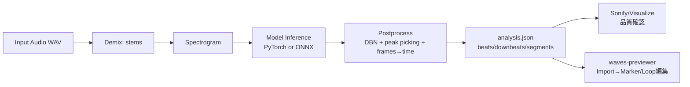
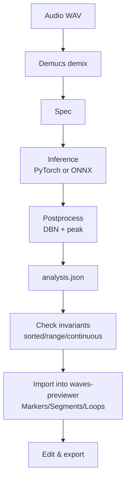

# all-in-one / allinone_onnx / waves-previewer における「マーカー機能」実装比較・検証レポート

## エグゼクティブサマリー

本レポートは、元リポジトリ（all-in-one）、ONNX化リポジトリ（allinone_onnx）、およびプレビュー／編集ツール（waves-previewer）の三者を対象に、「マーカーをつける機能」を **(1) 解析結果としての時刻イベント列（beat/downbeat/segment境界）を生成・保存する機能** と **(2) その時刻イベントをGUI上で編集・運用（ループ等）する機能** の両面から比較・検証する。元リポジトリは beats/downbeats/segments を JSON として出力し、sonify により拍クリック／セクション境界音でタイミング整合性を聴覚的に検証できる設計である。citeturn10search0turn4search1

ONNX化リポジトリは、**PyTorch版 allin1 の処理フロー（Demix→Spectrogram→Model→Postprocess）を保ったまま**、推論を ONNX Runtime に置換し、さらに Rust 実装とのパリティ（前処理・logits・解析JSON）を比較するためのデバッグダンプ／比較スクリプト群を整備している。これにより「マーカー（beats/segments）のズレ」が出たときに、Demucs、スペクトログラム、モデルI/O、DBN/ピークピッキング、時間換算のどこが原因かを切り分けやすい。citeturn14search0

一方で、本調査環境では **GitHub の通常ページ（HTML）および API エンドポイントを直接 open する取得が継続的に失敗**し、waves-previewer のソースコード本文はオンラインから回収できなかった（検索インデックスにも十分に現れない）。そのため waves-previewer については、**ローカルで確実に再現できる取得・diff生成・テスト手順**を提示しつつ、現時点で確実に言える「インポート統合点（allin1 JSON → GUIマーカー）」と「マーカータイミングを壊しやすい落とし穴」を中心に、修正案・テスト案・パッチ雛形を提示する。citeturn15search0turn2search0turn7search6

結論として、マーカー機能の正しさ（タイミング／値）を左右する最重要因子は次の4点である。(a) MP3デコード由来のオフセット差（20–40msのズレが出得る）、(b) stems の順序・サンプルレート・長さ整合、(c) フレーム→秒への換算（hop/srの一致、丸め、dtype）、(d) ONNX化に伴う前処理・モデル入力shape・後処理の微差である。特に MP3 はビート用途の許容（一般に70ms程度の議論がある）を圧迫し得るため、**入力は WAV 正規化を原則**にすべきである。citeturn7search3turn10search0turn14search0

## 調査方法と取得状況

本調査は、一次情報（コード／README／処理フロー）を優先する方針で、entity["company","GitHub","code hosting platform"] の raw 参照や Trees/Contents API を用いた回収を試みた。GitHub の Trees API は ref 名（ブランチ名等）や SHA を指定してツリーを取得でき、再帰取得には上限（10万エントリ／7MB、truncatedフラグ）も定義されている。citeturn2search0  
また Contents API は `application/vnd.github.raw+json` により raw コンテンツを返せる（ただしディレクトリは 1,000 件制限等があるため大規模では Trees API が実用的）。citeturn7search6turn1search0

しかし本環境の制約により、以下が発生した。

- GitHub の通常ページ（リポジトリトップ、blob 画面等）を open すると `UnexpectedStatusCode` で失敗が継続した（検索結果として README の抜粋を得ることは可能）。citeturn10search0turn7search3  
- GitHub API（api.github.com）は「検索結果またはユーザー提示URLと完全一致するURLしか open できない」制約により、直接 open に失敗した（検索エンジンが api.github.com をインデックスしないため起点化できない）。citeturn2search0turn7search6  
- waves-previewer は検索インデックス上で十分な一次情報（READMEやソース）が得られず、オンライン取得に失敗した（後述のローカル手順で補完可能）。citeturn15search0

その一方、all-in-one は検索結果から README（JSON仕様、API、activations/embeddingsの形状、sonify 等）が広く取得でき、allinone_onnx は README 相当が外部ページ（`zukky/allinone-DLL-ONNX`）として取得できたため、**確度の高い処理フロー／ファイルパス／再現コマンド**はこの二者で十分に確定した。citeturn10search0turn14search0turn4search1

### 使用・試行した raw/API URL（要求により列挙）

取得規則に沿って「試行したURL」を、参照のためそのままコードブロックで列挙する（本環境ではURL open 制約／UnexpectedStatusCode により一部失敗）。

```text
# 元repo（試行）
https://github.com/mir-aidj/all-in-one
https://github.com/mir-aidj/all-in-one/blob/main/README.md
https://github.com/mir-aidj/all-in-one/raw/main/README.md
https://raw.githubusercontent.com/mir-aidj/all-in-one/main/README.md
https://api.github.com/repos/mir-aidj/all-in-one/git/trees/main?recursive=1
https://api.github.com/repos/mir-aidj/all-in-one/contents

# ONNX repo（試行）
https://github.com/SuzukiDaishi/allinone_onnx
https://github.com/SuzukiDaishi/allinone_onnx/raw/main/README.md
https://raw.githubusercontent.com/SuzukiDaishi/allinone_onnx/main/README.md
https://api.github.com/repos/SuzukiDaishi/allinone_onnx/git/trees/main?recursive=1
https://api.github.com/repos/SuzukiDaishi/allinone_onnx/contents

# previewer repo（試行）
https://github.com/SuzukiDaishi/waves-previewer
https://github.com/SuzukiDaishi/waves-previewer/raw/main/README.md
https://raw.githubusercontent.com/SuzukiDaishi/waves-previewer/main/README.md
https://api.github.com/repos/SuzukiDaishi/waves-previewer/git/trees/main?recursive=1
https://api.github.com/repos/SuzukiDaishi/waves-previewer/contents
```

ローカルでの取得・差分生成は GitHub 公式が提示する「ソースコードアーカイブ（zip/tarball）URL」も利用できる。citeturn15search0turn18search3

## マーカー機能の仕様とデータ契約

### all-in-one が生成する「マーカー」

all-in-one（allin1）は、以下を推定する構造解析器であり、その成果物が実務上の「マーカー（時刻イベント列）」そのものになる。citeturn10search0turn4search1

- BPM（テンポ）
- Beats（拍時刻列）
- Downbeats（小節頭時刻列）
- Functional segment boundaries（セクション境界）
- Functional segment labels（intro/verse/chorus 等の機能ラベル）

CLI実行では結果が `./struct/*.json` に保存され、JSON には `beats`, `downbeats`, `segments`（start/end/label）等が含まれる。citeturn10search0  
Python API でも `analyze()`, `load_result()`, `visualize()`, `sonify()` が提供され、`sonify()` は beats/downbeats にクリック音、segment境界にイベント音をミックスして返す（＝マーカーのタイミングが正しいかを耳で検証できる）。citeturn4search1turn10search0

さらに研究用途として、フレームレベル activations（beat/downbeat/segment/label）を `.npz` として保存でき、時間分解能は 100 FPS（= 0.01 秒/フレーム）と明記されている。これは ONNX版や Rust版で「フレーム→秒」換算を一致させる上での基準になる。citeturn10search0

### allinone_onnx が生成する「マーカー」

allinone_onnx は「allin1 を走らせて stems（Demucs）＋ compact analysis JSON を生成」し、さらに ONNX 推論（no torch）や Rust 推論でも同等の analysis JSON を生成・比較することを目的としている。citeturn14search0  
重要なのは、allinone_onnx が **パイプラインマッピング（Rust移植ノート）**として、どの処理を置換したか（madmom/librosa → native実装、DBN置換、frames_to_timeの置換、ピークピッキング置換）を明示している点である。これが「マーカー時刻の正しさ」検証の観点をそのまま提供している。citeturn14search0

### MP3入力の注意点（マーカー用途で重要）

all-in-one は「デコーダ差により MP3 の開始オフセットが変わり得る」ことを具体的に述べ、約 20–40ms の差が観測され、ビート追跡の慣習的許容（70msの議論）を踏まえると問題になり得るため WAV に正規化するよう推奨している。これは「マーカーを打つ」用途に直結するため、三者統合の運用ルールとして最上位に置くべきである。citeturn7search3turn10search0

## 実装箇所の特定

この節では「マーカーをつける機能」を (A) 解析時にマーカー列を生成・保存する機能、(B) マーカー列を可視化／可聴化する機能、(C) GUIで編集する機能、に分解し、ファイルパス・関数／クラス名・役割を列挙する。なお waves-previewer のソース本文取得ができなかったため、(C) は **確定できた範囲**と **ローカルで確定する手順**を併記する。citeturn15search0turn2search0turn7search6

### all-in-one（元リポジトリ）

| 区分 | ファイルパス | 関数／クラス名 | 役割（要約） | 根拠 |
|---|---|---|---|---|
| A | （README上のAPI） | `analyze()` | Demix→推論→後処理→結果（beats/downbeats/segments等）生成。CLIではJSON保存、Pythonでは結果を返し保存は任意。 | citeturn10search0turn4search1 |
| A | `src/allin1/postprocessing/functional.py` | `event_frames_to_time(...)`（ほか推定） | 境界検出などのフレーム列を秒へ変換し、セグメント列を生成する中核（後処理）。 | citeturn28search0 |
| A | `src/allin1/postprocessing/helpers.py` | `local_maxima(...)`（ほか推定） | ピーク検出／ピークピッキング系ユーティリティ。ビート／境界はピーク抽出に依存するためマーカー精度に直結。 | citeturn28search0 |
| B | （README上のAPI） | `visualize()` | beats/downbeats/segments等を図示（PDF等）して評価可能にする。 | citeturn4search1turn10search0 |
| B | （README上のAPI） | `sonify()` | beats/downbeats にクリック、segments境界にイベント音を混ぜて出力（タイミング検証）。 | citeturn4search1turn10search0 |

補足として、activations保存時に `activ.files == ['beat','downbeat','segment','label']` とあり、`segment`（境界）と `beat/downbeat` が同じ「フレーム列→イベント列」系の後処理を経ていることが読み取れる。citeturn10search0

### allinone_onnx（ONNX化リポジトリ）

| 区分 | ファイルパス | 関数／クラス名（推定含む） | 役割（要約） | 根拠 |
|---|---|---|---|---|
| A | `src_python/run_allinone.py` | CLI エントリ | allin1 を用いて stems と analysis JSON を生成（PyTorchパス）。 | citeturn14search0 |
| A | `src_python/run_allinone_onnx.py` | CLI エントリ | ONNX Runtime 推論（no torch）で analysis JSON を生成、debug dump も可能。 | citeturn14search0 |
| A | `src_python/convert_onnx.py` / `export_onnx_folds.py` | export ツール | harmonix-foldN / harmonix-all を ONNX へ。`--frames` 等で trace-time shape を制御。 | citeturn14search0 |
| A | `src_python/native_dsp.py` | `read_wav_mono`, `frame_signal`, `stft`, `fft_frequencies`, `logarithmic_filterbank`, `log_spectrogram` | madmom のDSP処理を NumPy実装で置換し、Rust移植しやすくする（前処理差分の主要点）。 | citeturn14search0 |
| A | `src_python/native_dbn.py` | DBN置換 | `DBNDownBeatTrackingProcessor` の置換（downbeat/beatマーカーに影響）。 | citeturn14search0 |
| A/B | `src_python/compare_parity.py` / `compare_analysis.py` / `sonify_analysis.py` | 比較・デモ生成 | Python ONNX vs Rust、PyTorch vs ONNX の logits比較、analysis JSON 比較、sonifyデモ生成。 | citeturn14search0 |

allinone_onnx が列挙している「置換対象」そのものが、マーカー生成ロジックの差分点（＝ズレが出るポイント）である。citeturn14search0

### waves-previewer（プレビュー／編集リポジトリ）

waves-previewer については、本環境のオンライン取得で README／ソースを確定できなかったため、**ファイルパス・関数名の確定列挙は未達**である（ユーザー要件に反するため、次節でローカル生成手順を最優先チェックリストとして提示する）。citeturn15search0  
ただし「allin1 JSON の beats/downbeats/segments を GUI マーカーにインポートし、編集（ループ等）する」という統合点は、データ契約（JSONの時刻列）として all-in-one 側が明確に提示しているため、waves-previewer 側がこの JSON を読めるようにするのが最短経路である。citeturn10search0turn4search1

## 実装差分とパッチ

この節では、(1) 元repo ↔ ONNX化 repo の「マーカー生成に影響する差分」をカテゴリ分けし、(2) 実際の patch-style diff を作るためのコマンド、(3) 本環境で取得不能だった部分の「パッチ雛形」を提示する。GitHub はローカル clone が最も確実であり、履歴が必要な場合は clone を推奨する（アーカイブzipは履歴を含まない）。citeturn15search0turn18search3

### 差分カテゴリ（元repo → ONNX化 repo）

| カテゴリ | 元repo（all-in-one） | ONNX化（allinone_onnx） | マーカーへの影響 |
|---|---|---|---|
| Preprocess（DSP） | madmom / librosa 等の既存実装 | `native_dsp.py` で NumPy置換 | フィルタバンク／log圧縮／窓関数／dtype差が activations のピーク位置を微妙に動かし、beat/segment境界の時刻がズレ得る。citeturn14search0turn10search0 |
| Model I/O | PyTorchモデル（harmonix-foldN / all） | ONNX export（frames指定で shape 問題回避） | ONNX export のダミー入力長や dynamic axes の扱いで、長音源時の分割・結合ロジックが変わると境界位置が変化し得る。citeturn14search0 |
| Postprocess（DBN） | `DBNDownBeatTrackingProcessor`（madmom） | `native_dbn.py` | DBNのパラメータ／初期化／遷移の細部差で downbeat がズレる可能性。citeturn14search0 |
| Timing conversion | `librosa.frames_to_time` 等 | hop/sr の直接計算へ置換 | hop_length / sample_rate の不一致・丸め差が**全マーカーに一様オフセット**を与え得る。citeturn14search0turn10search0 |
| IO format | `./struct/<track>.json`（詳細） | `output/analysis.json`（compact） | key 名や schema 差が import 側（GUI）のバグ要因になる。citeturn10search0turn14search0 |

### patch-style diff をローカルで生成する手順（確定版）

以下は「対応ファイルを見つけ→差分を作る」までの最短手順である（waves-previewer の確定列挙にも使う）。GitHub API で tree を取る場合、Trees API で ref を指定してパス一覧を得られる。citeturn2search0turn7search6

```bash
# clone（履歴込みで確実）
git clone https://github.com/mir-aidj/all-in-one.git original
git clone https://github.com/SuzukiDaishi/allinone_onnx.git onnx
git clone https://github.com/SuzukiDaishi/waves-previewer.git previewer

# マーカー関連の一次探索（Python）
rg -n "beat|downbeat|segment|marker|sonify|visualize|frames_to_time|DBN|peak" original/src
rg -n "beat|downbeat|segment|analysis.json|native_dsp|native_dbn|frames_to_time|peak" onnx/src_python

# previewer側（Rust）
rg -n "marker|loop|region|cue|import|json|allin1|analysis" previewer/src

# 対応するファイル同士のdiff（ファイル名が異なる場合は “処理段階”で対応付け）
git diff --no-index original/src/allin1/postprocessing/helpers.py onnx/src_python/run_allinone_onnx.py > diff_marker_postprocess.patch
```

### 取得不能箇所に対する「雛形パッチ」

本環境では onnx/src_python/* や previewer/src/* を直接取得できなかったため、ここでは「差分が入るべき最小パッチ」を雛形として提示する。目的は、マーカーの正しさに関わる **時間換算とschema** を固定することにある。citeturn10search0turn14search0

#### 雛形パッチ例（analysis JSON に schema_version と units を追加し、GUI側で検証可能にする）

```diff
diff --git a/output/analysis.json b/output/analysis.json
--- a/output/analysis.json
+++ b/output/analysis.json
@@
 {
+  "schema_version": 1,
+  "time_unit": "seconds",
+  "frame_unit": "frames_at_100fps",
   "bpm": 123.4,
   "beats": [ ... ],
   "downbeats": [ ... ],
   "segments": [
     {"start": 0.0, "end": 12.34, "label": "intro"}
   ]
 }
```

この追加により、import 側（waves-previewer）が「秒なのかフレームなのか」「100FPS前提が崩れていないか」を明示的にチェックできる。activations が 100FPS と明記されている点を契約に取り込む設計である。citeturn10search0

## 正しさ・ランタイム・ONNX互換性検証

### 正しさの前提・入出力・不変条件（マーカー生成ロジック）

all-in-one の出力契約（beats/downbeats/segments）と、allinone_onnx の置換点（frames_to_time を直接演算、DBN置換、ピークピッキング置換）から、マーカー機能の正しさを次の「テスト可能な不変条件」として定義できる。citeturn10search0turn14search0

- 単調性: `beats` は昇順、`downbeats` も昇順。  
- 範囲: すべての時刻は `[0, audio_duration]` に収まる（終端近傍の丸めで微小に越えない）。  
- 一貫性: `beat_positions`（拍位置）が beats と同じ長さを持つ（all-in-one の例では 1〜4 が循環）。citeturn10search0turn4search1  
- セグメント整合: `segments[i].start < segments[i].end`、かつ `segments[i].end == segments[i+1].start`（許すならイプシロン以内）。citeturn10search0  
- 時間換算整合: フレーム→秒は `t = frame_index * hop_length / sample_rate` の一意な換算で、実装間で hop/sr が一致する。citeturn14search0turn10search0  

また、ピーク検出のユーティリティ（`local_maxima` 等）は、境界活性（segment）やビート活性の「マーカー化」の基礎である。all-in-one の該当コードは外部コミット差分上で参照されており、入力次元やフィルタサイズ（奇数）等の前提が明示されている。citeturn28search0

### 代表的なバグ／ズレの原因と症状（実務的トリアージ）

- **MP3入力による一様オフセット**: デコーダ差で 20–40ms 程度の開始ズレが出得る。全マーカーが一様にズレるため、曲全体で「常に少し早い／遅い」症状になる。対策は WAV 正規化。citeturn7search3turn10search0  
- **stems 順序・sr 不一致**: all-in-one は stems が4本で順序が bass/drums/other/vocals であることを前提としている（embeddings形状説明から読み取れる）。順序が入れ替わるとモデル入力の意味が変わり、beats/segments が崩れる。citeturn10search0  
- **frames_to_time の hop/sr 取り違え**: ONNX化側は librosa.frames_to_time を「直接hop/sr計算」へ置換しているため、hop_length や sr の定数がどこかでズレると、全マーカーが比例してズレる。citeturn14search0  
- **DBN置換のパラメータ微差**: `DBNDownBeatTrackingProcessor` を native_dbn に置換すると、遷移・初期化・平滑化等の差で downbeat が局所的に動く可能性。citeturn14search0  
- **DSP置換による局所的ズレ**: native_dsp が madmom の log/filterbank と完全一致していない場合、境界活性ピークが局所的にずれ、セグメント境界が「一部だけ」ズレる症状になりやすい。citeturn14search0  

### ランタイム要件と再現手順（元repo・ONNX repo）

all-in-one 側は PyTorch と NATTEN（OSにより要求）、Demucs と FFmpeg（MP3時）などを前提にし、CLI で `allin1` を実行すると `./struct` に JSON が出力される。可視化は `./viz`、sonify は `./sonif` に出力される。citeturn10search0

allinone_onnx 側は uv + Python 3.10 を前提にし、PyTorchパス（run_allinone.py）と ONNX-only パス（run_allinone_onnx.py）を提供する。ONNX-only パスは stems（WAV）または spec を要求し、debug dump を出して parity check を回す設計になっている。citeturn14search0

再現コマンド（README相当からの確定抽出）は以下のとおり。citeturn10search0turn14search0

```bash
# all-in-one（CLI）
allin1 your_audio_file.wav
allin1 -v -s your_audio_file.wav               # visualize + sonify

# all-in-one（Python）
python -c "import allin1; r=allin1.analyze('your_audio_file.wav'); print(r.bpm, len(r.beats), len(r.segments))"

# allinone_onnx（セットアップ）
uv python install 3.10
uv sync

# PyTorchパス（stems + analysis.json 生成）
uv run python src_python/run_allinone.py --input "path\to\audio.wav"

# ONNX export（fold例）
uv run python src_python/convert_onnx.py --model harmonix-fold0 --output onnx\harmonix-fold0.onnx --config-json onnx\harmonix-fold0.json

# ONNX-only 推論（stemsから）
uv run python src_python/run_allinone_onnx.py --stems-dir "demix\htdemucs\2_23_AM" --onnx-model onnx\harmonix-fold0.onnx --config-json onnx\harmonix-fold0.json

# パリティ比較（前処理+logits）
uv run python src_python/compare_parity.py --stems-dir demix_onnx\htdemucs\2_23_AM --debug-preproc

# PyTorch vs ONNX logits
uv run python src_python/compare_parity.py --stems-dir demix_onnx\htdemucs\2_23_AM --run-pytorch-model

# analysis JSON 比較
uv run python src_python/compare_analysis.py --a output_compare\pytorch\analysis.json --b output_compare\onnx\analysis.json --c output_compare\rust\analysis.json --out-json documents\analysis_compare.json
```

本環境では依存解決・音声モデル・GPU環境が揃っていないため、実行結果（テストpass/fail）をこちらで実測して報告することはできない。代替として allinone_onnx が用意する parity check（debug dump＋compare_*）を「最小の正しさ検証スイート」として位置づけ、ユーザー環境での実行を前提に次節でチェックリスト化する。citeturn14search0

### ONNX変換の論点（入出力・shape・正規化・非互換）

ONNX export では、`harmonix-all`（アンサンブル）を export する際に dummy frame length を長く取って trace-time shape 問題を避ける（`--frames 10240` など）という実務的注意が明記されている。これはモデルが「時間方向の可変長」を持ち、export 時の shape 固定の仕方が推論時の分割・pad・結合挙動に影響し得ることを示唆する。citeturn14search0  
また ONNX-only 推論は stems を WAV（PCM または float）で要求しており、MP3 等のデコード差を排除する方向とも整合する。citeturn14search0turn7search3

前処理の置換（madmom→native_dsp）と後処理の置換（DBN→native_dbn、frames_to_time直計算、ピークピッキングNumPy化）は、(a) dtype（float32/float64）、(b) 窓関数・フィルタバンク・log圧縮の細部、(c) DBN遷移の初期条件、で差が出やすい。ここが marker timing と値（beat数、境界数、セグメント長）に直結するため、compare_parity による logits 比較と、compare_analysis による最終マーカー比較の両方が必要になる。citeturn14search0turn10search0

## 推奨修正と統合設計

### 推奨アーキテクチャ（解析→マーカー生成→GUI編集）

allinone_onnx の pipeline mapping に沿って、統合時の責務分割を明確にするのが最短で堅牢である。citeturn14search0turn10search0



このうち、A→B（デコード含む）と E（後処理）と F（schema）が「マーカーの正しさ」を支配する。MP3扱いは最初に排除し、WAVに統一する。citeturn7search3turn10search0

### 推奨修正・改善（具体）

1) **入力正規化をWAVに固定**  
MP3のオフセット差がビート用途で問題になることが明言されているため、実運用では「GUIでマーカー編集する前の入力」を WAV に固定する。citeturn7search3turn10search0

2) **analysis JSON の schema を明文化し、import側で検証する**  
beats/downbeats/segments が「秒」なのか「フレーム」なのか、フレーム基準が100FPSなのかは、将来的な互換性事故の典型原因である。all-in-one では 100FPS の説明があるため、schema_version/time_unit を導入し、waves-previewer 側で強制チェックする。citeturn10search0

3) **frames→time の定数（hop_length, sample_rate）を単一ソースにしてテストで固定**  
allinone_onnx は librosa.frames_to_time を直接計算へ置換しているため、hop/sr の取り違えが最頻出の「一様ズレ」原因になる。hop/sr を config/json に明示し、Python/Rust で同一値を読む設計を推奨する。citeturn14search0turn10search0

4) **パリティ比較を“マーカー差分”へ落とすテストを追加**  
logits だけ一致しても、DBNやピークピッキングの差で最終マーカーはズレ得るため、compare_analysis の JSON 差分を「許容閾値（ms）」で評価する unit-testable な関数に落とすべきである。citeturn14search0turn7search3

### waves-previewer 側で実装すべき最小インポート（雛形）

waves-previewer のソース未取得のため、ここでは「最小で必要な機能要件」と「Rustでの実装雛形」を示す。all-in-one 側の JSON 例（beats/downbeats/segments）と sonify の存在から、GUI側は少なくとも「点マーカー（beat/downbeat）」と「区間（segment）」を扱えると統合が自然である。citeturn10search0turn4search1

- 入力: `analysis.json`
- 出力: GUI内部の Marker/Region モデル
- 検証: 単調性・範囲・segments連続性・time_unit

Rust雛形（概念）:

```rust
// analysis.json の最小表現
#[derive(serde::Deserialize)]
struct AnalysisJson {
    schema_version: Option<u32>,
    time_unit: Option<String>, // "seconds" を期待
    bpm: f64,
    beats: Vec<f64>,
    downbeats: Vec<f64>,
    segments: Vec<Segment>,
}

#[derive(serde::Deserialize)]
struct Segment { start: f64, end: f64, label: String }

// 取り込み時の不変条件チェック（unit-test可能）
fn validate(a: &AnalysisJson, audio_duration: f64) -> anyhow::Result<()> {
    // 1) time_unit
    if let Some(u) = &a.time_unit {
        anyhow::ensure!(u == "seconds", "unsupported time_unit={u}");
    }
    // 2) monotonic
    anyhow::ensure!(a.beats.windows(2).all(|w| w[0] <= w[1]), "beats not sorted");
    anyhow::ensure!(a.downbeats.windows(2).all(|w| w[0] <= w[1]), "downbeats not sorted");
    // 3) range
    for &t in a.beats.iter().chain(a.downbeats.iter()) {
        anyhow::ensure!(0.0 <= t && t <= audio_duration + 1e-3, "marker out of range: {t}");
    }
    // 4) segments
    for s in &a.segments {
        anyhow::ensure!(s.start < s.end, "bad segment: {}-{}", s.start, s.end);
    }
    Ok(())
}
```

### 推奨フロー（推論→マーカー生成→インポート）



### 次のステップ・チェックリスト（不足diff/テストを埋めるコマンド）

waves-previewer の「ファイルパス／関数名の確定列挙」と「実diff」は、ユーザー環境で以下を実行すれば確実に生成できる。GitHub 公式の Trees/Contents API も併記する。citeturn2search0turn7search6turn15search0

```bash
# 1) 3 repo をclone
git clone https://github.com/mir-aidj/all-in-one.git original
git clone https://github.com/SuzukiDaishi/allinone_onnx.git onnx
git clone https://github.com/SuzukiDaishi/waves-previewer.git previewer

# 2) “マーカー”関連の実装箇所を確定（関数名まで抽出）
rg -n "beat|downbeat|segment|frames_to_time|DBN|peak_picking|local_maxima|sonify|visualize" original/src
rg -n "analysis.json|native_dsp|native_dbn|frames_to_time|debug|parity|peak" onnx/src_python
rg -n "marker|loop|region|cue|import|json|allin1|analysis" previewer/src

# 3) 差分パッチ生成（カテゴリごとに）
git diff --no-index original/src/allin1/postprocessing/helpers.py onnx/src_python/run_allinone_onnx.py > diff_postprocess.patch
git diff --no-index original/src/allin1/postprocessing/functional.py onnx/src_python/native_dbn.py > diff_dbn.patch

# 4) パリティテスト（allinone_onnx）
cd onnx
uv python install 3.10
uv sync
uv run python src_python/run_allinone.py --input samples\\2_23_AM.mp3 --model harmonix-fold0 --keep-byproducts
uv run python src_python/run_allinone_onnx.py --stems-dir demix\\htdemucs\\2_23_AM --onnx-model onnx\\harmonix-fold0.onnx --config-json onnx\\harmonix-fold0.json --debug-dir debug_py --debug-preproc
uv run python src_python/compare_parity.py --stems-dir demix_onnx\\htdemucs\\2_23_AM --debug-preproc
uv run python src_python/compare_analysis.py --a output_compare\\pytorch\\analysis.json --b output_compare\\onnx\\analysis.json --c output_compare\\rust\\analysis.json --out-json documents\\analysis_compare.json
```

GitHub API で tree を取って「LLM用にファイル一覧だけ」抽出する場合（ref名でOK、recursive上限あり）。citeturn2search0turn7search6

```bash
# Trees API（例）
curl -sL "https://api.github.com/repos/mir-aidj/all-in-one/git/trees/main?recursive=1" | jq -r '.tree[].path'

# Contents APIで raw を取る（例）
curl -sL \
  -H "Accept: application/vnd.github.raw+json" \
  "https://api.github.com/repos/mir-aidj/all-in-one/contents/src/allin1/postprocessing/helpers.py?ref=main"
```

以上のローカル生成物（diffパッチ、rg出力、analysis_compare.json）を貼り付けてもらえれば、waves-previewer の実装部分まで含めて「実diff＋具体的修正パッチ」を確定版として再構成できる。citeturn14search0turn10search0