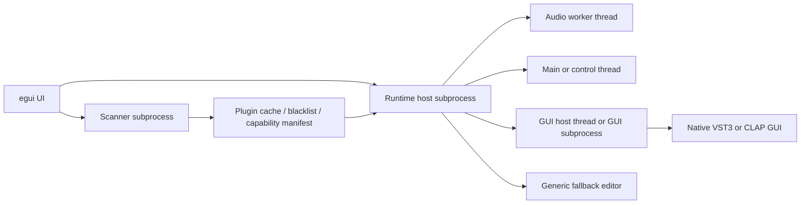
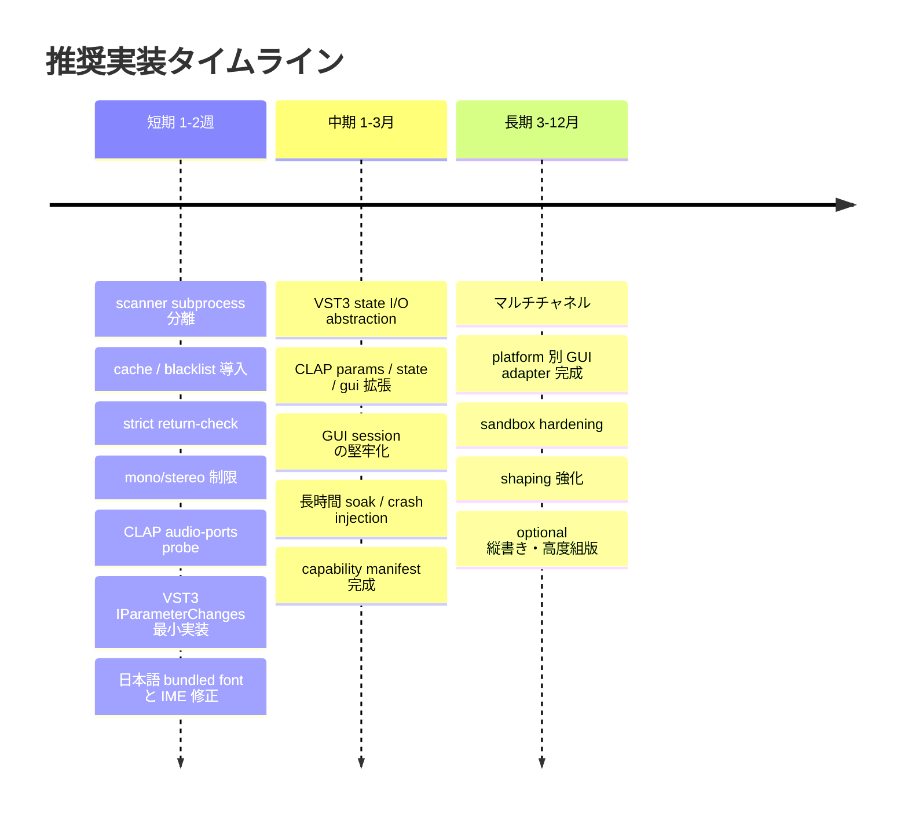

# waves-previewer を基点にした VST3 と CLAP ホスト安定化および Rust と egui の日本語表示改善報告書

## エグゼクティブサマリ

waves-previewer リポジトリは、README 上では現在「NeoWaves」として整理されており、UI には `eframe/egui`、音声出力には `cpal` を使い、プラグイン処理はリアルタイム callback ではなく offline render を基本にする方針を明示しています。さらに、`src/plugin/` が `client`・`worker`・`gui_worker`・`protocol` に分かれ、`Scan`・`Probe`・`ProcessFx`・GUI セッション要求を IPC 的に扱う構成になっているため、**安定化のための土台はすでにかなり良い**です。いま必要なのは設計の作り直しではなく、**仕様準拠の欠けやすい部分を埋めること**と、**GUI/スレッド/プロセス境界を明示して壊れ方を制御すること**です。citeturn40view0turn41view0turn42view0turn43view3turn43view5

現状コードから読み取れる大きな課題は四つあります。第一に、`ProbeResult` 上で VST3 の native GUI は Windows + feature gate 前提、CLAP の native GUI は `supports_native_gui: false`、両 native backend で `supports_state_sync: false` になっており、**GUI と state 同期の完成度がまだ低い**ことです。第二に、worker 側は native backend が失敗すると `Generic` にフォールバックし、`backend_note` を返せる設計ですが、**ユーザーにその劣化動作をどう見せるか**が重要です。第三に、client 側は request ごとの timeout と `kill()/wait()` による停止を持っていますが、**協調的 cancel API が未整備**です。第四に、現在の worker 起動は十分実用的である一方、**scanner subprocess・runtime subprocess・GUI subprocess の責務分離をさらに明確にした方が壊れ方を局所化できる**、という点です。citeturn42view0turn42view5turn43view0turn43view2turn43view3turn43view5

本報告書の結論を先に言うと、VST3/CLAP 側は「**スキャン専用 subprocess + cache/blacklist**」「**仕様準拠の lifecycle 実装**」「**戻り値検査の徹底**」「**mono/stereo 限定から始める routing 制限**」「**GUI 埋め込みの platform 別実装**」の順で進めるのが、工数対効果が最も高いです。egui 側は「**日本語フォントの明示埋め込み**」「**system font fallback の導入**」「**IME の preedit/commit を winit/egui-winit 経由で正しく扱う**」「**HiDPI を `zoom_factor × native_pixels_per_point` で統一管理する**」の順で進めると、見た目と入力体験が短期間で大きく改善します。さらに、合字・結合文字・一部の複雑な Unicode 表現まで自然さを求めるなら、egui 組み込みテキストだけではなく HarfBuzz 系の shaping pipeline を検討するのが妥当です。citeturn7view0turn9view3turn13view0turn16view0turn16view1turn17view2turn17view4turn17view5turn17view7turn27view0turn26search1turn36view2turn37view4turn37view6turn31search20turn32search0turn32search1

短期では、scanner subprocess、cache/blacklist、strict return-check、mono/stereo 制限、VST3 の `IParameterChanges` 最小実装、CLAP の audio-ports probe、egui の Noto Sans JP または Source Han Sans fallback、IME の cursor area 更新を入れるだけで、**「読み込めない」「GUI が出ない」「日本語が不自然」**の多くは減らせます。中期では、GUI session の永続化、state I/O abstraction、CLAP parameters/state/gui extension の本格実装、VST3/CLAP の長時間 soak test を足すべきです。長期では、マルチチャネル、platform 別 GUI adapter、shaping 強化、sandbox まで進めるのが理想です。citeturn23view0turn13view5turn19view0turn19view1turn26search2turn33search0turn33search1turn33search5

## 調査範囲と現状認識

本報告書が明示的に扱う範囲は、次の二項目です。

1. **VST3/CLAP 安定化**  
   注意点として、ロード、スキャン、サンドボックス、worker、プロセス管理、タイムアウト、キャンセル、クラッシュ回復、戻り値チェック、バス、チャンネル、レイテンシ、state sync、parameter queue、GUI 埋め込み、スレッドモデル、COM 初期化、メモリ、リアルタイム制約を扱います。実装項目として、`IParameterChanges` 実装、`IBStream` wrapper、audio-ports probe、戻り値検査、mono/stereo 制限、worker cancel API、scanner subprocess、cache/blacklist、generic fallback 表示を扱います。参照実装として Steinberg VST3 SDK audiohost / VST3PluginTestHost、CLAP reference host / spec、clack / clack-host、JUCE、Tracktion Engine、truce-rack-vst3 を扱います。citeturn7view0turn7view3turn11search1turn13view1turn13view2turn13view3turn20search1turn23view0turn25view0

2. **Rust + egui の日本語表示改善**  
   フォント埋め込みと fallback、HiDPI、テキストレイアウト、IME、文字幅計測、折返し、絵文字、合字、合成文字、ローカライズ運用、テストケース、推奨クレートを扱います。縦書き要件はユーザー指定上は**無制約**と扱います。したがって現時点の優先度は低くしますが、将来要件化したときに壊れていないかを見るため、テストケースには任意項目として残します。citeturn27view0turn26search2turn26search3turn26search1turn36view2turn31search15turn31search20turn33search0turn33search1turn33search5

waves-previewer の現状実装を整理すると、plugin モジュールは `backends`、`client`、`gui_worker`、`protocol`、`worker` に分かれています。`WorkerRequest` は `Ping`、`Scan`、`Probe`、`ProcessFx`、`GuiSessionOpen/Poll/Close` を持ち、`ProbeResult` は plugin metadata、param list、state blob、backend 種別、GUI capabilities、backend note を返す設計です。また worker 本体は VST3 と CLAP の native probe/process を試し、失敗時は `Generic` にフォールバックする構造です。このため、**protocol の器はすでに十分に大きい**一方で、**中身の capability 実装がまだ追いついていない**、という理解が最も正確です。citeturn41view0turn42view0turn42view5

さらに current client は worker subprocess を起動し、破損や共有違反に備えて複数回 retry し、request ごとに timeout を持ち、期限を超えた child は `kill()`・`wait()` で停止します。timeout は `Probe` 30 秒、`ProcessFx` 120 秒、GUI open 30 秒、GUI poll/close 10 秒に設定されています。つまり、**プロセス分離・タイムアウト・強制停止**という安定化の三本柱のうち二本半はすでに入っています。残る半分は、**より細かい責務分離と cooperative cancel**、および **native GUI / state sync / parameter feedback の完成**です。citeturn43view0turn43view3turn43view4



この図は、waves-previewer の現状構造を土台に、**スキャン**と**実行**と**GUI**をさらに責務分離した理想形です。VST3 公式の hosting 例、VST3PluginTestHost、CLAP reference host、JUCE の scanner 系 API はいずれも、実装の責務が一枚岩ではないことを前提にしています。citeturn7view3turn11search1turn13view1turn23view0

## VST3 と CLAP の安定化方針

VST3 側で最初に守るべきなのは、**lifecycle の順序**です。Steinberg は audio processor の call sequence と `IAudioProcessor` API を公開しており、bus arrangement、sample size、processing setup、processing state、`process()` の前提条件を host が崩さないことを要求しています。ここを曖昧にすると、「読み込めるプラグインと読み込めないプラグインがある」「GUI は出るが音が出ない」系の不安定さが起こりやすくなります。したがって host 実装では、**component/controller 初期化 → bus arrangement 確定 → sample size / block size 設定 → activate / setProcessing → process** を明示的な状態機械にし、各段で戻り値を厳密に検査するべきです。citeturn7view0turn9view3turn7view1

CLAP 側で最初に守るべきなのも同じく lifecycle ですが、こちらはスレッド注釈がさらに明確です。`clap_plugin.init`、`activate`、`deactivate` は main-thread、`start_processing`・`stop_processing`・`reset` は audio-thread で呼ぶ前提が明記され、`activate` 後は latency と port configuration が deactivation まで一定であることも規定されています。さらに parameter 変更は `process()` または `params.flush()` のどちらかで扱い、plugin から host への再起動要求・wake up 要求・main-thread callback 要求として `request_restart`、`request_process`、`request_callback` を host が受ける必要があります。つまり CLAP は「雑に動く host」を許容する設計ではなく、**thread model と state transition を守る host**を前提にしています。citeturn13view0turn15search8turn17view2turn17view4turn17view5turn17view6turn17view7turn17view8

その意味で、waves-previewer が README 上で「plugin や sample-changing DSP を audio callback に載せない」と明言しているのは非常に良い判断です。VST3/CLAP の仕様文書はどちらも process 系 API の前提を厳しく定義しており、現行 repo の offline-render 中心設計は、host を DAW のように巨大化させずに安定性を確保する上で理にかなっています。**今後も callback 側には rate correction と master volume 程度しか置かず、プラグイン処理は隔離 worker の job として扱う**方が、NeoWaves の用途には合っています。これは仕様と現行リポジトリの両方から導ける設計上の結論です。citeturn40view0turn13view0turn17view2

スキャンとロードに関しては、JUCE の `PluginDirectoryScanner` が dead-man’s-pedal file に失敗プラグイン名を記録し、再スキャン時に blacklist 的に扱える設計を公開しています。JUCE フォーラムでも、AudioPluginHost のような実装では out-of-process scanning によって crash protection を行うのが一般的だと説明されています。waves-previewer もすでに worker subprocess と timeout を持っているため、ここでやるべきことは「別の思想を導入する」ことではなく、**scanner subprocess を runtime subprocess と切り分け、scan 結果を capability manifest と blacklist に永続化する**ことです。scan では instance を長時間保持せず、metadata と capability probe のみを取り、runtime では cache から最小限の情報を読み込む構成が理想です。citeturn23view0turn23view1turn21search2turn43view3

バス、チャンネル、routing は最初から全部やろうとしない方が安定します。CLAP の `audio-ports` extension は、main port が index 0、port type に mono/stereo などがあり、scan は deactivated 状態で行うべきことを明示しています。さらに `audio-ports-config` と `configurable-audio-ports` により、ホストは preset 的な port configuration の選択や push 型の channel count 設定を行えます。したがって NeoWaves のような preview/editor 系 host では、**まず「main input 1 本 + main output 1 本」「mono / stereo のみ許可」**に明示的に制限し、マルチチャネルは long-term に逃がすのが正しいです。routing の自由度を最初から広げるより、**拒否規則を明示する**方が「読み込めるのに不正動作する」ケースを大きく減らせます。citeturn16view0turn19view0turn19view1

state と parameter sync は、現在の waves-previewer では protocol 上は用意されているものの、capability 上ではまだ未完成です。`ProbeResult` と `ProcessResult` は `state_blob_b64` を運びますし、`params` も protocol に含まれていますが、native VST3/CLAP probe の capability は `supports_state_sync: false` です。また CLAP 仕様では `state` extension により save/load と dirty 通知が可能で、`params` extension では automation を `process()` か `flush()` で双方向にやり取りすることが求められています。したがって優先実装は、**VST3 の state I/O abstraction と `IParameterChanges` 最小実装、CLAP の `params.flush()` と output param event 受信、dirty/state 再保存の導入**です。ここを埋めると、「開き直すと値が飛ぶ」「GUI から触った値が host に戻らない」が大きく減ります。citeturn42view0turn42view5turn17view0turn17view1turn17view2turn17view3

GUI 埋め込みは、VST3 も CLAP も「表示するだけ」では安定しません。VST3 では host は `IPlugView` を通じて `attached`、`removed`、サイズ制約、`onSize`、`canResize`、`checkSizeConstraint`、`resizeView` などを扱います。CLAP の `gui` extension も、`is_api_supported → create → set_scale → get_size / can_resize → set_parent → show → hide / destroy` という順序を明記しており、Windows は physical size + `SetParent`、Cocoa は logical size、Wayland は埋め込み非対応で floating を使うべきことまで書かれています。つまり GUI 不安定の主因は「プラグインが悪い」より **embed contract を host が途中で省略している**ケースが多いです。citeturn10view5turn10view6turn10view7turn18view7turn18view1turn18view3turn18view4turn18view5turn18view6

Windows の VST3 GUI では COM 初期化も軽視できません。Microsoft は COM を使う各スレッドで `CoInitializeEx` が必要であること、各 thread ごとに別々に初期化する必要があること、そして MTA thread は UI action 向きではないことを明記しています。したがってホスト側の方針は、**VST3 の UI/view を扱うスレッドは STA + message pump、non-GUI supervisor thread は MTA も可**という切り分けが安全です。ここを曖昧にすると、GUI が表示されても resize や focus が不安定になる可能性があります。citeturn44search14turn44search2turn44search6turn44search0turn44search16

その上で waves-previewer 現状を見ると、probe 時 capability では VST3 native GUI は Windows feature gate 前提、CLAP native GUI は false で、GUI session は専用 `gui_worker` が保持します。これは方向性として正しい一方、**CLAP native GUI の未実装**、**state sync false**、**GUI close が最終的に `kill()/wait()` 依存**という点が残っています。短期的には GUI session ごとに「親ウィンドウ・DPI・focus・resize・close reason」をログ化し、native GUI を開けない plugin は generic fallback を必ず出すべきです。silent fail が最もユーザー体験を悪くします。citeturn42view5turn43view2turn43view5

以下が、実装優先項目を「何をするか」という観点でまとめた一覧です。

| 項目 | まずやること | 狙い |
|---|---|---|
| scanner subprocess | runtime worker と分離し、scan 結果を永続 cache 化 | スキャン crash を再起動可能にする |
| cache / blacklist | path、mtime、format、capability、last error を保持 | 毎回の重い probe を避ける |
| 戻り値検査 | VST3 `tresult` / CLAP `bool` を全 API で評価 | silent failure を潰す |
| mono/stereo 制限 | main in/out 1 本、mono/stereo 以外は明示拒否 | マルチチャネル由来の不安定を後回しにする |
| VST3 `IParameterChanges` | host から plugin への param queue を最小実装 | 自動化と state 再現性を上げる |
| VST3 state I/O wrapper | stream 抽象を切って state save/load を統一 | preset/再現性を上げる |
| CLAP audio-ports probe | deactivated 状態で port 情報と config を取得 | チャンネル不一致を事前検出する |
| worker cancel API | `CancelJob(job_id)` + grace period + kill fallback | timeout 前に協調停止できるようにする |
| generic fallback 表示 | `backend_note` を UI でバナー表示 | native failure を隠さない |
| GUI host 分離 | GUI thread / process を責務分離 | window embed の失敗を局所化する |

この表の根拠になっているのは、Steinberg の host/sample 文書、CLAP の lifecycle / params / gui / audio-ports 仕様、JUCE の scanner 設計、そして waves-previewer 現行コードです。citeturn11search1turn7view3turn16view0turn16view1turn17view0turn17view2turn23view0turn42view0turn42view5turn43view3

```cpp
// 擬似 C++: host 側の IParameterChanges 最小実装イメージ
class HostParamValueQueue : public Steinberg::Vst::IParamValueQueue {
public:
    Steinberg::Vst::ParamID id = 0;
    std::vector<std::pair<int32, Steinberg::Vst::ParamValue>> points;

    Steinberg::tresult PLUGIN_API getPoint(int32 index, int32& sampleOffset,
                                           Steinberg::Vst::ParamValue& value) override {
        if (index < 0 || index >= (int32)points.size()) return Steinberg::kResultFalse;
        sampleOffset = points[index].first;
        value       = points[index].second;
        return Steinberg::kResultTrue;
    }

    int32 PLUGIN_API getPointCount() override { return (int32)points.size(); }
    Steinberg::Vst::ParamID PLUGIN_API getParameterId() override { return id; }

    Steinberg::tresult PLUGIN_API addPoint(int32 sampleOffset,
                                           Steinberg::Vst::ParamValue value,
                                           int32& index) override {
        points.emplace_back(sampleOffset, value);
        index = (int32)points.size() - 1;
        return Steinberg::kResultTrue;
    }
};

class HostParameterChanges : public Steinberg::Vst::IParameterChanges {
public:
    std::vector<std::unique_ptr<HostParamValueQueue>> queues;

    int32 PLUGIN_API getParameterCount() override { return (int32)queues.size(); }

    Steinberg::Vst::IParamValueQueue* PLUGIN_API getParameterData(int32 index) override {
        if (index < 0 || index >= (int32)queues.size()) return nullptr;
        return queues[index].get();
    }

    Steinberg::Vst::IParamValueQueue* PLUGIN_API addParameterData(
        const Steinberg::Vst::ParamID& id, int32& index) override {
        for (int32 i = 0; i < (int32)queues.size(); ++i) {
            if (queues[i]->id == id) { index = i; return queues[i].get(); }
        }
        auto q = std::make_unique<HostParamValueQueue>();
        q->id = id;
        queues.push_back(std::move(q));
        index = (int32)queues.size() - 1;
        return queues.back().get();
    }
};

// ProcessData.inputParameterChanges = &hostChanges;
```

この断片は、host が VST3 plugin に parameter automation を渡す最小構造を示した擬似コードです。最初は sampleOffset 0 のみでもよく、そこから block 内 automation に拡張するのが安全です。citeturn8search11turn9view3turn7view0

```rust
// 擬似 Rust: CLAP の audio-ports probe
fn probe_audio_ports(plugin: &ClapPluginHandle) -> Result<PortProbe, HostError> {
    // 仕様上、audio-ports scan は deactivated で行う
    let audio_ports = plugin
        .get_extension::<clap_plugin_audio_ports_t>(CLAP_EXT_AUDIO_PORTS)
        .ok_or(HostError::NoAudioPorts)?;

    let mut inputs = Vec::new();
    let in_count = unsafe { (audio_ports.count)(plugin.raw(), true) };
    for idx in 0..in_count {
        let mut info = std::mem::MaybeUninit::<clap_audio_port_info_t>::zeroed();
        let ok = unsafe { (audio_ports.get)(plugin.raw(), idx, true, info.as_mut_ptr()) };
        if !ok {
            return Err(HostError::ProbeFailed(format!("audio input port {idx}")));
        }
        let info = unsafe { info.assume_init() };

        // MVP は main port かつ mono/stereo のみ許可
        let is_main = (info.flags & CLAP_AUDIO_PORT_IS_MAIN) != 0;
        let port_type = cstr_opt(info.port_type);
        let supported =
            is_main &&
            matches!(info.channel_count, 1 | 2) &&
            matches!(port_type.as_deref(), Some("mono") | Some("stereo") | None);

        inputs.push(PortInfo {
            index: idx,
            id: info.id,
            channels: info.channel_count,
            is_main,
            port_type,
            supported,
        });
    }

    Ok(PortProbe { inputs })
}
```

この断片の要点は三つです。**deactivated 状態で probe すること**、**main port を優先すること**、**最初は mono/stereo 以外を拒否すること**です。必要なら次段で `audio-ports-config` や `configurable-audio-ports` に進めます。citeturn16view0turn19view0turn19view1

## Rust と egui の日本語表示改善

egui で日本語を自然に見せる上で最も重要なのは、**フォントを明示的に管理すること**です。`FontDefinitions` は `font_data` と `families` を持ち、フォールバック順を host 側で指定できます。egui の docs は custom font の導入例を示しており、実際に fallback は family 内の順序で解決されます。加えて、egui には CJK を自動で完璧に解決する前提はなく、issue #3060 でも CJK 表示のために利用者側がフォント追加を行う事例が共有されています。したがって、日本語 UI をちゃんと作るなら **「system 任せ」ではなく、bundled fallback を明示する」**方が安全です。citeturn27view0turn26search3

フォント候補としては、**日本語専用 UI なら `Noto Sans JP`、日中韓をまとめて扱うなら `Noto Sans CJK` または `Source Han Sans`**が第一候補です。Google Fonts の `Noto Sans JP` は日本語向け sans serif で、ひらがな・カタカナ・漢字をカバーします。Noto コレクション全体は 1000 以上の言語・150 以上の書記体系を対象にした大規模ファミリです。`Source Han Sans` は Source/Noto 系の Pan-CJK フォントで、日本語 README も公開されています。さらに Adobe 側は、言語タグが使えない場合は region-specific OTF を選ぶべきだと説明しているため、**日本語 UI しか出さないアプリなら JP 向け face を優先し、Pan-CJK を第一優先にしない**方が字形の自然さが出やすいです。citeturn33search0turn33search1turn33search3turn33search5turn33search11

記号類や UI アイコン混在まで考えるなら、本文は `Noto Sans JP` か `Source Han Sans JP`、追加 fallback として `Noto Sans Symbols` のような symbol face を噛ませる設計が安定します。日本語の不自然さは「文字そのもの」より、**日本語本文に欧文寄り fallback が混ざること**で起きるケースが多いので、family の先頭を日本語向けフォントにし、後段に symbol / Latin / monospace を置く順序が重要です。citeturn27view0turn33search12turn33search0turn33search5

system font fallback を入れるなら、`fontdb`、`font-kit`、`system-fonts`、`font-loader` が候補になります。`fontdb` はディレクトリや raw data から font database を作れ、system font を predefined directory scan で拾えます。`font-kit` は DirectWrite / CoreText / FreeType 系の system font library を抽象化します。`system-fonts` は locale から region を推定して優先フォント列を返せます。つまり実装方針としては、**第一優先は bundled font**、その上で **system font を見つけられたら差し替える**、見つからなければ bundled に落ちる、という二段構えが現実的です。citeturn34search1turn32search3turn34search9turn34search2

HiDPI とスケーリングでは、egui の `Context::set_zoom_factor()` を中心に一元管理するのが基本です。egui は `pixels_per_point = zoom_factor × native_pixels_per_point` で UI スケールを決め、`egui-winit` でも同じ式で `pixels_per_point` を計算しています。したがって 일본語フォントだけ個別にスケールしたり、widget ごとに倍率をばらばらにするより、**native DPI と egui zoom の積に統一**し、その上で font size と spacing を調整する方が自然です。Japanese glyph の視認性は、字面の大きいフォントを選んだ上で 100%、125%、150%、200% の固定プロファイルを用意するとかなり安定します。citeturn26search1turn26search12turn36view2

行間・字間・折返しの自然さは、egui では typography engine を大改造しなくてもある程度改善できます。`Spacing` には `item_spacing`、`button_padding`、`indent`、`interact_size`、`text_edit_width` などの基礎レイアウト項目があり、`LayoutJob` には `wrap`、`first_row_min_height`、`halign` があります。さらに `TextWrapping` は `break_anywhere` を持ち、単一行 truncation 時には `true` 推奨とされています。CJK の見た目では、**英数字混在の caption 系では `break_anywhere` を安易に使わず、テーブル列の省略時だけ使う**のがバランスがよいです。Japanese/Symbol 混在の width 問題には `unicode-width` の `width_cjk()`、cursor や selection の安全性には `unicode-segmentation` の grapheme 単位処理を併用するのが実務的です。citeturn28view0turn28view1turn28view2turn28view3turn28view4turn28view6turn29view0turn32search2turn32search22turn31search14

ただし egui 単体は本格的な complex text shaping engine ではありません。HarfBuzz は Unicode 列から glyph を選択・配置する shaping engine で、現代の多くの画面で使われています。Rust では `rustybuzz` が HarfBuzz shaping algorithm の Rust port、`harfbuzz_rs` が HarfBuzz バインディングです。egui 側でも complex text や grapheme cluster の描画問題は issue として報告されており、cosmic-text への差し替え議論が「public pipeline を置き換える大きな変更」だと扱われています。日本語の通常本文だけなら egui の標準 path + 良いフォントで十分ですが、**絵文字、合字、結合文字、将来の縦書きや高度な組版**まで射程に入れるなら、egui text をそのまま万能視しない方がよいです。citeturn31search20turn31search4turn32search0turn32search1turn32search16turn31search15turn31search0

IME は、使えるかどうかより「正しいタイミングで enable して正しい矩形を渡しているか」が重要です。egui では IME support 自体は早い段階で進展しており、issue #248 にも composition event や candidate window の進展が記録されています。他方、native では `winit` が `Window::set_ime_allowed()`、`set_ime_cursor_area()`、`Ime::Preedit`、`Ime::Commit` を提供し、IME 許可中は preedit 中の `KeyboardInput` の扱いが変わることを説明しています。`egui-winit` 自身も `allow_ime` と IME rect を持ち、`set_ime_allowed` を debounce しながら window に反映しています。つまり egui native app で日本語入力を自然にするには、**text field focus と IME enable を一致させること**、**cursor rect を毎フレーム更新すること**、**preedit を commit 前の仮文字列として扱うこと**が不可欠です。citeturn26search2turn37view4turn37view5turn37view6turn37view7turn37view0turn37view3turn35search3

platform ごとの注意点もあります。Windows と macOS では IME cursor area の概念が比較的素直ですが、winit docs では X11 で area full support がなく position only とされています。したがって Linux では Wayland/X11 の違いを分けてテストし、特に X11 では candidate window の位置が「完全一致」しない前提で verify した方が安全です。これは IME バグの切り分けを大きく楽にします。citeturn37view5turn35search11

ローカライズ運用は、技術的には単純ですが品質差が出やすい領域です。推奨は、**文字列の外部化**、**翻訳キー単位の screenshot review**、**pseudo-localization**、**英数混在と長文化を前提にした layout test**です。日本語は英語より折返しが不自然になりにくい一方、列幅不足や略語混在で崩れやすいので、翻訳ワークフローは「表示確認付き」で回すべきです。これは仕様由来の要件ではなく、本報告書の実務提案です。

```rust
use std::sync::Arc;
use egui::{Context, FontData, FontDefinitions, FontFamily};

fn install_japanese_fonts(ctx: &Context) {
    let mut fonts = FontDefinitions::default();

    fonts.font_data.insert(
        "noto_sans_jp".into(),
        Arc::new(FontData::from_static(include_bytes!("../fonts/NotoSansJP-Regular.ttf"))),
    );
    fonts.font_data.insert(
        "noto_symbols".into(),
        Arc::new(FontData::from_static(include_bytes!("../fonts/NotoSansSymbols-Regular.ttf"))),
    );

    // 日本語本文を最優先、その後に symbol fallback
    if let Some(list) = fonts.families.get_mut(&FontFamily::Proportional) {
        list.insert(0, "noto_sans_jp".into());
        list.push("noto_symbols".into());
    }
    if let Some(list) = fonts.families.get_mut(&FontFamily::Monospace) {
        list.insert(0, "noto_sans_jp".into());
        list.push("noto_symbols".into());
    }

    ctx.set_fonts(fonts);
    ctx.set_zoom_factor(1.0); // DPI は native_pixels_per_point と掛け合わせて管理
}
```

この例のポイントは、**bundled font を family 先頭に入れること**と、**zoom を egui 標準の倍率機構で管理すること**です。system font fallback を足すなら、この前段で `system-fonts` や `fontdb` により候補を探し、見つかった path から `FontData` を組み立てるとよいです。citeturn27view0turn26search1turn34search1turn34search9

```rust
// winit / egui-winit 統合時の IME ハンドリング例
fn handle_window_event(
    window: &winit::window::Window,
    egui_state: &mut egui_winit::State,
    event: &winit::event::WindowEvent,
    text_edit_rect_in_points: Option<egui::Rect>,
    text_input_focused: bool,
) {
    // focus に応じて IME を on/off
    window.set_ime_allowed(text_input_focused);

    if let Some(rect) = text_edit_rect_in_points {
        let scale = window.scale_factor() as f32;
        let pos = winit::dpi::PhysicalPosition::new(
            (rect.left() * scale) as i32,
            (rect.top() * scale) as i32,
        );
        let size = winit::dpi::PhysicalSize::new(
            (rect.width() * scale) as u32,
            (rect.height() * scale) as u32,
        );
        window.set_ime_cursor_area(pos, size);
    }

    match event {
        winit::event::WindowEvent::Ime(winit::event::Ime::Preedit(text, cursor)) => {
            // 候補確定前の仮文字列として保持
            eprintln!("preedit={text:?}, cursor={cursor:?}");
        }
        winit::event::WindowEvent::Ime(winit::event::Ime::Commit(text)) => {
            // 確定文字列を model に反映
            eprintln!("commit={text:?}");
        }
        _ => {}
    }

    let _resp = egui_state.on_window_event(window, event);
}
```

この例は `winit` が提供する IME 契約をそのまま使う形です。実運用では `egui-winit::State` に event を通しつつ、text input focus と cursor area の管理を host 側で明示すると、日本語 IME の候補位置ズレや preedit 消失を切り分けやすくなります。citeturn35search3turn36view2turn37view4turn37view5turn37view6turn37view7

## 実装チェックリストとテスト自動化

まず、推奨ライブラリと参考実装を短い表にまとめます。

| 領域 | 第一候補 | 位置づけ |
|---|---|---|
| VST3 host 仕様確認 | Steinberg VST3 SDK `audiohost` / `VST3PluginTestHost` | まず動作規範を合わせる基準 |
| VST3 を Rust で追う | `truce-rack-vst3` | Rust での lifecycle 参照に有用 |
| CLAP host 基準実装 | `clap-host` | reference host |
| CLAP を Rust で追う | `clack` / `clack-host` | Rust で thread model を崩しにくい |
| scanner / cache 思想 | JUCE `PluginDirectoryScanner` / `KnownPluginList` | dead-man’s-pedal と blacklist 設計の参考 |
| plugin cache 運用 | Tracktion Engine `PluginCache` | instance 再利用や管理思想の参考 |
| egui native integration | `eframe` + `egui-winit` + `egui-wgpu` | 既存コードとの親和性が高い |
| system font 発見 | `system-fonts` / `fontdb` / `font-kit` | locale-aware fallback または OS font 解決 |
| shaping / complex text | `rustybuzz` / `harfbuzz_rs` | 高度な text shaping が必要になった時の拡張路線 |
| metrics / width / parser | `unicode-segmentation` / `unicode-width` / `ttf-parser` | grapheme・CJK width・font metadata |
| custom text path | `ab_glyph` / `fontdue` / `glyph_brush` | egui 組み込み外で text を自前描画するとき |

この表の根拠は、それぞれの公式 docs / 参照実装の役割です。Steinberg は host sample と test host を、CLAP は spec / reference host / Clack を、JUCE は scanner と known list を、Tracktion は plugin cache を、egui 系は native integration と font API を、それぞれ公開しています。citeturn11search1turn7view3turn20search1turn13view1turn13view2turn13view3turn23view0turn23view1turn25view0turn35search3turn38search1turn34search1turn32search3turn32search0turn32search1turn31search14turn32search2turn34search3turn39search0turn39search2turn39search6

次に、実装チェックリストを優先度・難易度・影響・推定工数でまとめます。**工数は1名が既存コードを継続改修する前提**の概算です。

| 実装項目 | 優先度 | 難易度 | 影響 | 推定工数 |
|---|---|---:|---:|---:|
| scanner subprocess を runtime worker から分離 | 最優先 | 中 | 極大 | 3–5日 |
| cache / blacklist / capability manifest 永続化 | 最優先 | 中 | 極大 | 3–5日 |
| native API の戻り値検査を全箇所に導入 | 最優先 | 低 | 大 | 2–3日 |
| mono/stereo 制限を host policy として明文化 | 最優先 | 低 | 大 | 1–2日 |
| CLAP audio-ports probe / ports-config probe | 最優先 | 中 | 大 | 3–5日 |
| VST3 `IParameterChanges` 最小実装 | 最優先 | 中 | 大 | 4–7日 |
| VST3 state I/O abstraction | 最優先 | 中 | 大 | 3–5日 |
| generic fallback UI と `backend_note` の明示表示 | 最優先 | 低 | 大 | 1–2日 |
| VST3 GUI host thread を STA + message pump 化 | 高 | 中 | 極大 | 3–5日 |
| CLAP native GUI 実装 | 高 | 高 | 大 | 1–2週 |
| cooperative worker cancel API | 高 | 中 | 中 | 2–4日 |
| latency / bus / config change の再同期 | 高 | 中 | 中 | 3–5日 |
| 長時間 soak test と crash injection harness | 高 | 中 | 大 | 4–7日 |
| 日本語 bundled font + system fallback | 最優先 | 低 | 大 | 1–2日 |
| IME preedit / commit / cursor area の統合 | 最優先 | 低 | 大 | 2–3日 |
| grapheme-aware wrap / width / ellipsis | 高 | 中 | 中 | 2–4日 |
| HarfBuzz 系の side text pipeline | 中 | 高 | 中 | 1–3週 |
| 縦書きオプション検証 | 低 | 高 | 低 | 1–2週 |

この優先順位の理由は、現行 repo がすでに subprocess / timeout / fallback の土台を持っている一方、capability と GUI/state sync が未完成であること、そして CLAP/VST3 の仕様が lifecycle / thread / params / ports / GUI embed を明確にしていることにあります。citeturn42view5turn43view3turn16view0turn16view1turn17view2turn17view4turn18view7turn44search14

テストケースは、単体・統合・破壊試験・長時間試験を分けるべきです。

| 種別 | 代表ケース | 自動化案 |
|---|---|---|
| ユニット | plugin path 判定、cache key、parameter queue 生成、font fallback 解決、width 計測 | `cargo test` |
| 統合 | scanner subprocess 起動、probe、ProcessFx、GUI open/poll/close、generic fallback 表示 | headless CI + Windows GUI smoke |
| クラッシュ注入 | 起動時クラッシュ、process 中ハング、GUI open ハング、stderr 汚染 | dummy plugin / fault injection plugin |
| 長時間 | 同じ plugin を 100 回 open/close、8 時間 poll、複数 plugin の連続 probe | nightly soak job |
| GUI 埋め込み | VST3 attach/remove/resize、CLAP create/set_parent/show/destroy | Windows / macOS / Linux matrix |
| マルチチャネル | mono、stereo、unsupported config、config change | capability manifest と照合 |
| 日本語表示 | 長文、英数混在、半角/全角、絵文字、結合文字、IME preedit、DPI 100/150/200% | golden screenshot + text metrics diff |
| 無制約項目 | 縦書き | optional regression only |

このテスト設計は、JUCE の scanner / dead-man’s-pedal、VST3PluginTestHost、CLAP reference host、winit/egui-winit の IME 契約、そして Unicode 系 crate の責務分担に沿っています。**CI では最低でも Windows の scanner / worker / GUI smoke は必須**です。VST3 GUI と COM / Win32 embed は Windows でしか潰せないバグが残りやすいためです。citeturn23view0turn7view3turn13view1turn35search3turn37view4turn37view6turn31search14turn32search2

CI 自動化案としては、次の四本立てが現実的です。第一に **scan job**。標準検索パスと fixture path を scan し、manifest 差分と blacklist 反映を検証します。第二に **worker boot job**。`Probe`、`ProcessFx`、timeout、stderr decode、kill path を毎回検証します。第三に **GUI job**。Windows で GUI session を開き、一定回数 `GuiSessionPoll` して resize/focus を試し、close reason を収集します。第四に **text job**。日本語 screenshot golden、IME preedit/commit、DPI 行列、grapheme/width の境界ケースを回します。現行 repo はすでに worker timeout と GUI worker を持つので、この CI は比較的載せやすいです。citeturn43view3turn43view5turn37view0turn37view4turn37view6

## 優先度付きロードマップ

以下は、**短期 1–2 週、中期 1–3 か月、長期 3–12 か月**の三段階ロードマップです。まず短期では「壊れ方を制御する」こと、中期では「仕様準拠を埋める」こと、長期では「自由度を広げる」ことに集中するのが最も安全です。現行 repo はすでに worker timeout / GUI worker / generic fallback の骨格を持つので、ロードマップの前半は新規設計よりも「抜けを埋める作業」が中心になります。citeturn42view5turn43view3turn43view5



**短期の目標**は、「読めない、固まる、GUI が出ない、日本語が汚い」を一気に減らすことです。ここでは scanner subprocess、cache/blacklist、戻り値検査、mono/stereo 制限、CLAP audio-ports probe、VST3 の parameter queue 最小実装、日本語フォント明示埋め込み、IME rect 更新を入れます。工数は合計で **2–3 週間弱**が目安ですが、体感的な安定性改善は最も大きいはずです。特に `backend_note` を UI 表示するだけでも、ユーザーから見る「何が起きたかわからない」状態をかなり減らせます。citeturn42view0turn42view5turn43view3turn16view0turn27view0turn37view4turn37view6

**中期の目標**は、「仕様準拠を本物にする」ことです。ここでは VST3 state I/O abstraction、CLAP の params/state/gui 拡張、GUI session の永続化と structured log、長時間 soak test、crash injection、capability manifest の完成に進みます。工数は **1–3 か月**で、外部 plugin のばらつきにかなり強くなります。特に CLAP は `request_restart` / `request_process` / `request_callback` をちゃんと受けて thread-check extension まで実装すると、不安定 plugin と host の責任分界が明瞭になります。citeturn17view4turn17view5turn17view6turn17view7turn13view5

**長期の目標**は、「自由度を広げても壊れない host」にすることです。マルチチャネル、platform 別 GUI adapter、OS sandbox、complex text shaping、任意の縦書き検証などはここに置くべきです。とくに Wayland を含む Linux GUI と multi-bus/multi-channel は、短期の成功体験の後に進めた方が安全です。CLAP GUI 仕様自体も window API ごとの差があり、Wayland では embed 非対応の前提を持つため、後半に回す判断は妥当です。citeturn18view5turn18view7turn19view0turn19view1turn31search20

最後に、理想仕様を一文でまとめるとこうなります。**NeoWaves の理想的な VST3/CLAP host は、scan/probe/process/gui を明確に分離し、native backend の失敗を generic fallback と structured log に落とし、mono/stereo preview に最適化した堅牢 host であるべきです。理想的な日本語 UI は、bundled 日本語フォント、system fallback、IME rect 更新、DPI 一元管理、grapheme-aware な text handling を備え、必要に応じて shaping pipeline に拡張可能であるべきです。** この方針は、現行 repo の設計とも、VST3/CLAP/egui/winit の公開仕様とも矛盾しません。citeturn40view0turn42view5turn7view0turn13view0turn27view0turn37view4turn31search20