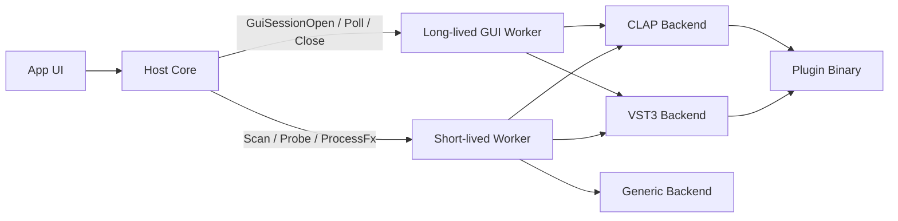
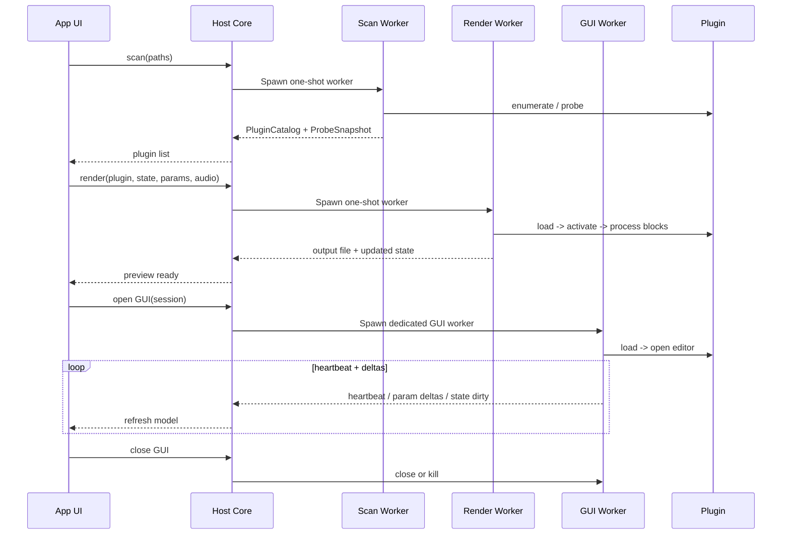
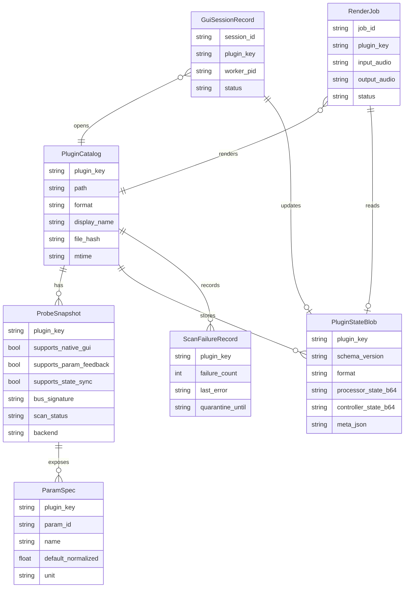

# waves-previewer 向け VST3 と CLAP ホスト安定化レポート

## エグゼクティブサマリー

`waves-previewer` は、すでに **プロセス分離** と **ネイティブ失敗時の Generic フォールバック** を持っている点が強みです。実際に `client.rs` は scan / probe / process ごとに外部ワーカーを起動し、タイムアウト時に kill する構成で、`worker.rs` は native VST3 / native CLAP が失敗した場合に Generic バックエンドへ切り替える設計になっています。`gui_worker.rs` でも GUI セッションを分離しています。これは「プラグインはホストから見ればブラックボックスである」という VST3 の前提に対して、かなり筋のよい出発点です。 citeturn5view1turn20view2turn20view3turn19view0turn27view0

一方で、**安定性を大きく損ねる高優先度の欠陥** が残っています。最重要なのは、VST3 側で **`IEditController::setParamNormalized()` を呼ぶだけで、`ProcessData.inputParameterChanges` を `null` のまま `process()` に渡している** ことです。VST3 の公式仕様では、コントローラからの変更はホストが `IParameterChanges` としてプロセッサへ渡して同期すべきであり、現在の実装は「UI では値が変わるが DSP に反映されない」「一部プラグインで反映が不定」「パラメータと state が食い違う」原因になります。 citeturn40search2turn40search3turn24search2turn7view0

次に大きいのは、**VST3 state の保存・復元が未実装に近い** 点と、**CLAP GUI ホスティングが不完全** な点です。VST3 は `IComponent::getState/setState` と `IEditController::setComponentState/getState` による processor/controller 同期を前提にしていますが、現状の native VST3 は worker 側 capability でも `supports_state_sync: false` を返しており、GUI/処理の両経路で状態同期が不足しています。CLAP 側は `PluginState` があれば save/load を行っている一方、GUI については公式 GUI 手順にある `set_parent()` やサイズ調整の流れを十分踏んでおらず、さらに `request_restart` / `request_process` / resize 系 host callback が実質スタブです。結果として、GUI 埋め込み失敗、サイズ不整合、再初期化要求の取りこぼしが起こりえます。 citeturn20view2turn20view3turn15view6turn16view0turn25search2turn26search2turn26search1turn7view1

加えて、**バス／チャンネル前提が固定的** です。VST3 は動的 I/O と `setBusArrangements()`、CLAP は `audio-ports` 拡張でポート構成を問い合わせる設計ですが、現状の waves-previewer は VST3 でも CLAP でも「メイン入出力 1 ポート、チャンネル数＝入力 WAV のチャンネル数」という近似が強く、サイドチェイン、モノラル専用、補助バス、in-place 条件つきのプラグインで壊れやすいです。 citeturn22search1turn27view0turn25search1turn26search9turn15view2turn7view0turn7view1

短期で最も効く対策は、**VST3 の `IParameterChanges` 注入**、**VST3/CLAP の return 値の完全チェック**、**GUI worker のタイムアウト／heartbeat／強制 kill**、**CLAP GUI 手順の整備**、**バス能力の事前 probe と unsupported 明示** の 5 つです。これだけで「ロードはできるが不安定」「GUI がたまに死ぬ」「特定プラグインだけ値が反映されない」といった、現場でつらい類の不具合の大半を減らせます。 citeturn22search0turn25search0turn25search2turn5view1turn19view2

## 現状評価と優先課題

waves-previewer の現在のホスト経路は、概ね次のように整理できます。scan / probe / offline process は短命 worker、GUI は長命 GUI worker、native が失敗した場合は Generic へフォールバックする構造です。これは「クラッシュ封じ込め」という観点では正しいですが、**長命 GUI worker だけはハングを抱え込む** ため、ここがいちばん危険です。`GuiWorkerClient::request()` は改行区切り JSON を `read_line()` で待ち続け、タイムアウトやキャンセルを持っていません。GUI 側でプラグインやホスト callback が固まると、親 UI まで道連れになります。 citeturn5view1turn19view0



repo から見える高優先度の課題を、影響度順にまとめると次の表です。ここでの「現状」は waves-previewer のコード読解に基づく評価で、「推奨修正」は後段で具体化します。 citeturn20view2turn20view3turn19view0turn19view1turn19view2turn7view0turn7view1

| 優先度 | 原因カテゴリ | 現状の露出 | 主症状 | repo 上の観測 | 推奨修正 |
|---|---|---:|---|---|---|
| 最優先 | VST3 パラメータ同期 | 極大 | UI 値と DSP 値がずれる、反映されない | controller へ `setParamNormalized()`、`inputParameterChanges = null` のまま `process()` 呼び出し | `IParameterChanges` を毎ブロック注入し、`outputParameterChanges` も回収 |
| 最優先 | GUI worker ハング | 極大 | 画面が開いたまま応答不能、親 UI も固まる | `GuiWorkerClient::request()` が blocking read、timeout/cancel なし | request timeout、heartbeat、kill/restart、セッション単位プロセス化 |
| 最優先 | VST3 state 未整備 | 大 | 保存復元不可、ロード後 mismatch | Probe capability で `supports_state_sync: false`、VST3 state 経路不足 | `IBStream` 実装、`setState/getState`、`setComponentState/getState` 導入 |
| 最優先 | CLAP GUI 埋め込み不全 | 大 | GUI が出ない、サイズがおかしい、floating/embedded 不整合 | `create()`→`show()` までで `set_parent()` 等が薄い | 公式 GUI 手順どおりに parent/size/resize を実装 |
| 高 | バス／チャンネル固定前提 | 大 | モノ/サイドチェイン/補助バス系で失敗 | VST3/CLAP とも主バス 1 本前提が強い | probe で bus/port 能力取得、非対応なら明示 fail |
| 高 | return 値の未チェック | 大 | プラグイン個別に沈黙・壊れ方が不定 | `setBusArrangements`, `activateBus`, `setActive`, `setProcessing`, `setFrame` 等の結果を無視する箇所がある | すべて検査し、失敗理由を `backend_note` / Error に昇格 |
| 高 | CLAP host callbacks スタブ | 中～大 | restart/process/resize 要求が効かない | `request_restart`, `request_process`, `rescan`, `clear` が no-op | shared/main-thread flags を設け、poll/open 側で処理 |
| 高 | 長命 GUI worker でのリーク封じ不全 | 中～大 | plugin close 後の蓄積、再オープン失敗 | VST3 で shutdown crash 回避のため `mem::forget` が使われる | GUI は「1 セッション 1 プロセス」で寿命を限定 |
| 中 | scan/probe クラッシュ再現性 | 中 | 特定プラグインで scan がたまに落ちる | 短命 worker はあるが dead-man’s pedal 的な再試行管理は薄い | 失敗 plugin を DB 記録し、最後に再試行、連続失敗は quarantine |
| 中 | 長時間処理の cancel 不足 | 中 | ユーザー abort が効かない | short-lived render worker は timeout kill のみ | cooperative cancel flag + hard kill の二段階化 |
| 中 | COM apartment 不整合 | 中 | Windows GUI attach/resize で不安定 | GUI スレッドの apartment/message pump 方針を明文化すべき | GUI は STA + message loop、処理 worker は MTA 寄りに分離 |
| 中 | capability 表示不一致 | 中 | UI 表示と実装が食い違う | Probe では CLAP/VST3 state_sync false だが CLAP GUI 側は state 拡張を利用 | `probe_capabilities == runtime_capabilities` に統一 |

## 不安定化要因別の対策

### ロード失敗と初期化失敗

VST3 では host 観点の生成手順として、factory から component と controller を作成し、必要に応じて `IConnectionPoint` を接続し、`setupProcessing`、`setActive(true)`、`setProcessing(true)` の順で進めるのが基本です。Steinberg は call sequence を明示しており、`setProcessing` は real-time thread から呼ばれる可能性があることも警告しています。したがって、**初期化のどこで落ちたかを段階別にログ化すること** が最初のハードニングです。現在の waves-previewer も component/controller 生成は行っていますが、後段 API の return 値チェックが甘いので、失敗が「沈黙」しやすいです。 citeturn22search0turn24search5turn27view0turn7view0

VST3 の `setBusArrangements()`、`getBusArrangement()`、`canProcessSampleSize()` は、互換性確認の要です。公式には bus arrangement と bus info の整合性が要求され、sample size も問い合わせ可能です。したがって実装では、**`setBusArrangements()` の結果を必ず確認し、失敗時は `getBusArrangement()` で実際の構成を再読込し、その構成に合わせて buffer を組み直す** べきです。処理を 32-bit float 固定にするにしても、`canProcessSampleSize(kSample32)` を一度確認しておくと、ロード時点で「このプラグインは対象外」ときれいに返せます。 citeturn22search1turn22search10

CLAP では plugin lifecycle がさらに明快で、`activate()` は main thread、`start_processing()` / `process()` は audio-thread、`get_extension()` は thread-safe と定義されています。また audio-ports 拡張を実装しないプラグインは「音声ポートを持たない」とみなされます。したがって **CLAP では instantiate 後に `audio-ports` / `params` / `state` / `gui` 拡張の有無を probe し、その結果を capability に反映し、未実装の機能は upfront に効率よく拒否する** のが安定です。 citeturn25search0turn25search1turn26search1turn26search2

### パラメータ不整合と state 不整合

VST3 の最大の論点は、**processor と controller を host が同期させる責任** です。Steinberg の API 文書は、processor state を host が controller に `setComponentState()` で渡すこと、controller からのパラメータ変更を host が `IParameterChanges` として `process()` に渡すこと、processor からの outgoing parameter changes を host が `setParamNormalized()` で controller に反映することを明記しています。waves-previewer の現状で最優先なのは、この仕様に沿うことです。 `setParamNormalized()` だけでは不十分です。 citeturn40search2turn40search3turn24search2

CLAP については、仕様上「host は controller 的立場」で、plugin は processor と GUI の同期責任を持ちます。`params.flush()` と `process()` 内イベントで host から parameter automation を渡せるうえ、`request_flush()`、`mark_dirty()`、`state.save/load()` といったフックもあります。waves-previewer の CLAP backend は inactive handle に対する `params_ext.flush()`、状態の save/load、`flush_requested` / `state_dirty` のポーリングまで実装されており、**VST3 より筋がよい** です。ただし worker の `ProbeResult` capability が `supports_state_sync: false` になっており、上位 UI との契約が一致していません。ここはまず直してください。 citeturn26search1turn26search2turn15view4turn15view5turn15view6turn20view2

state データ形式は、**フォーマット別バイナリを host 側 envelope で包む** 方針が安全です。具体的には `PluginStateBlob { format, schema_version, processor_state_b64, controller_state_b64, meta }` を `serde` で保存し、VST3 は processor/controller を分離、CLAP は `PluginState` 拡張の byte stream を 1 本保存する構成が扱いやすいです。`waves-previewer` の Generic backend がすでに JSON→Base64 的な state を持っているので、その拡張として統一できます。 citeturn20view1turn33search2turn26search2turn40search2turn40search3

### GUI 埋め込み不具合とスレッディング

CLAP GUI 仕様は、embedded/floating の二系統を定義したうえで、典型的な embedded 手順として `is_api_supported()` → `create()` → `set_scale()` / `get_size()` / `set_size()` → `set_parent()` → `show()` を記述しています。waves-previewer の CLAP GUI は `create()` と `show()` は行っていますが、仕様上重要な `set_parent()` の導線や resize negotiation が不十分です。そのため、**「GUI を開けるが親ウィンドウに正しく埋まらない」「サイズが初期化されない」「plugin 側 `request_resize()` が効かない」** という不具合が起こりやすいです。 citeturn25search2turn26search0turn7view1

VST3 GUI は Windows では HWND 埋め込みで成立しえますが、COM apartment の扱いが世界観の中心です。Microsoft の公式文書では、thread は `CoInitializeEx()` で apartment を明示しなければならず、STA は message pump を必要とします。また OLE 技術を使うなら `OleInitialize()` は STA を前提に `CoInitializeEx(COINIT_APARTMENTTHREADED)` 相当を行います。したがって、**GUI worker のプラグイン view attach/detach は「専用 GUI スレッド」に集約し、そのスレッドを STA + message loop に固定する** のが基本です。逆に offline process worker は GUI/OLE を持たないので、MTA 寄りに分けた方が実装が単純です。 citeturn37search0turn37search1turn37search2turn37search5turn37search11

repo では `gui_worker.rs` が GUI セッションのオープン／ポーリング／クローズを持ち、ネイティブ GUI 非対応時には `"native GUI unsupported; running in stub mode"` を返しています。これは UX 的にはよい方向ですが、**「ネイティブ GUI 非対応」と「現在のホスト実装がその GUI を扱えていない」を分けて表示する** べきです。とくに CLAP は仕様上 embedded GUI が一般的で、VST3 も EditorHost が Win/macOS/Linux をカバーするため、ホスト都合の未実装を plugin 側 unsupported と誤認させない方がデバッグしやすいです。 citeturn19view2turn39search11

### バス不一致と音声処理不一致

VST3 は dynamic I/O を支持し、`setBusArrangements()` と bus activation を通じて実際の処理構成を確定します。CLAP も audio-ports 拡張で channel_count / in_place / main port などを表現します。ところが waves-previewer の現在実装は、VST3 では input/output 各 1 バスを前提に `ProcessData.numInputs = 1`, `numOutputs = 1` を渡し、CLAP でも `AudioPorts::with_capacity(channels_len, 1)` の上で 1 ポートに多チャンネルを詰める構成です。これは一般的なステレオ FX なら動いても、**モノ専用、L/R 非対称、sidechain、aux bus、複数 main port、CV port** を持つプラグインで破綻します。 citeturn22search1turn25search1turn26search9turn15view2turn7view0turn7view1

したがって、ホストは probe 時点で **「このプラグインは waves-previewer の簡易 preview モデルで安全に扱えるか」** を判定し、ダメなものはロード前に落とすのが正解です。判定条件は、たとえば「音声入力 main 1 / 音声出力 main 1 / 補助バスなし / 32-bit float 可 / sidechain なし / GUI は optional」といったものです。条件外のプラグインは無理に動かすより、明示的に「簡易 preview 非対応」と返した方が、クラッシュも誤動作も減ります。 citeturn22search1turn25search1turn26search9

### クラッシュ封じ込めと sandboxing

プロセス分離は、waves-previewer で今後も維持すべき中心戦略です。現状の short-lived worker は、scan / probe / process を 1 リクエスト 1 プロセスで処理し、タイムアウト時には kill します。この方式は **プラグインの shutdown crash や COM 破損を親プロセスへ持ち帰らない** という意味で非常に有効です。VST3 backend で `mem::forget()` を使って release 時クラッシュを避けている痕跡も、実運用上は「だからこそ worker で閉じ込めるべき」ことを示しています。 citeturn5view1turn7view0

ただし、GUI worker は事情が違います。長命プロセスにしてしまうと、クラッシュは避けられても **ハング、リーク、プラグイン内部の壊れたグローバル状態** が蓄積します。したがって理想は、**GUI も 1 セッション 1 プロセス** にすることです。最低限でも、heartbeat を protocol に入れ、親が一定時間応答を見失ったら GUI worker を強制終了して「プラグインが応答しないため安全のため終了」と示すべきです。 citeturn19view0turn5view1

scan hardening については、JUCE の `PluginDirectoryScanner` が参考になります。JUCE は dead-man’s-pedal file により「初期化中に死んだ plugin を後回しにして再 scan を継続する」仕組みを公式に持っています。waves-previewer でも同じ考え方で、**失敗プラグイン DB / dead plugin quarantine / 再試行回数 / 最終成功時刻** を `sqlite` に記録しておくと、scan の再現性と UX が大きく改善します。 citeturn32search3turn38view2turn33search3

## 推奨アーキテクチャとデータモデル

実装方針としては、**Rust でホスト制御を維持しつつ、フォーマットごとの差分を「ワーカー内 backend trait」に閉じ込める** のが最も扱いやすいです。CLAP は `clack` / `clack-host` を中核にし、VST3 は Steinberg SDK を source of truth としつつ、Rust 側では `vst3` / `truce-rack-vst3` を参照しながら host glue を整備するのが現実的です。C++ に全面移行するより、まずは Rust 主体で hardening を進めた方が、既存コードとの整合もよいです。 citeturn27view1turn30view0turn24search16turn22search6

### 推奨ライブラリと採用判断

| ライブラリ / SDK | 推奨度 | 用途 | 採用判断 |
|---|---|---|---|
| Steinberg VST3 SDK | 必須 | VST3 の仕様準拠、サンプル host、validator / test host 参照 | **source of truth**。EditorHost / Inspector / VST3PluginTestHost を必ず参照する |
| `vst3` Rust crate | 高 | Rust からの VST3 interface binding | 低レベルだが、既存 Rust 実装との整合がよい |
| `truce-rack-vst3` | 中～高 | Rust 製 VST3 host 実装の参考 | lifecycle 手順の確認に有用。設計参照向け |
| CLAP spec / `free-audio/clap` | 必須 | CLAP の仕様 source of truth | GUI / params / state / audio-ports / thread rules の基準 |
| `clack` / `clack-host` | 必須 | Rust での CLAP host 実装 | 現状でも最有力。安全・低レベル・thread-safe を志向 |
| `free-audio/clap-host` | 高 | 参照ホスト | GUI / audio / MIDI を含むリファレンス実装の比較対象 |
| JUCE | 中 | C++ 側 test harness / scanner / host UX 参考 | 本体実装より **検証用・比較用** に向く |
| Tracktion Engine | 低～中 | DAW 的 graph / project model を一気に欲しい場合 | waves-previewer には重い。GPL/commercial の検討も必要 |
| RtAudio / PortAudio | 中 | C++ 側のリアルタイム I/O 参照 | waves-previewer の主用途が offline preview なら優先度は低め |
| RtMidi | 低～中 | MIDI テスト入力 | FX preview 主体なら後回し |
| `crossbeam` | 高 | worker 間キュー、reader thread 通信 | MPMC channel / queue が扱いやすい |
| `parking_lot` | 高 | worker 内 lock 最適化 | GUI / control thread には有効、audio thread では lock を避ける |
| `serde` | 必須 | protocol / state envelope / DB record 直列化 | いまの JSON protocol と相性がよい |
| `sqlite` | 高 | scan キャッシュ、quarantine、probe 結果保存 | 小さく信頼性が高く、ローカル管理に向く |
| `tonic` / gRPC | 条件付き | 将来のリモート worker / 別言語 worker | ローカル専用 IPC としては過剰。今は不要 |
| stdio length-prefixed binary IPC | 最有力 | ローカル worker IPC | 現状の stdin/stdout を発展させるならこれが最小変更 |

根拠として、VST3 SDK は公式に host / test host / editor host / inspector を含み、CLAP は `free-audio/clap` が ABI と stable extension 群の仕様そのものです。`clack` は Rust での CLAP host 実装向けに memory-safe / thread-safe を掲げており、`truce-rack-vst3` は Rust での VST3 host lifecycle を明示しています。JUCE は plugin host / scanner / known plugin list を公式に持ち、Tracktion Engine は高レベルの Edit / plugin model を提供します。`crossbeam`, `parking_lot`, `serde`, `sqlite`, `tonic` も、それぞれ concurrency / sync / serialization / local DB / RPC の一次資料がそろっています。 citeturn24search16turn39search7turn39search11turn39search15turn21search2turn27view1turn27view2turn30view0turn31view0turn32search3turn31view2turn31view3turn33search0turn33search1turn33search2turn33search3turn36view0

### 理想アーキテクチャ



この形の利点は、**scan / render / GUI を別ライフサイクルに分けられる** ことです。scan は壊れたプラグインを見つけても親 UI と無関係に失敗できます。render は one-shot なのでリークや shutdown crash を気にせず最後にプロセスごと捨てられます。GUI はセッション単位で dedicated worker にすることで、リークや message loop 破損を 1 プラグイン内に閉じ込められます。 citeturn5view1turn19view0turn22search3turn39search11

### 推奨データモデル



このモデルにすると、**probe 結果**, **state**, **失敗履歴**, **GUI セッション状態** が分離されます。特に `ProbeSnapshot` と `ScanFailureRecord` を分けると、「プラグイン自体は有効だが最近の scan で死んだ」「state_sync はあるが GUI はない」といった状態を UI に正しく出せます。保存先としては、ローカル用途・低競合という性質上 `sqlite` が最も扱いやすいです。 citeturn33search3turn33search7

## 実装パターンとサンプルパッチ

### VST3 で `IParameterChanges` を注入する

VST3 では controller 変更を processor に届ける正規経路が `IParameterChanges` です。したがって `src/plugin/backends/vst3.rs::process` の最優先修正は、`controller.setParamNormalized()` で済ませるのをやめ、**毎ブロックの `ProcessData.inputParameterChanges` にキューを入れる** ことです。仕様上、sample-accurate automation もそのために存在します。 citeturn24search2turn40search3turn7view0

```cpp
// C++ pseudocode
class HostParamValueQueue final : public Steinberg::Vst::IParamValueQueue {
public:
    Steinberg::Vst::ParamID id {};
    std::vector<std::pair<int32_t, Steinberg::Vst::ParamValue>> points;

    int32 PLUGIN_API getPointCount() override { return (int32) points.size(); }
    Steinberg::Vst::ParamID PLUGIN_API getParameterId() override { return id; }

    tresult PLUGIN_API getPoint(int32 index, int32& sampleOffset, Steinberg::Vst::ParamValue& value) override {
        if (index < 0 || index >= (int32)points.size()) return kInvalidArgument;
        sampleOffset = points[index].first;
        value       = points[index].second;
        return kResultOk;
    }

    tresult PLUGIN_API addPoint(int32 sampleOffset, Steinberg::Vst::ParamValue value, int32& index) override {
        points.emplace_back(sampleOffset, value);
        index = (int32)points.size() - 1;
        return kResultOk;
    }
};

class HostParameterChanges final : public Steinberg::Vst::IParameterChanges {
public:
    std::vector<std::unique_ptr<HostParamValueQueue>> queues;

    int32 PLUGIN_API getParameterCount() override { return (int32)queues.size(); }

    Steinberg::Vst::IParamValueQueue* PLUGIN_API getParameterData(int32 index) override {
        if (index < 0 || index >= (int32)queues.size()) return nullptr;
        return queues[index].get();
    }

    Steinberg::Vst::IParamValueQueue* PLUGIN_API addParameterData(Steinberg::Vst::ParamID id, int32& index) override {
        auto q = std::make_unique<HostParamValueQueue>();
        q->id = id;
        queues.push_back(std::move(q));
        index = (int32)queues.size() - 1;
        return queues.back().get();
    }
};

// block setup
HostParameterChanges inChanges;
for (auto& p : paramsForThisBlock) {
    int32 idx = 0;
    auto* q = inChanges.addParameterData(p.id, idx);
    q->addPoint(/*sampleOffset=*/0, p.normalized, idx);
}
data.inputParameterChanges = &inChanges;
data.outputParameterChanges = &outChanges; // あるなら回収
processor->process(data);
```

Rust 側では `Vec<Queue>` をブロック再利用できるようにし、**audio thread 上で allocation しない** よう reserve 済みバッファを持たせるのが安全です。`setProcessing()` は real-time thread から呼ばれる可能性があるため lock-free であるべき、という Steinberg の注意に合わせ、`process()` に渡すキューも「ブロック開始前に構築済み」にしてください。 citeturn22search0turn40search3

### VST3 の state save/load を `IBStream` で実装する

VST3 の保存復元で最低限必要なのは、**processor state と controller sync を分けて扱う** ことです。公式には host が `IComponent::setState()` を呼んだら、その processor state を `IEditController::setComponentState()` にも渡すことが求められています。必要なら controller 独自 state (`IEditController::getState/setState`) も別に保存します。 citeturn40search1turn40search2turn40search3turn40search4

```cpp
// C++ pseudocode for in-memory IBStream
class MemoryStream final : public IBStream, public IStreamAttributes {
public:
    std::vector<uint8_t> buf;
    int64 pos = 0;
    // read/write/seek/tell...
    // optional: expose preset/project context through IStreamAttributes
};

// load path
MemoryStream procIn = decodeBase64(procBlob);
check(component->setState(&procIn));

MemoryStream procIn2 = decodeBase64(procBlob);
check(controller->setComponentState(&procIn2));

if (!controllerBlob.empty()) {
    MemoryStream ctrlIn = decodeBase64(controllerBlob);
    controller->setState(&ctrlIn); // optional but recommended
}

// save path
MemoryStream procOut;
check(component->getState(&procOut));

MemoryStream ctrlOut;
controller->getState(&ctrlOut); // optional

PersistedState st {
    .schema_version = "v1",
    .format = "vst3",
    .processor_state_b64 = base64(procOut.buf),
    .controller_state_b64 = base64(ctrlOut.buf),
};
```

`waves-previewer` での変更ポイントは `src/plugin/backends/vst3.rs::process` と `::gui_open/gui_close` です。`probe` にも `supports_state_sync: true/false` を実装結果どおり返すように揃えてください。いま worker 側 capability と runtime 実装にズレがあるのは、UI バグの種になります。 citeturn20view2turn20view3turn7view0

### VST3 GUI と COM STA/MTA の扱い

Windows では、GUI worker で **専用 GUI スレッドを立てて STA 初期化し、そのスレッドで HWND 作成・`createView()`・attach/detach・message loop を完結** させるのが最も安定します。COM の公式文書どおり、GUI を扱う STA は message pump を持つべきで、MTA と混ぜるほど壊れます。 citeturn37search0turn37search1turn37search2turn37search5turn37search11

```rust
// Rust pseudocode
fn spawn_vst3_gui_thread(req: GuiOpenReq) -> JoinHandle<Result<(), HostError>> {
    std::thread::spawn(move || unsafe {
        // GUI thread: STA + message loop
        windows::Win32::System::Ole::OleInitialize(std::ptr::null_mut())
            .ok()
            .map_err(|e| HostError::ComInit(format!("{e:?}")))?;

        let hwnd = create_host_window(&req.title)?;
        let (component, controller, view) = load_vst3_editor(&req.plugin_path)?;

        check_hr(view.isPlatformTypeSupported(kPlatformTypeHWND))?;
        let mut rect = query_or_default_rect(&view)?;
        let frame = PlugFrame::new(hwnd);
        check_hr(view.setFrame(frame.as_raw()))?;
        check_hr(view.attached(hwnd as *mut _, kPlatformTypeHWND))?;
        check_hr(view.onSize(&mut rect))?;

        // GetMessage/DispatchMessage loop
        run_message_loop_until_close(hwnd)?;

        // same thread teardown
        let _ = view.removed();
        let _ = view.setFrame(std::ptr::null_mut());
        destroy_window(hwnd);
        controller.terminate_if_separate();
        component.terminate();

        windows::Win32::System::Com::CoUninitialize();
        Ok(())
    })
}
```

audio/render worker は GUI/OLE を使わないので、こちらは `COINIT_MULTITHREADED` 側に寄せるのが無難です。重要なのは、**同じ plugin instance の GUI と audio control を apartment をまたいで雑に共有しない** ことです。GUI session を別 worker に分ける提案は、この意味でも有効です。 citeturn37search0turn37search2turn5view1

### CLAP GUI 手順と host callback を仕様どおりにする

CLAP GUI は次の順序を守るのが基本です。仕様書のとおり、embedded なら `create()` のあと、必要に応じて `set_scale()`、`can_resize()`、`get_size()` / `set_size()`、`set_parent()`、そして `show()` に進みます。waves-previewer の CLAP GUI 実装は、ここを素通りしている箇所があるので、まず修正してください。 citeturn25search2turn7view1

```c
// C-like CLAP pseudocode for embedded GUI
const clap_plugin_gui_t* gui = plugin->get_extension(plugin, CLAP_EXT_GUI);
check(gui != NULL);
check(gui->is_api_supported(plugin, host_api, false));

check(gui->create(plugin, host_api, false));

uint32_t w = 0, h = 0;
if (!gui->get_size(plugin, &w, &h)) { w = 640; h = 420; }

if (gui->can_resize(plugin)) {
    clap_gui_resize_hints_t hints;
    if (gui->get_resize_hints(plugin, &hints)) {
        // host keeps hints
    }
    gui->adjust_size(plugin, &w, &h);
}

clap_window_t parent = make_host_parent_window(native_handle);
check(gui->set_parent(plugin, &parent));
check(gui->set_size(plugin, w, h));
check(gui->show(plugin));
```

さらに host callback 側で、`request_restart`, `request_process`, `request_flush`, `request_resize`, `request_show/hide`, `closed`, `mark_dirty` を **すべて shared/main-thread state に反映** し、`gui_poll()` 側で処理する必要があります。現状の `request_restart()` / `request_process()` / `rescan()` / `clear()` の no-op は、中長期的に必ず問題になります。最低限、次のようなフラグを足してください。 citeturn26search1turn26search2turn26search0turn7view1

```rust
#[derive(Default)]
struct ClapHostShared {
    callback_requested: AtomicBool,
    flush_requested: AtomicBool,
    restart_requested: AtomicBool,
    process_requested: AtomicBool,
    resize_requested: AtomicBool,
    gui_closed: AtomicBool,
}

impl SharedHandler<'_> for ClapHostShared {
    fn request_restart(&self) { self.restart_requested.store(true, Ordering::Release); }
    fn request_process(&self) { self.process_requested.store(true, Ordering::Release); }
    fn request_callback(&self) { self.callback_requested.store(true, Ordering::Release); }
}
```

`gui_poll()` では `restart_requested` を見て **GUI session を clean close して reopen する**、または「plugin requested restart」を返して親に再生成を促すのが安全です。`request_process` は offline preview では即時意味を持ちにくいですが、「plugin が本来 sleeping 状態から起きたがっている」合図なので無視すべきではありません。 citeturn25search0turn26search1turn7view1

### worker cancel / timeout / kill を二層化する

`client.rs` の short-lived worker には timeout がありますが、GUI worker にはありません。ここは **deadline + heartbeat + hard kill** の三点セットにするべきです。最小変更なら、reader thread を 1 本立てて `crossbeam::channel` でレスポンスを受け、`recv_timeout()` を使うだけでもかなり改善します。 `crossbeam` は MPMC channel / concurrent queue を提供しており、この用途に向いています。 citeturn5view1turn33search0

```rust
// Rust pseudocode
pub fn request_with_timeout(
    &mut self,
    request: &WorkerRequest,
    timeout: Duration,
) -> Result<WorkerResponse, String> {
    let req_id = self.next_id.fetch_add(1, Ordering::Relaxed);
    self.send_frame(req_id, request)?;

    let started = Instant::now();
    loop {
        match self.rx.recv_timeout(Duration::from_millis(250)) {
            Ok(Frame::Heartbeat { .. }) => {
                self.last_heartbeat = Instant::now();
            }
            Ok(Frame::Response { id, response }) if id == req_id => {
                return Ok(response);
            }
            Ok(_) => {}
            Err(crossbeam::channel::RecvTimeoutError::Timeout) => {
                if started.elapsed() >= timeout {
                    self.kill_and_reap(); // hard kill
                    return Err(format!("gui worker timeout after {} ms", timeout.as_millis()));
                }
            }
            Err(e) => {
                self.kill_and_reap();
                return Err(format!("gui worker channel failed: {e}"));
            }
        }
    }
}
```

併せて protocol を少し拡張し、`request_id`, `heartbeat`, `progress`, `warning`, `cancelled` を区別できるようにするとよいです。改行区切り JSON 自体は当面でも構いませんが、**少なくとも request/reply の相関 ID** は入れてください。今のままだと、将来 reader thread 化したときに並行安全性が足りません。 citeturn5view1turn33search2

## テスト戦略と CI

VST3 SDK には `VST3PluginTestHost`、`EditorHost`、`InspectorApp` といった host サンプルがあり、Host/Plugin 双方の挙動比較に使えます。CLAP 側にも `free-audio/clap-host` という reference host があり、Qt + RtAudio + RtMidi を使った最小ホストとして比較に向いています。さらに Rust では `clack` の host example があるため、「仕様」「reference host」「Rust host example」の三角測量が可能です。waves-previewer の挙動が怪しいときは、この三者のどこに違いがあるかで切り分けるのが最短です。 citeturn22search3turn39search11turn39search15turn27view2turn27view1

テストは、**unit / integration / corpus / fuzz / CI matrix** に分けるのがよいです。unit では param id 変換、state envelope roundtrip、bus signature 判定、worker protocol encode/decode を確認します。integration では worker 実プロセスを起動し、`Probe -> ProcessFx -> GuiSessionOpen/Poll/Close` を golden plugin で通します。corpus では VST3 SDK 付属サンプルを少なくとも固定メンバーにし、CLAP については自前の open-source corpus を持つのがよいです。fuzz は protocol parser と state blob loader に集中させるとコスパが高いです。 citeturn39search7turn39search11turn33search2turn26search2

JUCE の `PluginDirectoryScanner` は、failed file 一覧や dead-man’s-pedal による crash plugin の後回し再走査を公式に持っています。waves-previewer はプロセス分離があるぶん JUCE より強い面もありますが、**scan resiliency の UX は JUCE から学ぶ価値が高い** です。scan job が落ちても「ここまで見つかったものを残す」「危険 plugin を quarantine する」「次回は最後に回す」を実装すると、ユーザーの体感が大きく変わります。 citeturn32search3turn38view1turn38view2turn38view4

推奨 CI は、用途から見て次の形です。OS/arch はユーザー要件に明示がないため、以下は推奨です。VST3 の GUI 互換性を本気で見るなら、**Windows x64 は必須** です。CLAP と offline path だけを見るなら Linux/macOS も価値があります。 citeturn39search7turn39search11turn31view2

| レイヤ | 推奨ジョブ | 目的 |
|---|---|---|
| 必須 | Windows x64 | native VST3 load/process/GUI の本番検証 |
| 必須 | Linux x64 | CLAP load/process、scan、worker isolation |
| 推奨 | macOS arm64 | CLAP / VST3 bundle path と GUI 差分確認 |
| 推奨 | macOS x86_64 | 既存 plugin 互換性の尾っぽ確認 |
| 条件付き | Windows Arm64 | VST3 Arm64EC 互換を将来見る場合 |
| 条件付き | Linux arm64 | 将来の配布対象なら追加 |

watchdog の基準値は、当面は **scan/probe 30 秒、offline render 120 秒、GUI open 15～30 秒、GUI heartbeat 1 秒、3 回連続 missed heartbeat で kill** が妥当です。これらは仕様値ではなく運用上の初期推奨ですが、現状 short-lived worker timeout の延長線に置けるため実装しやすいです。 citeturn5view1

## ロードマップと変更チェックリスト

### 短期ロードマップ

短期の目標は、「壊れるものを壊れ方込みで制御する」ことです。ここでは feature 追加よりも、**誤反映・ハング・沈黙失敗** を潰すことを優先します。 citeturn22search0turn25search0

| 項目 | 優先度 | 目安工数 | リスク | 効果 |
|---|---|---:|---|---|
| GUI worker に timeout/heartbeat/kill を入れる | 最優先 | 1～2日 | 低 | UI フリーズを即減らす |
| VST3 return 値を全面チェック | 最優先 | 1～2日 | 低 | 失敗原因が見えるようになる |
| VST3 `IParameterChanges` 注入 | 最優先 | 3～5日 | 中 | 反映不一致の主要因を解消 |
| Probe capability の整合化 | 最優先 | 0.5～1日 | 低 | UI 表示と実装のズレ解消 |
| CLAP GUI の `set_parent/size/resize` 整備 | 高 | 3～5日 | 中 | GUI embed の成功率向上 |
| バス適合性 probe と unsupported 明示 | 高 | 2～4日 | 低～中 | 壊れる plugin を upfront に排除 |

### 中期ロードマップ

中期では、「保存復元」と「再起動要求」を正規経路へ乗せます。ここまでやると、ホストとしての挙動がかなり “普通の DAW / host” に近づきます。 citeturn40search1turn40search2turn40search3turn26search1turn26search2

| 項目 | 優先度 | 目安工数 | リスク | 効果 |
|---|---|---:|---|---|
| VST3 `IBStream` による state save/load 実装 | 高 | 4～6日 | 中 | プロジェクト再現性が上がる |
| VST3 controller state 分離保存 | 中 | 2～3日 | 中 | GUI-only state を保持できる |
| CLAP `request_restart/process` 処理 | 高 | 2～4日 | 中 | 一部 plugin の再初期化不具合解消 |
| dedicated GUI worker per session | 高 | 3～6日 | 中 | リーク/ハング封じ込め強化 |
| quarantine DB / failed plugin 記録 | 中 | 2～3日 | 低 | scan UX が安定する |

### 長期ロードマップ

長期では、「多バス正当対応」と「継続的な自動検証基盤」を整えます。waves-previewer の範囲を考えると、ここはユーザー価値との相談です。すべて要るわけではありません。 citeturn22search1turn25search1turn32search3

| 項目 | 優先度 | 目安工数 | リスク | 効果 |
|---|---|---:|---|---|
| VST3/CLAP 多バス・sidechain 正当対応 | 中 | 1～2週間 | 高 | 対応 plugin 幅が広がる |
| 自動 plugin corpus CI | 高 | 4～8日 | 中 | 回 regressions を減らす |
| IPC の framed binary 化 | 中 | 2～4日 | 中 | GUI worker 通信の信頼性向上 |
| tonic/gRPC 等の高度 IPC 化 | 低 | 1～2週間 | 中～高 | 将来の分散/別言語 worker 向け |

### waves-previewer 変更チェックリスト

repo の具体的な変更ポイントは次のとおりです。パスは repo 上に存在するファイルを指しています。 citeturn4view0turn7view0turn7view1turn18view0turn5view1turn10view0

| ファイル | 関数 / 領域 | 変更内容 | 優先度 |
|---|---|---|---|
| `src/plugin/backends/vst3.rs` | `process` | `IParameterChanges` 注入、`outputParameterChanges` 回収、`setBusArrangements` / `activateBus` / `setActive` / `setProcessing` / `process` の return 値厳密チェック | 最優先 |
| `src/plugin/backends/vst3.rs` | `process`, `gui_open`, `gui_close` | `IBStream` 実装、`getState/setState`, `setComponentState`, optional `controller getState/setState` | 最優先 |
| `src/plugin/backends/vst3.rs` | `ComponentHandler::restartComponent` | `kLatencyChanged`, `kParamValuesChanged`, `kIoChanged` 等を flags に保持して session/process 再構成へつなぐ | 高 |
| `src/plugin/backends/vst3.rs` | Windows GUI 周辺 | GUI 専用 STA thread 化、attach/detach 同一 thread 保証、resize query 実装 | 高 |
| `src/plugin/backends/clap.rs` | `process` | `audio-ports` から port/channel 構成を取得し、非対応構成は upfront reject | 高 |
| `src/plugin/backends/clap.rs` | `gui_open`, `gui_poll` | `set_parent`, `get_size`, `set_size`, `request_resize`, `request_restart` 対応 | 高 |
| `src/plugin/backends/clap.rs` | `ClapHostShared`, `ClapHostMainThread` | no-op callback をフラグ化し poll/open 側処理へ渡す | 高 |
| `src/plugin/client.rs` | `GuiWorkerClient::request`, `close` | timeout, heartbeat, reader thread, kill/reap 強化 | 最優先 |
| `src/plugin/worker.rs` | `handle_request` | capability 値を runtime 実装に合わせて統一、state_sync 表示修正 | 最優先 |
| `src/plugin/gui_worker.rs` | session lifecycle | close 時の clean teardown と異常時 hard kill ルール明確化 | 高 |
| `src/plugin/protocol.rs` | `WorkerRequest`, `WorkerResponse`, `GuiCapabilities` | `request_id`, `heartbeat`, `warning`, `cancelled`, `restart_requested` 等を追加 | 高 |

## UX とエラーメッセージ指針

現状の `backend_note` や `"native GUI unsupported; running in stub mode"` というメッセージは方向性としてよいですが、**ユーザーには「plugin の制約」と「host の未実装」を分けて伝える** 方がよいです。今後のメッセージは、少なくとも「ネイティブ GUI 非対応」「現在のホストでは埋め込み未対応」「このプラグインは簡易 preview の前提を満たさない」「安全のため worker を終了した」を分離してください。 citeturn19view2turn20view2turn20view3

推奨文言は次のとおりです。これらは仕様文言ではなく UX 提案ですが、現状の error / backend_note の延長でそのまま入れられます。 citeturn19view2turn20view2turn20view3

| 状況 | 推奨メッセージ |
|---|---|
| ネイティブ GUI を plugin が持たない | 「このプラグインはネイティブ GUI を公開していません。パラメータ一覧のみ表示します。」 |
| plugin は GUI を持つが host 埋め込み未対応 | 「このプラグインの GUI は利用可能ですが、現在のホスト実装ではこの埋め込み方式に未対応です。パラメータ一覧に切り替えます。」 |
| sidechain / 多バスで簡易 preview 非対応 | 「このプラグインは複数バスまたはサイドチェインを必要とするため、簡易プレビューでは正しく再現できません。」 |
| worker timeout / heartbeat 喪失 | 「プラグインが一定時間応答しなかったため、安全のため終了しました。状態は可能な範囲で保持されています。」 |
| native 失敗で Generic fallback | 「ネイティブ処理の初期化に失敗したため、近似プレビューへ切り替えました。音は完全一致しない場合があります。」 |
| state 保存が一部のみ | 「このプラグインは一部の状態のみ保存できます。再オープン時に GUI の見た目や内部状態が完全には再現されないことがあります。」 |

## オープンクエスチョンと制約

今回の調査では、target OS / arch matrix が明示されていなかったため、**Windows x64 を最優先、Linux x64 と macOS arm64/x86_64 を推奨対象** として扱いました。実際の配布ターゲットが限定されるなら、GUI と COM の設計判断はもっと絞れます。 citeturn39search7turn39search11turn31view2

また、repo の中心ファイル群は確認しましたが、**すべての補助モジュールやアプリ側 UI 層までは詳細追跡していません**。とくに Windows GUI worker の COM 初期化位置、上位 UI が `GuiCapabilities` をどう使っているか、Generic backend と native backend の state モデル統一は、最終実装前に一度だけ通し確認が必要です。これは「追加調査が必要」というより、「修正 PR を切る前の最終 diff review 項目」です。 citeturn18view0turn5view1turn20view2turn20view3

結論として、waves-previewer は **基礎設計はよく、壊れ方を制御する方向性も正しい** です。ですが、VST3/CLAP ホストとして安定域に入るには、**VST3 の正規同期経路、CLAP GUI 手順、長命 GUI worker のハング対策、バス構成の upfront 判定** の 4 点を外せません。ここを押さえれば、「音が出ることもある試作」から「壊れるプラグインにも一定の礼儀で接する host」へかなり近づきます。 citeturn22search0turn40search3turn25search2turn25search1turn5view1turn19view0