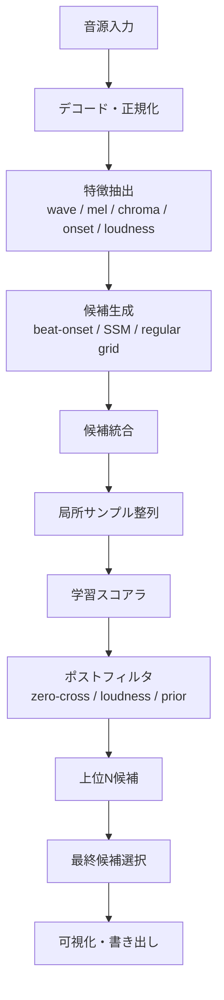
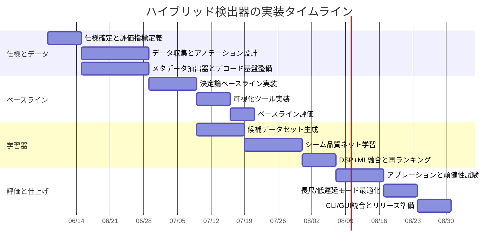

# ループ検出GitHub三件の深層調査レポート

## エグゼクティブサマリ

今回の三件は、同じ「ループ検出」を扱っていても、設計思想がかなり異なります。`milselarch/autolooper` は **WAV専用・C実装・波形直接比較中心** の最小構成で、最終的にはループ区間を複製して**長いWAVを書き出す**ツールです。`YoshimiKudo/AutoLooper` は **Electron/TypeScript製のデスクトップ向けループマーカー編集機** で、同一波形ではなく「同じように聞こえる瞬間」を狙う設計を前面に出し、**ループマーカー編集をロスレスに行う**方向に振れています。`arkrow/PyMusicLooper` は **Python/CLI中心の高機能ツール** で、クロマ・ビート・ラウドネス・候補枝刈りを組み合わせ、**タグ出力・テキスト出力・分割・延長・再生**まで含むワークフロー全体を持っています。 citeturn5view1turn5view2turn8view0turn18view0turn31view0turn44view11

アルゴリズム面では、`milselarch/autolooper` が **生波形差分と局所的な終端合わせ** を使うのに対し、`YoshimiKudo/AutoLooper` は **粗い特徴ベクトル＋局所再探索＋ゼロクロス補正＋ラウドネス補正** という段階的なスコアリングを行い、`PyMusicLooper` は **STFT→メル/クロマ→ビート列→候補生成→枝刈り→重み付きコサイン類似度** というMIR寄りの構成です。したがって、**試料点一致の精度**は `milselarch` 的手法が強く、**知覚的一致・実運用の編集性**は Yoshimi 版が強く、**楽曲構造を踏まえた候補探索の安定性**は PyMusicLooper が最も豊かです。 citeturn20view0turn21view0turn22view0turn36view1turn36view2turn37view1turn37view2turn37view3turn38view0turn42view5turn45view0turn45view1turn45view5turn46view1turn46view2

実装資産として最も再利用価値が高いのは、**PyMusicLooper の候補生成思想** と **Yoshimi の高速な局所再探索・ゼロクロス補正** です。一方で、真に「最強のループ」を狙うなら、**マルチスケール候補生成** と **局所サンプル整列** の間に、**学習ベースのシーム品質スコアラ** を挟むハイブリッド構成が最有望です。これは、`milselarch` のサンプル整列能力、`Yoshimi` の軽量知覚特徴、`PyMusicLooper` のビート・クロマ由来の候補削減を同時に活かせるためです。 citeturn22view0turn36view1turn36view2turn36view3turn37view1turn45view0turn45view1turn45view5turn46view1

なお、入力音源のジャンル・長さ・サンプリングレート・リアルタイム要件は未指定なので、本レポートでは **短尺BGM**, **通常長楽曲**, **長時間アンビエンス**, **低遅延近似リアルタイム** の四つの運用シナリオを想定して評価軸と実装計画を組んでいます。これはユーザー指定がないための前提であり、後段の設計と評価基準もその前提で整理しています。

## リポジトリ詳細解析

### milselarch/autolooper

このリポジトリは、README と `main.c` の記述からみて、**既存の音声をループ区間で延長して新しいWAVを生成するC製CLI** です。CLI は `./main INPUT_FILE OUTPUT_FILE MIN_LENGTH [START_TIME] [END_TIME]` という形式で、引数が4個なら自動探索、6個なら開始・終了秒を与える手動モードになります。入力・出力とも有限状態機械で `.wav` 拡張子かどうかを検査し、数値は「非負整数」だけを通すため、**秒単位・整数指定に限定**され、サブ秒マーカー指定はできません。 citeturn5view1turn18view0turn15view2turn25view0

音声IOは `parse_wav.h` / `parse_wav.c` の独自実装で行われ、`WavHeaders`, `WavFile`, `WavParseResult` という構造体にヘッダ・フレーム・スケール情報を保持します。`loop.h` / `loop.c` はサンプルバッファの読み出し、開始窓と終了窓の照合、延長後バッファの組み立てを担当し、`autoloop.c` は自動ループ探索全体を受け持ちます。つまり、この実装は **外部MIRライブラリなしの波形直接処理** に徹しています。 citeturn16view0turn15view0turn20view0turn22view0

主要アルゴリズムは二段です。手動モードでは、開始秒の位置から **1秒分**、終了秒の位置から **2秒分** を読み出し、`find_loop_end` が開始窓と終了窓の相対オフセットごとの二乗誤差和を総当たりして、最良の終了オフセットを選びます。その後 `loop()` が intro / loop / ending を切り出し、`min_length` を満たすまでループ部分を複製します。自動モードでは `find_loop_points_auto_offsets()` が、**10, 15, 20, 25秒** の複数窓長について `get_window_score()` を走らせ、曲全体で start/end の粗い候補を探索し、その後 `find_loop_end_short_arr()` で **1秒の精密整列** をかけ、最良の start/end を採用します。粗探索のスコア `find_difference()` はコメントでは平均二乗差のように見えますが、実際には `sqrt(d*d)` を足し込むため **平均絶対差に近い**実装です。 citeturn17view3turn21view0turn22view0turn20view0

特徴量らしい特徴量はほぼなく、**生波形振幅そのもの** が比較対象です。前処理も、ごく基本的な読み出しとバッファ化以外はありません。つまりこの実装は、**構造反復を高次特徴で探すのではなく、波形そのものの近さで押し切る** タイプです。そのぶん、正しく候補が近傍に入ればサンプルレベルで鋭いですが、候補が遠いと弱く、編曲の反復や知覚的一致には必ずしも強くありません。これは README が manual と auto を分けていることと、コードが秒指定・粗探索・局所整列を前提にしていることからも読み取れます。 citeturn5view1turn21view0turn22view0turn20view0

計算コストは、自動モードでかなり重くなります。`get_window_score()` は start と end の全組合せをステップ幅ごとに走査し、各組合せについて `find_difference()` を呼ぶため、概算では **候補数二乗 × 窓長** に近い複雑さになります。しかも自動モードではファイル全体を `all_smpl_buf` に読み込むため、メモリ使用量も曲長に比例します。対照的に手動モードは、主に `find_loop_end()` の **1秒窓に対する総当たり整列** が支配的で、44.1kHzならおおよそ `O(sr^2)` 級の局所探索です。これらはコードから導ける概算で、長尺アンビエンスではかなり重くなる設計です。 citeturn17view3turn22view0turn20view0

評価手法は強くは整備されていません。コードは自動探索時に **best score**, 推定 start/end 時刻, 窓長, 実行時間を `printf` しますが、公開ベンチマークや境界誤差評価は見当たりません。補助的な `py_testing/audio_test.py` は独自WAVパーサの出力を `librosa.load()` と比較し、許容誤差 `1e-3` 以内か確認しています。ただし、そのテストコードはチャネルループの中で `raw_data[0]` と `custom_raw_data[0]` を固定参照しており、**複数チャネル全体を実際には検証していない** ため、テスト自体にも穴があります。 citeturn17view4turn23view0turn24view0

既知の制約・不具合候補も明確です。`crossfade_samples()` には **stereo互換性のTODO** があり、しかも `extend_audio()` 内ではクロスフェード実装がコメントアウトされているため、現状は単純コピー延長です。`autoloop.c` には **「docs追加」「loop length追加」TODO** が残っています。また `main.c` は `fopen(..., "r")` / `fopen(..., "w")` を使っており、POSIXではほぼ問題にならない一方、**Windowsではバイナリモード未指定が移植性リスク** です。言い切りの実害バグではなく、コード上のポータビリティ欠陥候補として見るのが妥当です。 citeturn19view1turn22view0turn18view0

| ソースファイル | 役割 | 主要関数・構造 | 所見 |
|---|---|---|---|
| `main.c` | CLI入口、引数検証、manual/auto分岐 | `main` | `.wav` と非負整数のみ受理し、4引数で自動探索、6引数で手動探索。 citeturn18view0 |
| `autoloop.c` / `autoloop.h` | 自動ループ探索 | `find_difference`, `get_window_score`, `find_loop_points_auto_offsets`, `loop_with_offsets`, `auto_loop` | 粗探索→局所整列の二段構え。窓長は 10/15/20/25 秒固定。 citeturn21view0turn22view0turn17view4 |
| `loop.c` / `loop.h` | 手動ループ整列と延長音声生成 | `read_samples`, `find_loop_end`, `find_loop_end_short_arr`, `crossfade_samples`, `extend_audio`, `loop` | 波形直接比較。クロスフェードは実装途中で、延長は単純複製が中心。 citeturn15view0turn20view0turn19view1 |
| `parse_wav.c` / `parse_wav.h` | WAVの独自パースと書き出し | `WavHeaders`, `WavFile`, `read_wav_headers`, `read_frames`, `read_wav_file`, `write_wav` | 外部オーディオI/O依存を避けた自前実装。 citeturn16view0 |
| `fsm.c` / `fsm.h` | 拡張子・数値入力の有限状態機械 | `runFileExtFsm`, `runNumFsm` | CLI制約をかなり強めている。サブ秒不可。 citeturn15view2turn25view0 |
| `py_testing/*` | 解析補助とパーサ検証 | `audio_test.py` など | `librosa` 比較テストはあるが、多チャネル検証は不完全。 citeturn23view0turn24view0 |

### YoshimiKudo/AutoLooper

このリポジトリは `package.json` で **“Desktop batch loop marker editor for game music files”** と説明されている Electron/React/TypeScript ベースのデスクトップアプリです。README では、波形が完全一致する点ではなく、**「同じように知覚される瞬間」** を探すことを明示しており、さらに保存時には **フェードの追加・削除をせず、ループマーカーだけをロスレスに編集する** 方針を掲げています。つまり設計の中心は「延長音声を生成すること」ではなく、**ゲーム向けのループマーカー編集** にあります。 citeturn31view0turn5view2

リポジトリ構成も、その思想をよく表しています。`src/shared/detectCore.ts` が検出アルゴリズム本体、`src/main/main.ts` が Electron メインプロセスでの import/detect/save IPC、`src/main/services/detect.ts` が検出サービス、`src/main/audio/*` がフォーマット別デコード/メタデータ処理、`src/preload/index.ts` がレンダラ向けAPI公開、`src/renderer/App.tsx` がUI、`src/shared/types.ts` が型定義です。`src/main/audio` には `wav.ts`, `aiff.ts`, `flac.ts`, `mp3.ts`, `ogg.ts`, `waveform.ts`, `validation.ts` があり、フォーマット別処理を分けています。 citeturn27view0turn27view1turn27view2turn27view3turn28view0

入力仕様としては、インポートダイアログが `wav`, `aif`, `aiff`, `ogg`, `mp3`, `flac`, `opus` を受け付けます。検出設定は `DetectionSettings` で定義され、`mode`, `matchWindowMs`, `matchThreshold`, `minimumLoopMs`, `loopCheckPrerollMs` を持ちます。`main.ts` ではこれらがサニタイズされ、`matchWindowMs` は **100–30000ms**、`matchThreshold` は **1–100**（デフォルト 88）、`minimumLoopMs` は **100–600000ms**（デフォルト 3000）、`loopCheckPrerollMs` は **0–30000ms** に制限されています。UI文字列では `Normal` は「高速で主に waveform similarity ベース」、`Deep` は「beat-like positions と loudness differences も考える精密モード」と説明されています。 citeturn34view7turn39view2turn40view0turn32view2

ただし、コードを細かく見ると、**メインプロセスの検出サービス** `detectTrackLoop()` は `decodeWav()` と `decodeAiff()` しか直接呼ばず、それ以外のフォーマットでは **“Use the renderer WebAudio path”** を返します。したがって、リポジトリ全体としては多形式インポートに対応していても、今回直接追跡できた「共有検出コア + メインサービス」の経路は **WAV/AIFF で最も明瞭** です。この点は重要で、README上の広い対応形式と、検出コードを追ったときの実際の経路を混同しない方がよいです。 citeturn34view7turn42view3turn42view5

前処理はまずデコード後の **mono化** です。そのうえで `findBestLoop()` は、もし既存メタデータループがあればそれを候補として評価し、その後 `coarseSearch()` を走らせます。`coarseSearch()` は、比較窓長 `windowSamples` を固定して、区間ごとに **48次元の軽量特徴** を作り、候補位置ごとの内積で粗い類似候補を集めます。この特徴 `makeFeature()` は、ブロックごとの **平均絶対値とRMSを 0.65 / 0.35 で混合** して作った後、平均中心化とL2正規化を行うため、**純粋な波形そのものではなく、時間局所エネルギーの形** を見ています。 citeturn36view0turn36view2turn36view4turn37view2

類似度計算 `measureMatch()` は、この実装の肝です。これは区間A/Bの各サンプルについて、**相関係数ベースの類似度** と **RMS誤差ベースの類似度** を求め、それぞれ 0–100 に正規化し、**0.75 × correlation similarity + 0.25 × error similarity** で混ぜています。つまり Yoshimi 版は、`milselarch` のように単純な差分最小化ではなく、**形の相関** と **絶対誤差** を折衷した知覚寄りスコアを採用しています。 citeturn37view1

境界検出は normal / deep で少し違います。normal では `coarseSearch()` が候補を集め、`refineCandidate()` が **±2048サンプル, step 128** の局所探索で候補を磨きます。コード上では粗い stride=16 評価と、さらに細かい stride=4 評価が使われています。deep では `buildOnsetAlignedPositions()` が **RMSフラックス** から onset-like peak を抽出し、上位 **850個** の強いピークに加え、`max(windowSamples, sampleRate)` 間隔の規則格子も混ぜます。これにより、**ビート/オンセット系候補** と **fallbackの等間隔格子** が両立され、ビート偏重で候補を落としすぎるのを防いでいます。深い候補はさらに `applyZeroCrossingCorrection()` で **半径256サンプル以内のゼロクロス** に吸着し、`rescoreDeepCandidate()` で短い区間の **ラウドネス差ペナルティ** を上乗せして再スコアされます。最後に deep 候補と normal 候補を比較し、deep が normal より **1ポイント以上極端に悪くない** なら deep を採用します。 citeturn36view3turn37view0turn37view1turn37view3turn35view5turn38view0

WAV については `wav.ts` が `smpl` チャンクを読み、既存ループを `LoopMarker` として解釈します。また保存時には既存 `smpl` を外して新しい `smpl` チャンクを付与する `writeWavLoop()` を持つため、**WAVのループメタデータ読書き** はコード上で明示的に確認できます。出力形式全体については `saveLooped` 経路が存在し、オーディオモジュールも複数ありますが、今回の直接追跡範囲では **WAVの `smpl` 書き込みが最も明確に確認できた保存経路** です。 citeturn41view0turn41view4turn34view7

計算コストは、normal モードで `P` 個の候補位置に対する **`O(P^2 × 48)` の粗探索** が中心です。しかも `coarseSearch()` は `maxFeaturePositions = 3500` を持っていて、位置数をおおむね数千に抑える設計です。deep モードは onset-like 候補に絞るため、通常は `P` がもっと小さくなりますが、上位80候補を局所再探索し、さらにゼロクロス補正・ラウドネス再スコアまで行うので、**normal より遅いが高品質** という README/UI の説明と整合します。メモリはフルトラックの mono バッファに比例し、そこに軽量特徴列が載る形です。 citeturn32view2turn36view2turn37view0turn37view1

評価手法としては、学術的なベンチマークスクリプトは今回の追跡範囲では見当たりませんが、コードレベルでは **confidence 値**, **detected / low-confidence / no-loop / error** などの状態が一貫して設計されており、UIにも `Check Loop` や各種設定値が存在します。つまりこのプロジェクトは「研究コード」よりは **実用UI付きの編集ツール** として組み立てられていると読むべきです。確認できたテストファイルは `tests/audio.test.ts` でした。 citeturn42view3turn42view5turn27view2turn30view0

既知の制約としては、まず上述のように **検出経路が main process では WAV/AIFF に寄っている** こと、つぎに **mono downmix** を前提にしていること、そして設計思想として **試料点一致ではなく知覚的一致を優先** していることが挙げられます。最後の点は制約であると同時に長所でもあり、サンプル完全一致が必要な厳密ループ素材では外す可能性がある一方、ゲームBGMのように「自然に回る」ことを優先する用途にはよく合います。 citeturn5view2turn42view3turn36view0turn37view1

| ソースファイル | 役割 | 主要関数・構造 | 所見 |
|---|---|---|---|
| `src/shared/detectCore.ts` | 検出アルゴリズム本体 | `findBestLoop`, `findBestLoopDeep`, `measureMatch`, `coarseSearch`, `refineCandidate`, `buildOnsetAlignedPositions`, `applyZeroCrossingCorrection` | 本リポジトリの中核。normal/deep の差もここに集約。 citeturn36view0turn36view1turn36view2turn36view3turn37view1turn37view2turn37view3turn38view0 |
| `src/main/main.ts` | Electronメインプロセス、IPC、入出力管理 | `ipcMain.handle("tracks:import" / "tracks:detect" / "tracks:save-looped" ...)`, `sanitizeDetectionSettings` | 実運用の制約とデフォルト値はここで確定する。 citeturn34view7turn39view2 |
| `src/main/services/detect.ts` | 検出サービス | `detectTrackLoop` | WAV/AIFF は main 側で直接検出し、他形式は renderer WebAudio 経路へ促す。 citeturn42view1turn42view3turn42view5 |
| `src/main/audio/wav.ts` | WAVデコードとループメタデータ処理 | `decodeWav`, `writeWavLoop`, `parseSmpl`, `createSmplChunk` | WAV `smpl` 読書きが明示確認できる。 citeturn41view0turn41view4 |
| `src/shared/types.ts` | 型定義 | `DetectionSettings`, `LoopMarker`, `TrackInfo`, `DetectionResult`, `SaveOptions` | UI・IPC・検出コアの共通契約。 citeturn40view0 |
| `src/preload/index.ts` | Renderer公開API | `detectTracks`, `saveLoopedCopies`, `selectOutputDirectory`, `openSavedFolder` | Electronセキュリティ境界をまたぐ公開面。 citeturn39view4 |
| `src/renderer/App.tsx` | UI・設定・一括編集体験 | 設定文言、プリセット説明、操作状態 | Normal/Deep の説明や編集ワークフローが反映される。 citeturn32view2turn33view2 |
| `src/main/audio/*` | 形式別オーディオ/メタデータ処理 | `aiff.ts`, `flac.ts`, `mp3.ts`, `ogg.ts`, `waveform.ts`, `validation.ts` | 多形式対応の骨格。今回の詳細検証は WAV/AIFF 中心。 citeturn28view0 |

### arkrow/PyMusicLooper

PyMusicLooper は README で **“Python utility to find loop points in an audio file”** と説明され、ループポイントの検出だけでなく、**タグ出力・テキスト出力・拡張書き出し・分割・再生** までをカバーする Python ツールです。README では、信号処理と機械学習を組み合わせるが **学習済みモデルの訓練は不要** という趣旨が説明されており、実装を見ても深層学習モデルよりは **MIR的特徴設計と探索戦略** に重心があります。 citeturn8view0turn0search1

中核APIは `core.py` の `MusicLooper` クラスで、`find_loop_pairs()` が主要入口です。CLI は `cli.py` に実装され、`play`, `play_tagged`, `split_audio`, `extend`, `export_points`, `tag` などのサブコマンドを持ちます。共通オプションとして `--min-duration-multiplier`（デフォルト **0.35**）、`--min-loop-duration`, `--max-loop-duration`, `--approx-loop-position`、`--brute-force`、`--disable-pruning` が用意されており、`--approx-loop-position` には **±2秒探索窓**、`--brute-force` には **数分かかりうる警告** が明示されています。つまり、PyMusicLooper は三件の中で最も **運用オプションが豊富** です。 citeturn46view3turn46view4turn44view11

前処理は `audio.py` の `MLAudio` が担い、`librosa` を使って音声をロードします。分析側では `analysis.py` が STFT を計算し、そこから **パワースペクトル**, **perceptual weighting**, **128バンドのメルスペクトログラム**, **chroma_stft**, **power_db** を作ります。ビート解析を有効にする場合は、`librosa.onset.onset_strength()` で onset envelope を求め、`librosa.beat.plp()` の局所極大と `librosa.beat.beat_track()` の結果を併合して beat 列を作り、BPM も取得します。ここは三件の中で最も「教科書的なMIRパイプライン」に近い部分です。 citeturn46view5turn45view0turn45view1turn45view2

候補生成は beat ベースです。`find_best_loop_points()` は秒指定の最小/最大ループ長をフレーム数に変換し、のちに `LoopPair` の列を返します。候補ループの生成関数は、docstring 上 **「beat indices の組合せを使って valid candidate loop pairs を生成し、クロマによる note 比較と loudness difference を使う」** と明記されています。またコード内には **trial and error 由来の magic constants** があり、例えば `ACCEPTABLE_NOTE_DEVIATION = 0.0875` が固定されています。ここから、PyMusicLooper は「全区間自己相関」ではなく、**拍に同期した構造反復の仮説空間を先に作り、その上で音高と音量の整合性を見る** 設計だと分かります。 citeturn45view6turn46view1

候補評価と枝刈りは `_assess_and_filter_loop_pairs()` が担当します。ここでは BPM から **1秒あたりの拍数** を出し、**12拍分** をテスト長として subsequent notes の類似度を測ります。候補が多いときは `_prune_candidates()` で **note_distance と loudness_difference の百分位 기반枝刈り** を行い、デフォルトでは `keep_top_notes=75`, `keep_top_loudness=50`, `acceptable_loudness=0.25` が使われます。その後 `_calculate_loop_score()` が **重み付きのコサイン類似度** を計算し、`score` を付けて再ソートします。つまり PyMusicLooper の本体は、**候補生成→候補削減→精査スコア** の三段構成です。 citeturn45view5turn46view2

この設計の強みは、ビート列 `B` に対する探索が基本になるため、全フレーム探索より大幅に軽いことです。概算では候補生成は **`O(B^2)`** に近く、特徴抽出が **STFT由来の `O(T log T)`**、最終精査が候補数 `K` とテスト長に比例します。反対に `--brute-force` は beat に限定せず「entire audio track」を検査するため、CLI 上でも長時間化が警告されています。要するにこの実装は、**ビート同期を使って計算量と誤検出を抑える** ことを最重要の工夫にしており、非拍節的なループや自由テンポ素材では brute-force や近傍制約オプションが必要になります。 citeturn44view11turn45view5turn46view1

評価面では、公開ベンチマークハーネスよりも **実務ワークフローが充実** しています。`LoopPair` は exact sample の `loop_start`, `loop_end`, `note_distance`, `loudness_difference`, `score` を持ちますし、CLI では `export_points` で top-N 候補も出せます。`play` は発見ループで再生を回せますし、`tag` はユーザー指定のメタデータタグ名でループ情報を書き出せます。したがって PyMusicLooper は「研究プロトタイプ」であると同時に、**結果確認とエクスポートまで完結する職人的CLI** と見た方が実態に近いです。 citeturn46view0turn44view7turn44view11

既知の制約はかなり明確です。第一に **beat analysis failure で処理が止まる** ため、極端に静的・無拍の素材では不利です。第二に、拍ベース候補は高速ですが、**拍外ループを見落とす** 危険があるため `--brute-force` が用意されています。第三に、候補が多い場合の枝刈りは trial and error の magic constants と百分位閾値に依存しているので、**良い候補を pruning で落とす可能性** があり、そのため `--disable-pruning` が明示的に準備されています。 citeturn45view0turn45view5turn44view11

| ソースファイル | 役割 | 主要関数・構造 | 所見 |
|---|---|---|---|
| `analysis.py` | ループ候補生成とスコアリングの本体 | `LoopPair`, `find_best_loop_points`, `_assess_and_filter_loop_pairs`, `_prune_candidates`, 類似度計算群 | STFT/メル/クロマ/ビート/枝刈り/重み付きコサイン類似度が集中。 citeturn45view0turn45view5turn45view6turn46view1turn46view2 |
| `core.py` | 高レベルAPI | `MusicLooper`, `find_loop_pairs`, `export_txt` など | ライブラリ利用者向けAPI面。 citeturn44view5turn44view7turn46view3 |
| `handler.py` | CLI向けオーケストレーション | `LoopHandler` | パス、長さ制約、近似位置、対話的選択などを束ねる運用層。 citeturn44view8 |
| `audio.py` | 音声読み込みラッパ | `MLAudio` | `librosa` ベースで音声・レート・長さ・トリム情報を持つ。 citeturn46view5 |
| `cli.py` | コマンドラインUI | `play`, `play_tagged`, `split_audio`, `extend`, `export_points`, `tag` | 三件中もっとも運用オプションが豊富。 citeturn44view11turn46view4 |
| `playback.py` | 再生支援 | 再生モジュール | ループ試聴ワークフローを支える。 citeturn43view4 |
| `console.py`, `exceptions.py`, `utils.py`, `youtube.py` | 補助モジュール | 例外・表示・ユーティリティ・補助入力 | 周辺機能までパッケージ化されている。 citeturn9view0 |

## 比較表

| 項目 | milselarch/autolooper | YoshimiKudo/AutoLooper | arkrow/PyMusicLooper | 根拠 |
|---|---|---|---|---|
| 主目的 | WAVをループ区間で延長して**新しい音声ファイル**を作る | **ゲーム音楽向けループマーカー編集**を一括で行うデスクトップアプリ | ループポイント検出に加え、**再生・分割・延長・タグ/テキスト出力**まで行うCLI/API | citeturn5view1turn5view2turn8view0turn44view11turn31view0 |
| 入力形式 | `.wav` のみ | import は `wav/aif/aiff/ogg/mp3/flac/opus`。ただし main 側検出は WAV/AIFF が明示的 | 音声ファイルを対象にCLI/APIで処理。出力では WAV/FLAC/OGG/MP3 などを選べる | citeturn18view0turn34view7turn42view3turn44view11 |
| 出力形式 | 延長済みWAV | ループマーカー付きコピーを保存。WAVでは `smpl` メタデータの読書きが明示 | ループポイントのSTDOUT/TXT出力、タグ出力、分割合成、延長音声出力 | citeturn20view0turn41view0turn41view4turn44view7turn44view11 |
| 前処理 | 自前WAV読み込み以外ほぼなし。生波形直接処理 | デコード後 mono 化。lightweight feature と onset-like candidate を作る | STFT→perceptual weighting→mel/chroma、onset strength、beat/PLP | citeturn16view0turn20view0turn36view0turn37view2turn37view3turn45view0 |
| 主特徴量 | 生波形振幅 | 平均絶対値+RMSの軽量時間特徴、相関+誤差、ラウドネス、ゼロクロス | クロマ、perceptual power dB、beat、tempo、候補の note/loudness 指標 | citeturn20view0turn21view0turn37view1turn37view2turn36view3turn45view0turn45view5 |
| 類似度計算 | 平均絶対差に近い粗スコア + 二乗誤差和で終端整列 | `measureMatch` による相関類似度と誤差類似度の混合 | 重み付きコサイン類似度を中心に候補スコアを付与 | citeturn21view0turn20view0turn37view1turn46view2 |
| 境界検出 | user指定秒 or 全曲粗探索後、1秒局所整列 | coarseSearch→局所再探索→ゼロクロス補正→deepならラウドネス再スコア | beat組合せ候補→枝刈り→12拍分の後続ノート比較で再スコア | citeturn22view0turn36view2turn36view3turn37view0turn37view3turn45view5turn46view1 |
| 主要パラメータ | CLIの `MIN_LENGTH`, optional `START_TIME/END_TIME`。auto 窓長 10/15/20/25 秒は固定 | `mode`, `matchWindowMs`, `matchThreshold`, `minimumLoopMs`, `loopCheckPrerollMs` | `min-duration-multiplier=0.35`, `min/max-loop-duration`, `approx-loop-position`, `brute-force`, `disable-pruning` | citeturn18view0turn17view3turn39view2turn40view0turn44view11 |
| 計算コストの傾向 | 自動探索は曲全体の start/end 組合せ探索で重い。長尺に不利 | 粗探索は位置数を数千に制限し、上位候補だけを局所精査 | beat制約では比較的軽いが、brute-force は重い | citeturn22view0turn36view2turn37view0turn44view11turn45view5 |
| 評価の見せ方 | best score / offset / runtime 出力。公開ベンチマークは見当たらない | confidence と status をUI/IPCで返す。`tests/audio.test.ts` はある | `LoopPair.score`, top-N export, play での耳確認が中心 | citeturn17view4turn42view3turn30view0turn46view0turn44view11 |
| 既知の制約 | WAV専用、整数秒入力、クロスフェード未整備、Windowsでバイナリモード未指定の移植性懸念 | main 側の直接検出は WAV/AIFF 寄り、mono前提、知覚一致優先で試料点一致保証ではない | beat依存で拍外ループを落としうる、枝刈りで良候補を落としうる、brute-force は遅い | citeturn18view0turn19view1turn22view0turn42view3turn5view2turn36view0turn44view11turn45view5 |

## 学術的背景と実装示唆

ループ検出・セグメンテーションの古典としてまず重要なのは、**自己類似行列** です。Foote の自己類似可視化は、音声中の任意の二時点の類似度を2次元に並べることで、反復構造・周期構造・セグメント境界を見える化し、構造抽出やセグメンテーション、テンポ解析にも使えることを示しました。利点は、**曲全体の反復構造を一望できること** と、使う特徴量を差し替えれば同じ枠組みで多様な構造解析に使えることです。欠点は、**時間・メモリが基本的に二乗** で増えること、そして特徴量の選び方で見える斜線・ブロックが大きく変わることです。実装上は、全フレームの完全SSMを最初から作るのでなく、**ダウンサンプル特徴で粗いSSMを作り、候補対だけ局所精査する** 構成が現実的です。 citeturn48search1turn48search2

反復検出をより音楽的にしたものが、Bartsch と Wakefield の **chroma-based audio thumbnailing** 系統です。ここでは絶対周波数ではなく **音高クラス** に注目することで、編曲差・音色差に比較的頑健にコーラスや繰り返し区間を捉えられます。利点は、**同じ和声進行・同じフレーズの再出現** を拾いやすいことです。欠点は、**パーカッシブ主導・無調・ドローン・ノイズ系** では情報量が落ちやすいこと、また転調や強いテンポ揺れでは単純比較だけでは崩れやすいことです。実装上は、PyMusicLooper が採るように **クロマを粗い候補選別に使い、その後に別の境界精査を噛ませる** のが筋がよいです。 citeturn47search0turn47search3turn47search6

拍・オンセット・テンポ推定を使う方法は、探索空間を強く減らせるのが最大の魅力です。PyMusicLooper は `librosa.onset.onset_strength`, `librosa.beat.plp`, `librosa.beat.beat_track` を組み合わせて候補を beat 列に制限しており、Yoshimi の deep mode も RMS フラックス由来の onset-like positions を使って候補の位置を削っています。これは実装的には極めて正しい発想で、**候補を全サンプルから探すのではなく「音楽的な拍・立ち上がり」に寄せる** ことで、計算量も誤候補も一気に減ります。弱点は、**拍が明瞭でない素材** や **拍外にループ境界がある素材** に弱いことなので、Yoshimi が regular grid fallback を併用している点は非常に良い設計です。 citeturn45view0turn45view1turn37view0turn37view3

ニューラル手法の文脈では、Schlüter と Böck の CNN ベース onset detection や、Davies と Böck らの TCN ベース beat tracking が重要です。これらは、従来の手工特徴や単純閾値処理よりも、**局所スペクトルパターンや時間文脈** を学習的に扱える点が強みです。一方で、ループ境界そのものの教師データはビートやオンセットより希少なので、実装上は **「beat/onset を学習で直接全部解く」より「候補生成は決定論、境界シーム品質の再スコアだけを学習でやる」** 方がデータ効率も保守性も良いことが多いです。これは三件の実装を並べたときにも自然な帰結で、学習を足すなら `milselarch` の局所整列や `Yoshimi` の局所精査を置き換えるのでなく、**PyMusicLooper/Yoshimi 的候補群の順位付け層** に足すのが最も筋が良いです。 citeturn47search12turn47search8turn45view0turn36view2turn37view1

実装上の示唆を一言でまとめるなら、**粗探索は音楽構造特徴、最終境界は波形整列、最終採択は知覚スコア** が最も安定です。三件のコードでも、`milselarch` は最後のサンプル整列、Yoshimi は知覚寄りの局所スコア、PyMusicLooper は音楽構造寄りの候補生成にそれぞれ強みがあり、単独で完結させるより **役割分担を分離** した方が設計品質は上がります。 citeturn22view0turn37view1turn45view5

## 改良案設計

以下では、「**最強のループを取るアルゴリズム**」を目標に、短尺BGM・通常長楽曲・長時間アンビエンス・低遅延近似リアルタイムの四シナリオを想定して三案を示します。三案とも、今回調査した三件の実装と、自己類似・クロマ・オンセット/ビート・軽量ニューラルの文脈を統合する発想に基づいています。 citeturn22view0turn36view2turn37view3turn45view0turn48search1turn47search0turn47search12turn47search8

### 高速決定論アーキテクチャ

この案は、**Yoshimi normal + milselarch refine** をさらに整えた「低遅延・学習不要」案です。粗探索は downmix 後の軽量エネルギー特徴とクロマ要約で行い、上位候補だけを波形相関・ゼロクロス・短区間ラウドネスで精査します。短尺BGMやツール内プレビューに向きます。

```text
入力
  -> デコード・mono化・正規化
  -> 軽量特徴抽出（短時間RMS, 平均絶対値, 低次元クロマ）
  -> マルチスケール粗探索（0.5s / 1.5s / 4s）
  -> 上位K候補抽出
  -> 局所再探索（±数千サンプルで相関/誤差混合スコア）
  -> ゼロクロス補正
  -> ラウドネス差・DC差・クリック推定で再順位付け
  -> 最良候補を返す
```

```pseudo
function detect_fast(audio, sr, cfg):
    mono = downmix(normalize(audio))
    feats = make_fast_features(mono, sr, scales=[0.5, 1.5, 4.0])
    coarse = propose_repeat_pairs(feats, min_len=cfg.min_len, max_len=cfg.max_len, topK=K1)

    refined = []
    for pair in coarse:
        pair2 = local_waveform_refine(mono, pair, radius=2048, step=64)
        pair3 = snap_zero_cross(pair2, radius=256)
        score = fuse(
            corr_score(mono, pair3),
            error_score(mono, pair3),
            loudness_penalty(mono, pair3),
            click_penalty(mono, pair3)
        )
        refined.append((pair3, score))

    return argmax(refined)
```

計算コストは、粗探索を `T'` 個の要約フレームに圧縮すれば概ね **`O(T'^2 d + K·R·L)`** です。ここで `d` は特徴次元、`K` は上位候補数、`R` は局所探索候補数、`L` は比較窓長です。通常長楽曲では十分高速ですが、拍や和声の情報が弱いので、**類似だが文脈の違う反復** を誤採択しやすいリスクがあります。

### ハイブリッド学習アーキテクチャ

この案を本レポートでは **最有望** と判断します。候補生成は決定論で行い、**「その候補が本当に自然にループするか」** の判定だけを軽量学習器に任せます。データ効率・説明可能性・実行時間のバランスが最も良いからです。

```text
入力
  -> デコード・リサンプル・mono/stereo補助特徴生成
  -> 候補生成器A（オンセット/ビート同期）
  -> 候補生成器B（クロマ/SSM対角ピーク）
  -> 候補生成器C（均等格子 fallback）
  -> 候補統合・重複除去
  -> 局所サンプル整列
  -> 学習スコアラ（境界前後のマルチスケール特徴テンソル）
  -> ルールベース後段（ゼロクロス, ラウドネス差, ループ長 prior, 既存メタデータ prior）
  -> 上位N候補 + 最終1候補
```

```pseudo
function detect_hybrid(audio, sr, cfg, metadata=None):
    x = preprocess(audio, sr)
    candA = propose_onset_beat_pairs(x, cfg)
    candB = propose_ssm_chroma_pairs(x, cfg)
    candC = propose_regular_grid_pairs(x, cfg)

    candidates = dedupe_and_merge(candA, candB, candC, metadata)
    candidates = rank_by_fast_scores(candidates, x)[:K]

    outputs = []
    for c in candidates:
        c_ref = local_align(x.wave, c, search_ms=[40, 8])
        tensor = make_boundary_tensor(
            x, c_ref,
            scales_ms=[5, 25, 100, 500],
            feats=["wave", "mel", "chroma", "rms", "onset", "stereo_delta"]
        )
        ml = seam_quality_net(tensor)
        dsp = dsp_seam_score(x, c_ref)
        prior = metadata_prior(c_ref, metadata) + duration_prior(c_ref, cfg)
        final = w1*ml + w2*dsp + w3*prior
        outputs.append((c_ref, final))

    return select_best_with_diversity(outputs)
```

計算コストは候補生成を `P` 個の候補位置、再精査対象を `K` 個とすると、概算で **`O(P^2 d + K·R·L + K·NN)`** です。`NN` は軽量シーム品質ネットの推論コストで、候補数 `K` を 32–128 程度に抑えれば現実的です。利点は、**誤候補の多い全探索を避けつつ、知覚的一致を学習的に吸収できる** ことです。リスクは、**境界アノテーションデータの準備** と **学習器が特定ジャンルに偏ること** です。

### 重厚オフラインアーキテクチャ

これは最終品質を最優先する **オフライン専用の重量級案** です。曲全体のマルチスケール表現から近似SSMを構成し、対角線パターン抽出、セグメント候補、局所再整列、最後に transformer / TCN 系スコアラで全体文脈込み再評価を行います。長時間アンビエンスや最終マスター確認向けです。

```text
入力
  -> 高解像度特徴（wave / mel / chroma / onset / loudness）
  -> 低解像度トークン列
  -> 近似自己類似行列
  -> 対角線群・反復セグメント抽出
  -> 制約付きDPで(start, end)候補列化
  -> 局所波形整列
  -> 文脈ネットで再スコア
  -> 多様性制約付きN-best出力
```

```pseudo
function detect_offline_strong(audio, sr, cfg):
    feat_hi = multiscale_frontend(audio, sr)
    tokens = temporal_encoder(feat_hi)
    ssm = ann_similarity(tokens)
    diagonals = detect_repeat_diagonals(ssm, min_len=cfg.min_len)
    pairs = constrained_dp(diagonals, onset=feat_hi.onset, duration_range=cfg.range)

    refined = []
    for p in topM(pairs):
        p2 = multistage_align(audio, p)
        ctx = make_context_tensor(feat_hi, p2, left_ctx=8s, right_ctx=8s)
        refined.append((p2, context_net(ctx)))

    return rerank_with_postfilters(refined)
```

計算コストは近似検索を使っても **`O(T·d^2)` から `O(T^2)` に近づきやすく**、最も重いです。最大の利点は、**拍に乗らない長尺ドローンや段階的変化を含む素材** にも対応しやすいことですが、実装難度が高く、リアルタイム性は期待しにくいです。

### 評価指標とテストデータ要件

この三案を比較するため、本レポートでは次の指標を定義します。

| 指標 | 定義 | 目的 |
|---|---|---|
| 境界精度 | start/end が基準境界から 5ms / 10ms / 20ms 以内に入る率 | サンプル精度と実用精度の両方を見る |
| 境界誤差 | `|Δstart|`, `|Δend|`, `|Δlength|` の平均・中央値・95パーセンタイル | ずれの分布を見る |
| Seam品質 | ループ境界前後の相関・RMS誤差・ラウドネス差・クリック推定の合成指標 | 「自然に回るか」を測る |
| Candidate Recall@K | 正解近傍候補が上位Kに存在する率 | 候補生成器の良し悪しを見る |
| 実行時間 | 1曲あたり時間、Real-Time Factor、ピークメモリ | 実運用可否を測る |
| 頑健性 | サンプリングレート変更、モノラル化、MP3/OGG圧縮、長尺化、無拍素材での劣化量 | 実務での壊れにくさを見る |

テストデータは、最低でも **正例ループ付き素材**, **複数妥当ループを持つ素材**, **そもそも良いループが存在しない負例**, **拍が明瞭な素材**, **拍が曖昧なアンビエンス**, **圧縮コーデック由来の歪みを含む素材**, **既存メタデータ付き素材** を含む必要があります。さらに、短尺BGM・通常長曲・長時間環境音・低遅延用途の四シナリオに分けて評価すべきです。  
この要件を満たさないと、ビート依存法、波形依存法、知覚スコア法のどれが本当に強いかを比較できません。

## 実装計画

### 採用方針

最も有望なのは、前節の **ハイブリッド学習アーキテクチャ** です。理由は三つあります。第一に、`milselarch` のような波形局所整列は最終的なサンプル精度に不可欠です。第二に、`Yoshimi` と `PyMusicLooper` が示すように、候補生成を **onset/beat/chroma/軽量特徴** に寄せると探索空間が現実的になります。第三に、ループ境界の「自然さ」は純粋な相関だけでは測りきれず、**短い境界前後コンテキストを学習的に見るシーム品質スコアラ** が効く可能性が高いからです。 citeturn22view0turn36view2turn37view1turn37view3turn45view0turn45view5

### 実装ステップ

実装は、**データ基盤 → 決定論ベースライン → 学習スコアラ → 融合・評価 → 配布** の順に進めるのが安全です。先に決定論だけで end-to-end を通し、その後に学習器を差し込むことで、どこで改善したかをアブレーションで切り分けられます。

| フェーズ | 実装内容 | 主要成果物 |
|---|---|---|
| データ基盤 | デコーダ、既存メタデータ抽出、アノテーション形式統一 | `AudioItem`, `LoopAnnotation`, codec adapter |
| ベースライン | 高速候補生成、局所整列、ゼロクロス補正、可視化 | deterministic baseline |
| 学習準備 | 候補集合と正解境界から pair/tensor データセット生成 | training dataset v1 |
| 学習器 | Siamese/TCN 系の seam quality net 学習 | trained scorer |
| 融合 | DSPスコア + MLスコア + prior の重み最適化 | fused detector |
| 評価 | シナリオ別評価、アブレーション、誤検出分析 | benchmark report |
| 配布 | CLI/GUI/ライブラリ化、ONNX化、プロファイル | release candidate |

### 必要ライブラリ

推奨ライブラリは以下です。ここでは **実装容易性・再現性・可視化しやすさ** を優先しています。

| 用途 | 推奨ライブラリ |
|---|---|
| 音声デコード | `soundfile`, `ffmpeg-python` または `pydub`, 必要なら `audioread` |
| 信号処理 | `numpy`, `scipy`, `librosa` |
| 高速化 | `numba`, `faiss` または `annoy` 相当, `onnxruntime` |
| 学習 | `torch`, `torchaudio`, `pytorch-lightning` |
| 可視化 | `matplotlib`, `plotly` |
| 評価管理 | `pandas`, `polars`, `jsonlines`, `hydra` または `omegaconf` |

### データセット設計

公開の「厳密ループ境界」データだけで十分に学習するのは難しいので、実装計画では **三層データ** を前提にします。

第一層は、**既存ループメタデータ付き音源** です。Yoshimi が WAV `smpl` を読み書きでき、PyMusicLooper がループポイントやタグ出力、テキスト出力のワークフローを持つため、既存資産から **弱教師ありラベル** を作る足場があります。第二層は、手動で sample-accurate に確認した **高品質アノテーション集合** です。第三層は、検出不要な負例や、複数妥当解を持つ素材です。これにより、「正解一点」だけを無理に押しつけない評価ができます。 citeturn41view0turn41view4turn44view7turn44view11

アノテーション項目は最低でも、`start_sample`, `end_sample`, `quality_rank`, `alternate_loops`, `loopable:boolean`, `genre_tag`, `tempo_tag`, `codec`, `sample_rate`, `channels`, `existing_metadata_source` を持たせるべきです。特に `alternate_loops` を持たせないと、音楽的に複数の自然なループがある曲で学習器が不当に罰せられます。

### ハイパーパラメータ初期値

初期値は、三件の実装から逆算した「保守的な値」から始めるのが良いです。

| パラメータ | 初期値 | 由来 |
|---|---|---|
| 候補比較窓 `match_window` | 1.5 s | Yoshimi の既定値に近い長さから開始 |
| 最小ループ長 | 3.0 s | Yoshimi 既定値に近く、短すぎる誤検出を避ける |
| 候補上位数 `K` | 64 | Yoshimi の normal coarseSearch に近い |
| onset/beat 候補上限 | 512–1024 | PyMusicLooper 的な探索削減を意識 |
| 局所整列探索半径 | ±2048 samples | Yoshimi の実装を起点にする |
| ゼロクロス補正半径 | 256 samples | Yoshimi の実装を起点にする |
| 学習器入力スケール | 5/25/100/500 ms | seam の局所〜半局所文脈を両立 |
| 損失関数 | ranking loss + BCE | 候補順位と自然/不自然の両面を学習 |

### 評価実験設計

実験は最低でも次の四本を回すべきです。

まず **ベースライン比較** として、`milselarch` 型の sample-domain only、Yoshimi 型の lightweight perceptual、多段候補生成だけ、PyMusicLooper 型の beat/chroma 候補だけ、そして最終ハイブリッドを横並びにします。  
次に **アブレーション** として、beat候補除去、SSM候補除去、ゼロクロス補正除去、学習スコアラ除去、ラウドネス罰則除去を個別に試します。  
三本目は **頑健性試験** で、WAV/AIFF/MP3/OGG、44.1/48/96kHz、mono/stereo、短尺/長尺、無拍/有拍を分けて測ります。  
四本目は **実行性能試験** で、オフライン最良品質モードと低遅延モードを分け、1曲あたり時間・ピークメモリ・Real-Time Factor を出します。

### 可視化計画

可視化は、デバッグと研究の両方に効きます。最低限、以下の四種類は常設すべきです。

| 可視化 | 内容 | 目的 |
|---|---|---|
| 波形拡大図 | 境界前後の波形、ゼロクロス位置、クリック推定 | sample-level デバッグ |
| 類似度マトリクス | coarse SSM、候補線、採択候補 | 反復構造の可視化 |
| 候補散布図 | x=start, y=end, 色=score, 大きさ=loop長 | 候補分布の把握 |
| 境界テンソル表示 | mel/chroma/onset/rms の前後窓 | MLスコアラの判断根拠把握 |



このフローは、三件の長所を分業化して統合するための実装骨格です。候補生成は PyMusicLooper / Yoshimi 系、局所整列は milselarch / Yoshimi 系、最終再順位付けだけ学習器に寄せる設計です。 citeturn22view0turn36view2turn37view3turn45view5

### タイムライン

以下は、2026年6月開始を想定した **約十週間** のガント風計画です。研究寄りですが、ツール開発まで含めた現実的な日程にしています。



### 最終推奨

結論として、**「候補生成は音楽構造で粗く、最終境界は波形で細かく、採択は知覚品質で決める」** という三層構造が最も有望です。  
`milselarch/autolooper` 単独ではサンプル整列は鋭いが探索が粗く、`YoshimiKudo/AutoLooper` 単独では実用品質は高いが学習ベースの最終評価層がなく、`PyMusicLooper` 単独では候補生成は強いが beat 依存が残ります。したがって、**PyMusicLooper の候補生成思想 + Yoshimi の局所補正 + milselarch 的なサンプル整列 + 軽量学習スコアラ** が、「最強のループ」に最も近い設計です。 citeturn22view0turn37view1turn37view3turn45view0turn45view5