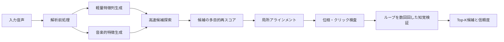
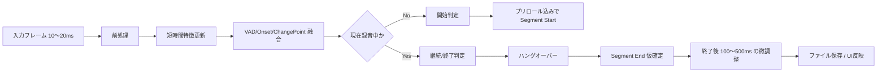
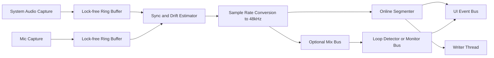

# ループ検出とリアルタイム区間分割とRust録音設計の詳細調査

## Executive Summary

指定された三つの実装は、同じ「ループ点を見つける」問題を扱っていても、アルゴリズムの思想がかなり異なります。`milselarch/autolooper` は、固定長ウィンドウの時間領域差分を総当たり気味に比較し、最後に 1 秒周辺でサンプル単位の最小二乗差を見て継ぎ目を詰める、きわめて素朴で C らしい実装です。`YoshimiKudo/AutoLooper` は、時間領域のままでもっと実用寄りに整理されており、粗探索ではブロックごとの mean-abs と RMS からなる正規化特徴ベクトルを使い、精密化で相関係数・誤差類似度・オンセット様ピーク・音量差・ゼロクロス補正まで取り入れています。`arkrow/PyMusicLooper` は三者の中で最も音楽的特徴を強く使っており、STFT、知覚重み付きスペクトル、mel、chroma、オンセット強度、PLP、beat tracking、重み付きコサイン類似度を組み合わせて候補を選別・再スコアしています。 citeturn41view0turn42view2turn14view1turn15view1turn19view0turn25view3turn23view0turn23view1turn28view0

結論だけ先に言うと、「最強のループ」を取りに行くなら、現状の三者のどれか一つをそのまま採用するより、**PyMusicLooper の音楽的候補生成**、**AutoLooper の軽量な粗探索と局所精密化**、**サンプル単位の継ぎ目補正**を統合した多段ハイブリッドが最適です。特に、三実装ともクリック回避のためのゼロクロス寄せは持っていても、**複素 STFT の位相連続性**や**ループを数回回したときの知覚的継続性**まで明示的に最適化していません。この抜けを埋めると、単発の一致スコアが高いだけの境界より、実際にゲーム実装で崩れにくいループが選べます。 citeturn15view1turn27view3turn42view3

一方で、「つながっている音声をその場で区間分割する」問題は、上記三実装の主戦場ではありません。`autolooper` は反復素材を前提にしており、`AutoLooper` はストリーミング状態機械を持たず、`PyMusicLooper` は全体文脈を使うオフライン解析です。リアルタイム分割には、用途別に **VAD 系**、**オンセット検出系**、**変化点検出系**を切り分け、さらにヒステリシス、プリロール、ハングオーバー、終了後微調整を持つストリーミング状態機械で包むのが現実的です。発話主体なら WebRTC VAD や Silero VAD、音楽・効果音主体なら onset strength / spectral flux 系、複数話者や会話単位が必要なら pyannote 系が適しています。 citeturn18view6turn23view1turn38search0turn38search4turn40search3turn38search3turn38search2

録音基盤については、**マイクは CPAL を軸**にし、**システム音は OS 固有 API を別途使う**のが安全です。Windows は WASAPI loopback、macOS は ScreenCaptureKit、Linux は PipeWire、ブラウザは `getDisplayMedia({ audio: true, systemAudio: "include" })` と `getUserMedia({ audio: true })` を Web Audio で合流する構成が本筋です。`rodio` は録音コアではなく、ループ継ぎ目の試聴や UI 用プレーヤとして使うのが向いています。`portaudio-rs` は C 依存を許容できるなら、成熟した callback / blocking の二系統 I/O を使える選択肢です。 citeturn39view4turn36search1turn36search5turn36search2turn37view2turn37view3turn39view0turn39view1turn39view2turn40search5

## GitHub実装の詳細解析

### milselarch autolooper

`milselarch/autolooper` は、README 上でも「WAV 入力」「自動検出時は少なくとも 2 周分の音楽があることを推奨」とされており、用途としては**単純な反復素材のオフライン延長**に強く寄っています。実行インタフェースも CLI で、`START_TIME END_TIME` を省略した場合に自動ループ探索へ入ります。 citeturn34view1turn34view3

自動検出の中核は `find_loop_points_auto_offsets` です。ここでは候補探索用ウィンドウ長を **10 秒から 25 秒まで 5 秒刻み**で走査し、`step_size = (sample_rate / 6) * num_channels` で開始・終了候補をざっくりサンプリングします。その各ウィンドウについて `get_window_score` で最良候補を取り、さらに見つけた `curr_end_offset` を半ステップ戻してから、`find_loop_end_short_arr` で**1 秒相当の開始バッファ**と**2 秒近傍の終了側バッファ**のサンプル差を詰め直しています。最後のスコア評価は `find_difference` による時間領域差分で、コード中には `find_frequency_difference` を使う代替案がコメントアウトで残っていますが、アクティブなのは時間領域スコアです。 citeturn41view0turn41view5turn41view6turn42view2turn42view3

この実装の特徴量はほぼ**波形そのもの**で、エネルギー包絡、ゼロ交差率、スペクトル類似度、テンポ推定、拍位置、明示的な位相整合はありません。ローカル精密化がサンプル単位の二乗誤差最小化なので、狭い意味では“位相に敏感”ではありますが、STFT 位相や複素スペクトルの連続性を扱っているわけではありません。したがって、反復がかなり素直で、開始点と終了点の近傍波形が似ている素材には通る一方、和声は似ているが局所波形が厳密には一致しないケースや、トランジェントの位置が微妙にずれるケースには弱いです。 citeturn41view6turn42view2turn42view3

計算量も重めです。`get_window_score` が開始候補と終了候補の二重ループを回し、その中で固定長ウィンドウ差分を毎回計算しているため、コードから読む限り**候補点数の二乗**に比例して増えます。さらに各ウィンドウ長でこれを繰り返すので、長尺楽曲ではかなり不利です。これは C 実装ゆえに短いファイルなら押し切れるものの、**リアルタイム向けというより“バッチで一回走らせる道具”**と見るのが妥当です。なお README にも、十分な反復を前提としていることが明記されています。 citeturn41view0turn42view2turn34view3

### YoshimiKudo AutoLooper

`YoshimiKudo/AutoLooper` は、README と UI 文言の両方で `Normal / Deep / Custom` を掲げており、`Normal` は「waveform-similarity based」、`Deep` は「beat-like positions and loudness differences」を使うと説明されています。デフォルトの検出設定は `matchWindowMs=1500`、`matchThreshold=88`、`minimumLoopMs=3000`、`loopCheckPrerollMs=1000` です。このうち `loopCheckPrerollMs` は UI ヘルプ上、ループチェック再生を `Loop End` 手前から始めるための値で、検出コアのスコアリング用パラメータではありません。 citeturn18view6turn18view5turn17view0turn18view0turn33view1

`Normal` モードは `findBestLoop` にまとまっており、まず `matchWindowMs` と `minimumLoopMs` をサンプル数に直し、既存メタデータにループ点があれば `measureMatch` で再採点して候補に加えます。その後 `coarseSearch` が走り、ここでは各位置に対して **48 要素の軽量特徴**を作ります。特徴生成 `makeFeature` は、各ブロックで `meanAbs * 0.65 + rms * 0.35` を取り、それを**平均 0・L2 ノルム 1 に正規化**したものです。粗探索はこの特徴間のドット積で候補を絞り、上位 64 件だけを精密化に回します。 citeturn19view0turn14view2turn16view0turn32view4turn32view5

`measureMatch` のスコアも整理されています。ウィンドウ内で二つの区間の平均・分散・共分散を計算し、**相関係数由来の類似度 75%**と、RMS 誤差を信号 RMS で割った**誤差類似度 25%**を混ぜています。つまり `AutoLooper` は、完全な生波形比較より少し頑健にしつつ、なお時間領域で勝負する設計です。精密化ではまず半径 2048 サンプルを 128 刻みで、次に半径 128 サンプルを 8 刻みで評価し、ストライド 16 → 4 に切り替えてより細かく詰めています。 citeturn13view2turn13view3turn32view0turn32view2

`Deep` モードは `findBestLoopDeep` で `Normal` の結果を出したあと、`buildOnsetAlignedPositions` により探索位置を**RMS の一次差分フラックス**から得られるピークへ寄せます。ここで使っているのは厳密な拍推定というより、“拍っぽい/オンセットっぽいイベント位置”です。上位 850 個のピークに加え、`regularHop = max(windowSamples, round(sampleRate))` の定期位置も足して探索点群を作り、各点の 64 次元特徴ベクトルとラウドネス dB を計算して、**特徴ドット積から音量差ペナルティを差し引いた候補スコア**で上位 80 件を残します。その後は `refineCandidate`、`applyZeroCrossingCorrection`、`rescoreDeepCandidate` を通し、ゼロクロス寄せ後の一致度が元より 1.5 ポイント以上悪化しない場合だけ補正を採用します。最終的には `deepCandidate.confidence >= normalCandidate.confidence - 1` なら deep 側を採る、という極端に揺れない判定です。 citeturn14view0turn14view1turn15view0turn15view1turn16view0turn32view4turn32view6

この実装の良いところは、**軽量特徴による全体探索**と**サンプル近傍リファイン**のバランスが良く、GUI での実務フローに向いていることです。一方で、chroma や複素スペクトル位相を見ていないので、和声的には同じでも局所波形が変わる素材や、音色差だけが目立つ素材では押し切れない可能性があります。リアルタイム性については PyMusicLooper より軽いですが、探索自体は依然として候補位置ペアの比較なので、**厳密にはオフライン/短区間向け**です。 citeturn18view6turn14view2turn32view5turn14view1

### arkrow PyMusicLooper

`PyMusicLooper` は README でも「best automatically discovered loop points」を掲げていますが、実装を見るとその根拠がかなり明確です。`MLAudio` の初期化では `librosa.load(..., sr=None, mono=False)` で元サンプルレートのまま読み込み、解析用には `to_mono` でモノ化したうえで最大絶対値で正規化し、`librosa.effects.trim(top_db=40)` で前後無音を落とします。再生・書き出し用には元の `raw_audio` を保持し、最終的な採用点には trim offset を再適用します。つまり**解析はトリム後モノラル、出力は元ソース**という構成です。 citeturn24view8turn29view0turn29view1

分析本体 `_analyze_audio` は、STFT からパワースペクトルを作り、`perceptual_weighting` をかけ、その上で `melspectrogram` と `chroma_stft` を導出し、さらに `power_to_db` を使って dB 領域の強度を作っています。拍周辺の推定では `librosa.onset.onset_strength`、`librosa.beat.plp`、`librosa.beat.beat_track` を併用し、PLP の局所極大と beat_track の結果を `union1d` で統合しています。三つの GitHub 実装の中で、ここまで**音楽構造に依存した候補生成**をしているのは PyMusicLooper だけです。 citeturn24view1turn23view0turn23view1

候補生成 `_find_candidate_pairs` は、beat フレーム同士の組み合わせを見て、`note_distance = ||chroma[end] - chroma[start]||` が閾値以下、かつ `_db_diff(power_db[end], power_db[start])` が許容値以下であるものだけを候補にします。コード中の“magic constants” は `ACCEPTABLE_NOTE_DEVIATION = 0.0875`、`ACCEPTABLE_LOUDNESS_DIFFERENCE = 0.5` です。さらに `_prune_candidates` で note distance と loudness difference のパーセンタイル閾値をかけ、`_assess_and_filter_loop_pairs` で残った候補に類似度スコアを付けます。 citeturn25view4turn25view5turn27view2

このスコアはかなり洗練されています。`num_test_beats = 12` から BPM に応じてテスト長を決め、`_calculate_loop_score` で**前方列**と**後方列**の両方の chroma 列類似度を計算して高い方を採ります。`_calculate_subseq_beat_similarity` では各時点の chroma ベクトルに対してコサイン類似度を列ごとに求め、足りない長さはゼロパディングしつつ `np.average(..., weights=weights)` で重み付き平均を取ります。重み列は `_weights(length, start=100, stop=1)` で幾何級数的に減衰するので、**継ぎ目近傍をより重く、遠方を軽く**扱っています。さらにスコアがほぼ同等な候補群では `_prioritize_duration` により**長いループを優先**します。最後は Audacity の zero-cross 処理を再実装した `nearest_zero_crossing` で開始・終了点を補正します。 citeturn23view8turn24view5turn24view6turn28view0turn24view4turn27view0turn27view3

`PyMusicLooper` の欠点は明快で、**重い**ことです。STFT、mel、chroma、onset、beat tracking を行う全体解析なので、短時間に逐次更新するストリーミング設計ではありません。しかも `brute_force=True` では beat 解析を飛ばして「全フレーム」を候補にするため、ログ上でも「数分かかる可能性」が明記されています。一方で、近似ループ開始・終了を与えるモードでは beat 解析をスキップして前後 ±2 秒だけを調べるため、探索空間をかなり絞れます。これは実務で非常に使いやすい特徴です。 citeturn23view6turn26view2turn26view3turn31view3

## 各実装の比較

以下の表の「計算コスト」は、公開コードのループ構造と候補数制限から読んだ**概算的なオーダー評価**です。厳密なベンチマークではありませんが、実装選定には十分役立ちます。 citeturn41view0turn42view2turn32view5turn32view4turn24view1turn25view4

| 実装 | 主アルゴリズム | 主な特徴量 | 主要パラメータ | 継ぎ目処理 | 主要根拠 |
|---|---|---|---|---|---|
| `milselarch/autolooper` | 固定長ウィンドウごとの差分最小化で粗探索し、終了点近傍 1 秒でサンプル差分最小の位置へ詰める | 生波形の時間領域差分のみ。アクティブ経路ではスペクトル特徴なし | ウィンドウ長 10–25 秒、5 秒刻み。`step_size=(sample_rate/6)*channels` | サンプル差分による終了点微調整。明示的なゼロクロス補正は見当たらない | citeturn41view0turn41view5turn41view6turn42view2 |
| `YoshimiKudo/AutoLooper` `Normal` | 48 次元の軽量特徴で粗探索し、上位候補を相関＋誤差類似度で局所精密化 | block mean-abs、RMS、相関係数、RMS 誤差 | `matchWindowMs`、`matchThreshold`、`minimumLoopMs`。既定値は 1500 / 88 / 3000 ms | 局所探索のあと、Deep ではなくても精密一致評価あり | citeturn14view2turn16view0turn18view0 |
| `YoshimiKudo/AutoLooper` `Deep` | onset-like 位置へ探索点を寄せ、特徴類似度から音量差ペナルティを引いて候補化。上位を精密化・ゼロクロス補正・再採点 | 64 次元軽量特徴、RMS フラックス由来オンセット位置、ラウドネス dB、相関＋誤差 | `matchWindowMs`、`matchThreshold`、`minimumLoopMs`、上位 850 峰＋規則位置 | ゼロクロス補正あり。補正後スコアが悪化しすぎる場合は棄却 | citeturn14view0turn14view1turn15view1turn32view6 |
| `arkrow/PyMusicLooper` | STFT/chroma/beat による音楽的候補生成、pruning、12 beat 前後の重み付きコサイン再採点、最後にゼロクロス補正 | STFT、知覚重み、mel、chroma、onset strength、PLP、beat、ラウドネス差、コサイン類似度 | `min_duration_multiplier`、`min_loop_duration`、`max_loop_duration`、`approx_loop_start/end`、`brute_force` | Audacity 互換の rising zero-cross 補正あり | citeturn24view1turn23view0turn23view1turn25view4turn28view0 |

| 実装 | 強み | 弱み | 計算コストの見立て | リアルタイム適性 | 主要根拠 |
|---|---|---|---|---|---|
| `milselarch/autolooper` | 実装が単純で移植しやすい。反復が素直な素材では説明可能性が高い | 音楽的特徴を見ない。長尺で探索が重い。反復が崩れた素材に弱い | 粗探索が候補位置数の二乗に近く、各候補で固定長差分を計算。オフライン向き | 低い | citeturn41view0turn42view2turn34view3 |
| `AutoLooper` | 軽量。GUI 実務向き。メタデータ候補も再採点できる。Deep でオンセット位置と音量差を扱う | 音高・和声の明示特徴がない。真のテンポ/拍モデルではなく onset-like な探索 | 粗探索は `P^2 * d` 型だが `P<=3500` に抑制。上位 64/80 件だけ精密化 | 中程度。短クリップの準リアルタイムには寄せられるが、素のまま streaming ではない | citeturn19view0turn32view5turn32view4turn14view1 |
| `PyMusicLooper` | 三者で最も音楽的。chroma と beat 系を使うので和声・拍の連続性を見やすい。近似境界モードも便利 | グローバル解析で重い。ライブラリ依存が大きい。ライブ境界決定には遅い | STFT/beat/chroma に加え、候補は beat/frame の組み合わせ。`brute_force` は最悪フレーム二乗 | 低い。オフライン最適化向き | citeturn24view1turn25view3turn23view6turn31view3 |

特徴量の観点だけを切り出すと、三者の差はさらに明快です。`autolooper` は**時間領域差分のみ**、`AutoLooper` は**包絡・相関・音量差・オンセット様位置・ゼロクロス**、`PyMusicLooper` はそこに加えて**スペクトル・chroma・テンポ/拍推定**を持ちます。逆に言うと、**明示的な位相整合**は三者ともほぼ未実装です。`autolooper` は局所 SSE が結果的に位相に敏感、`AutoLooper` と `PyMusicLooper` はゼロクロス補正でクリックを減らしますが、複素位相や群遅延の連続性までは見ていません。 citeturn41view6turn15view1turn27view3

## 最強のループを取るアルゴリズムの提案

三実装の良いところだけを抜くと、次の方針になります。**粗探索は AutoLooper 型の軽量特徴で高速化し、候補生成は PyMusicLooper 型の音楽的イベントと chroma で絞り、最後の継ぎ目は milselarch 型のサンプル近傍最適化を発展させて“位相も含めて”詰める**、という多段ハイブリッドです。こうすると、全曲全位置総当たりの爆発を避けつつ、単なる波形一致だけでは拾えない「和声的に自然な継ぎ目」も拾えます。既存三実装のうち、音楽構造の強さは PyMusicLooper、計算整理は AutoLooper、局所サンプル合わせの素直さは autolooper が参考になります。 citeturn23view0turn23view1turn14view1turn13view3turn41view0turn42view2



提案アルゴリズムの具体像は以下です。

| 段階 | 何をするか | 採用理由 |
|---|---|---|
| 前処理 | DC オフセット除去、解析用モノ化、ラウドネス正規化、必要なら帯域分割 | 解析の安定化。PyMusicLooper も解析用に正規化・trim を行っている citeturn29view0 |
| 粗特徴 | 0.5 秒、1 秒、2 秒の多解像度で envelope / RMS / mean-abs / short autocorr を作る | AutoLooper の軽量特徴が非常にコスト効率が良い citeturn16view0turn32view5 |
| 音楽特徴 | chroma / HPCP、onset strength、テンポ安定度、帯域別スペクトル包絡 | PyMusicLooper が最も強い部分。楽曲ループでは有効 citeturn23view0turn23view1 |
| 候補生成 | onset / beat / phrase-like 境界と、自己類似列の高点だけを候補化 | 全位置総当たりを避ける。AutoLooper Deep と PyMusicLooper の折衷 citeturn14view0turn14view1turn25view4 |
| 精密スコア | 波形相関、誤差類似度、chroma 類似、音量差、トランジェント整合、ループ長 prior を統合 | どれか一つに偏ると誤判定しやすい。既存三実装の弱点補完 citeturn13view3turn25view4turn24view4 |
| 局所アライン | ±20〜50 ms で相互相関、さらにサンプル単位微調整、最後にゼロクロス補正 | クリック抑制と境界安定化。三実装とも局所詰めの重要性を示している citeturn42view2turn15view1turn27view3 |
| 位相検査 | 複素 STFT 近傍の位相差・群遅延差をペナルティ化 | 既存三実装が明示的に弱い箇所。ここを足すと“見かけ上合うが回すと濁る境界”を落とせる |
| 知覚検証 | `A...B|A...B` を 2〜4 周合成し、継ぎ目クリック、帯域別誤差、音量ジャンプを測る | 一回の境界一致だけでは見抜けない失敗を落とす |

実際のスコアは、たとえば次のような形が扱いやすいです。これは既存実装のスコア分解をより汎用化したものです。

```text
Score =
  0.22 * s_wave_corr
+ 0.12 * s_wave_err
+ 0.18 * s_chroma
+ 0.10 * s_onset_align
+ 0.10 * s_loudness
+ 0.12 * s_spectral_env
+ 0.10 * s_phase
+ 0.06 * s_length_prior
- penalties(click, DC jump, transient mismatch, instability)
```

重要なのは、**候補生成と最終採択を分ける**ことです。PyMusicLooper は候補生成が優秀で、AutoLooper は精密局所探索が実務的で、autolooper は極めて単純ながら最終サンプル詰めの価値を示しています。最強を狙うなら、どこで粗く落とし、どこで重い解析を使うかを分離したほうが伸びます。特に長尺 BGM では、いきなり複素スペクトル類似を全組み合わせで評価するのは無駄が多すぎます。 citeturn25view4turn14view2turn42view2

実装モードは二つ用意するとよいです。**Offline Mastering モード**では上の全部を使い、**Interactive Preview モード**では粗特徴＋局所アライン＋ゼロクロスだけ先に返し、裏で chroma/phase の再採点を走らせて候補順位を更新する構成です。これなら UX も良く、手動調整とも相性が良いです。UI 的には、PyMusicLooper のような Top-K 表示と、AutoLooper のようなその場試聴・微調整 UI を合わせるのが最も強いです。 citeturn20view0turn18view4

## 連続音声のリアルタイム区間分割

ここでは、未指定要件は「制約なし」としつつ、リアルタイム収録でその場で区間分割する典型要件を明示します。重要なのは、**何を区切りたいか**で最適解が変わることです。発話区間、効果音ワンショット、楽器フレーズ、BGM テイクでは、許容遅延も誤検出許容度も異なります。

| ユースケース | 遅延許容 | 境界精度 | UI/UX | 誤検出許容 |
|---|---|---|---|---|
| 音声コマンド・会話録音 | 100〜300 ms で開始検出、終了は 200〜800 ms ハングオーバー可 | 50〜150 ms で十分 | 録音中に「話し始めた/終わった」が見えること | 取りこぼしは致命的、多少の後ろ余りは許容 |
| Foley / one-shot SFX 収録 | 開始は 20〜100 ms、終了確定は 200〜500 ms | 5〜20 ms 程度まで詰めたい | 自動分割後に即 Undo / Merge / Trim できること | 誤分割はかなり困る。無音を少し残す方が安全 |
| 楽器フレーズ / 音楽素材収録 | 開始 50〜150 ms、終了は 500 ms〜2 s の遅延も許容 | オンセット/小節境界へのスナップが重要 | 波形・オンセット・拍を重ねて見せたい | 誤分割より誤結合の方が危険なことが多い |

この問題に対する既存アルゴリズム/ライブラリの適用可否は、次のように整理できます。

| 手法 / 実装 | 得意領域 | 苦手領域 | ライブ適性 | この用途への判断 | 主要根拠 |
|---|---|---|---|---|---|
| `milselarch/autolooper` | 反復素材のオフライン loop end 探索 | 単発送音、会話、未知長の逐次区間 | 低い | 不適 | citeturn34view3turn41view0turn42view2 |
| `YoshimiKudo/AutoLooper` | 短い音声ファイルのループ境界候補、オンセット様位置の利用 | 逐次開始/終了判定の状態管理 | 低〜中 | 境界候補生成部だけ流用可 | citeturn14view0turn14view1turn15view1 |
| `arkrow/PyMusicLooper` | 音楽的に自然な反復点のオフライン探索 | 低遅延区間分割、即時応答 | 低い | オフライン後処理には有用、ライブ分割には不向き | citeturn24view1turn25view3turn23view6 |
| `librosa.onset_detect` | 音楽・打音・トランジェントの開始点検出 | 発話終了点、環境ノイズ下の音声区切り | 中程度 | 音楽/効果音の開始点に有効。終了は別ロジック必須 | citeturn38search0turn38search4 |
| WebRTC VAD | 低遅延の voiced/unvoiced 判定 | 音楽や Foley の多様な非発話イベント | 高い | 発話主体の分割には実戦的 | citeturn40search3 |
| Silero VAD | 発話検出の精度と速度のバランス | 音楽イベントの境界 | 高い | 音声収録アプリの本命候補 | citeturn38search3 |
| `pyannote.audio` | 話者や会話構造を含む高精度オフライン解析 | 低遅延・軽量エッジ処理 | 低〜中 | オフライン再分割/話者単位後処理に向く | citeturn38search2 |

つまり、既存三実装をそのままリアルタイム区間分割に転用するのは無理筋です。代わりに、次のような**ストリーミング状態機械**がよく機能します。



推奨改良案は次のとおりです。

**発話主体**なら、VAD を主信号にし、RMS と spectral flux を補助に使います。開始は VAD posterior が閾値を超えたら即座に開き、終了はヒステリシス＋ハングオーバーで決めます。これで言い切り直後の子音や息を切り捨てにくくなります。WebRTC VAD や Silero VAD はまさにこの用途に向いています。 citeturn40search3turn38search3

**効果音やフォーリー主体**なら、VAD より onset strength / spectral flux / bandwise energy rise を主信号にするべきです。`librosa.onset_detect` でも「segmentation の slice points に useful」と説明されている通り、開始点検出は強いです。ただし終了判定は onset 系だけでは弱いので、短時間エネルギーの減衰、スペクトルフラットネス、最小持続時間、無音持続時間を組み合わせる必要があります。 citeturn38search0turn38search4

**音楽フレーズ主体**なら、開始は onset、終了は単純無音ではなく、**拍・小節・フレーズ境界に寄せる後処理**を入れると圧倒的に扱いやすくなります。PyMusicLooper の beat/chroma 系はライブには重いですが、フレーズ終了後 0.5〜2 秒の遅延を許せるなら、終了後にだけ軽い後解析を回して境界候補を拍へスナップする運用は十分現実的です。 citeturn23view1turn25view4

UI/UX では、**自動確定しすぎない**ことが重要です。おすすめは「開始は素早く、終了は仮確定、その後 300 ms 以内に補正」という二段階です。これにより、録音者にはほぼ遅延なく区間が切れたように見せつつ、ファイルに焼き込むときは後方文脈を少し使えます。さらに各区間に confidence を付け、低信頼区間だけ色を変えるとレビュー効率が上がります。これは、AutoLooper の confidence や PyMusicLooper の Top-K 候補思想とも整合します。 citeturn17view0turn20view0

## システム音とマイク録音のRust実装

### 収録方法の整理

システム音とマイクを同時に録る方法は、クロスプラットフォームに一発で揃うわけではありません。**マイクは概ね共通 API で取れる**一方、**システム音は OS ごとに別 API が必要**です。

| プラットフォーム | システム音の主筋 | マイクの主筋 | Rust 実装方針 | 留意点 | 主要根拠 |
|---|---|---|---|---|---|
| Windows | WASAPI loopback。レンダリング endpoint に対して `AUDCLNT_STREAMFLAGS_LOOPBACK` で capture stream を開く | CPAL もしくは WASAPI capture | マイクは CPAL、システム音は Windows バインディングで loopback | loopback は shared mode のみ。Windows 10 1703 以後は event-driven loopback が素直 | citeturn39view4 |
| macOS | ScreenCaptureKit で screen/audio content を取得 | CPAL または AVFoundation/CoreAudio | システム音は ScreenCaptureKit、マイクは別入力として取得して後段で同期 | ScreenCaptureKit は高性能 screen/audio capture 向け。二系統同期を設計する必要がある | citeturn36search1turn36search5turn36search17 |
| Linux | PipeWire の graph/node capture | CPAL または PipeWire input | 可能なら両方 PipeWire 側で扱い、同一 graph clock を使う | デスクトップ構成差が大きい。PipeWire が第一候補 | citeturn36search2turn36search6 |
| Browser | `getDisplayMedia({audio:true, systemAudio:"include"})` | `getUserMedia({audio:true})` | 二つの MediaStream を Web Audio で合流し、Rust/WASM 側へ渡す | secure context 必須。音声トラック対応や system audio 提示はブラウザ差あり | citeturn37view2turn37view3turn37view0turn37view1 |

### Rust ライブラリ比較

| ライブラリ | 主用途 | 長所 | 弱点 | 向く役割 | 主要根拠 |
|---|---|---|---|---|---|
| `cpal` | 低レベル音声 I/O | Host / Device / Stream モデルが明快で、入力・出力ストリームを組みやすい | システム音 loopback は portable API だけで完結しないことが多い | マイク録音、再生、共通 I/O 抽象 | citeturn39view0turn35search8 |
| `rodio` | 高レベル再生 | デコード済み/デコードソースを簡単に再生でき、フィルタや `repeat_infinite` など試聴用途に便利 | 録音コアとしては不向き。capture API 中心ではない | ループ継ぎ目試聴、プレビュー、デバッグ再生 | citeturn39view1turn35search17 |
| `portaudio-rs` | PortAudio バインディング | callback I/O と blocking read/write の両方が使える。実績ある PortAudio の流儀に乗れる | C ライブラリ依存。配布/ビルド負荷が上がる | デスクトップ専用の成熟 I/O が欲しい場合 | citeturn35search10turn39view2 |
| `wasm-bindgen + WebAudio` | ブラウザ音声アプリ | `AudioContext` や Web Audio ノード群に直接触れられる。`getDisplayMedia` / `getUserMedia` との相性が良い | 権限、secure context、ブラウザ差に強く縛られる | Web ターゲット、画面共有音＋マイクのブラウザ実装 | citeturn37view4turn37view2turn37view3 |
| `cpal` の `wasm-bindgen` backend | WASM 向け CPAL 利用 | Web Audio backend を使って CPAL 風の抽象でブラウザ音声へ寄せられる | ブラウザ制約自体は消えない | ネイティブと Web の API 面を近づけたい場合 | citeturn40search5turn40search1 |
| `screencapturekit-rs` 系 | macOS 専用の system audio / screen capture | ScreenCaptureKit ラッパーとして Rust から使いやすい | macOS 専用 | macOS の system audio 実装 | citeturn40search2turn40search18 |

実務的な推奨はかなりはっきりしています。**クロスプラットフォーム録音エンジンの基盤は `cpal`**、**プレビュー再生は `rodio`**、**Windows/macOS/Linux の system audio は OS 固有バックエンド**、**ブラウザは `wasm-bindgen + WebAudio`**です。`portaudio-rs` は「C 依存を許容してでも callback / blocking の成熟 API が欲しい」ケースには十分ありですが、今から新規に Rust 中心で組むなら、まずは CPAL ベースの方が拡張しやすいです。 citeturn39view0turn39view1turn39view2turn40search5

### 推奨アーキテクチャ

ネイティブ実装は、**capture callback から重い処理を一切しない**構成にするのが第一です。PortAudio の callback モデルは、ロックやメモリアロケーションなどのブロッキング処理を避けるよう明示的に注意しています。CPAL もデバイスが data callback を周期的に呼ぶモデルなので、同じ原則で設計するのが安全です。 citeturn39view2turn39view0



推奨スレッドモデルは以下です。

| スレッド | 役割 | 実装上の注意 |
|---|---|---|
| Capture callback | 受け取った PCM をタイムスタンプ付きで ring buffer へ積むだけ | ロック禁止、アロケーション禁止、ログ禁止 |
| Sync / SRC thread | system / mic を共通サンプルレート・共通時間軸へ合わせる | ドリフト推定を持つ。欠落時は無音挿入で継続 |
| Analysis thread | VAD / onset / 区間分割 / ループ候補検出 | 逐次状態を持つ。UI とは event で疎結合 |
| Writer thread | WAV/FLAC などへの書き出し | 大きいブロックでまとめて I/O |
| UI thread | 波形、メータ、候補表示、Undo/Merge | 音声処理と同期しすぎない |

### API とバッファ管理のサンプル設計

```rust
pub struct CaptureConfig {
    pub capture_system: bool,
    pub capture_microphone: bool,
    pub target_sample_rate: u32,   // 推奨: 48_000
    pub target_channels: u16,      // 1 or 2
    pub segment_mode: SegmentMode,
    pub preroll_ms: u32,           // 例: 150
    pub hangover_ms: u32,          // 例: 300
    pub max_segment_len_ms: Option<u32>,
}

pub enum SegmentMode {
    Speech,
    Foley,
    MusicPhrase,
    ManualAssist,
}

pub enum CaptureEvent {
    LevelMeter { system_rms: f32, mic_rms: f32 },
    SegmentStarted { id: u64, t_samples: u64 },
    SegmentEnded {
        id: u64,
        start_samples: u64,
        end_samples: u64,
        confidence: f32,
    },
    Warning { message: String },
}

pub trait Recorder {
    fn start(&mut self) -> anyhow::Result<()>;
    fn stop(&mut self) -> anyhow::Result<()>;
    fn poll_event(&mut self) -> Option<CaptureEvent>;
}
```

サンプルレート変換は、**内部処理系を 48 kHz に固定**するのが無難です。ブラウザ、WASAPI shared、ScreenCaptureKit、PipeWire の多くが 48 kHz と相性が良く、VAD やオンセット系特徴量も扱いやすいからです。入力デバイスが 44.1 kHz や 96 kHz でも、capture callback 直後ではなく、専用の Sync / SRC thread で揃えます。こうしておくと、system 音と mic が異なるサンプルレートでも後段が単純化します。system と mic が別クロックなら、**固定比 resampling ではなく drift-aware の追従**が必要です。これは OS が共通 graph clock を保証しない限り避けられません。 citeturn39view0turn39view2turn36search2

バッファ長は、次のように切ると扱いやすいです。

| バッファ | 推奨値 | 理由 |
|---|---|---|
| callback → ring | 50〜150 ms | callback 安全性と取りこぼし防止の両立 |
| sync/SRC lookbehind | 200〜500 ms | ドリフト補正や欠落補間に必要 |
| segment preroll | 100〜200 ms | 立ち上がり切れ防止 |
| segment hangover | 200〜800 ms | 語尾・残響・リリース保護 |
| writer chunk | 20〜100 ms | I/O 効率と UI 追従の妥協点 |

### ブラウザ向け設計

ブラウザでは、`getDisplayMedia()` が返す画面共有ストリームに**音声トラックが付くかどうかは surface とブラウザ依存**で、`systemAudio: "include"` や `windowAudio` はあくまで hint です。マイクは `getUserMedia({ audio: true })` で separately 取り、Web Audio で二つを入力ノード化して一本の bus にまとめ、その後 `MediaRecorder` へ回すか、WASM 側へ処理用フレームを送るのが実装しやすいです。`getUserMedia()` は secure context と権限が必須なので、デスクトップネイティブと同じ UX をそのまま再現するのは難しい点に注意が必要です。 citeturn37view2turn37view0turn37view1turn37view3turn37view4

最終的なおすすめの実装方針を一文にすると、**「CPAL を共通 I/O 抽象の中心に置きつつ、system audio だけは OS / Web 固有 API に任せ、同期・SRC・区間分割をアプリ側の責務としてきれいに分離する」**です。これが、ループ検出・リアルタイム分割・クロスプラットフォーム録音を一つの製品に載せるとき、最も破綻しにくい構成です。 citeturn39view0turn39view4turn36search1turn36search2turn37view2